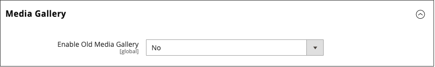

# The Media Gallery

With Adobe Commerce or Magento Open Source 2.4, merchants can use the new _enhanced_ Media Gallery to organize and manage their media files on the server. This new Media Gallery contains the same functionalities as the existing Media Storage, but includes an improved user interface and a closer integration with [Adobe Stock][adobe-stock].

<!-- zoom -->

>[!NOTE]
>
>Product Gallery images added to the [_Images and Videos_ product section](https://docs.magento.com/user-guide/catalog/product-image-upload.html) are not managed by the new Media Gallery. Only images used in the _Content_ product section fields are displayed and filtered in the new Media Gallery.

## Enable the new Media Gallery

1. On the _Admin_ sidebar, go to **Stores** > _Settings_ > **Configuration**.

1. In the left panel, expand **Advanced** and choose **System**.

1. Expand  **Media Gallery**.

   <!-- zoom -->

1. Set **Enable Old Media Gallery** to `No`.

1. Click **Save Config**.

1. When prompted, click the **Cache Management** link in the system message and refresh the invalid cache.

   The [Content menu][content-menu] now displays the new _Media Gallery_ option.

>[!NOTE]
>
>Full functionality for new Media Gallery requires `media.gallery.synchronization` and `media.content.synchronization` queue consumers to be started for initial synchronization. See [Manage message queues](https://devdocs.magento.com/guides/v2.4/config-guide/mq/manage-message-queues.html) in our developer documentation for more details.

## Access the new Media Gallery

The new Media Gallery is accessible from the Content menu or when you [add or edit a page][add-page]. You can also access it when you [create or edit a category][create-category], or when you [insert images using the Content Editor][editor-insert-image].

To access the new Media Gallery through the Content menu:

- On the _Admin_ sidebar, go to **Content** > _Media_ > **Media Gallery**.

To access the new Media Gallery when you are adding or editing a page:

1. On the _Admin_ sidebar, go to **Content** > _Elements_ > **Pages**.

1. Click **Add a New Page**.

   If you want to edit an existing page, you can use the _Action_ column to click **Select** and choose **Edit**.

1. Expand  the **Content** section and do the following:

   - If you have [Page Builder enabled](../page-builder/setup.md), expand the **Media** panel and drag an **Image** placeholder to the target container. Then click **Select from Gallery**.

      <!-- zoom -->

   - If you have the [WYSIWYG editor enabled][editor-config], click **Show/Hide Editor** and then click **Insert Image**.

[adobe-stock]: https://stock.adobe.com
[content-menu]: content-menu.md
[add-page]: page-add.md
[create-category]: https://docs.magento.com/user-guide/catalog/category-create.html
[editor-insert-image]: editor-insert-image.md
[editor-config]: editor.md#configure-the-editor
