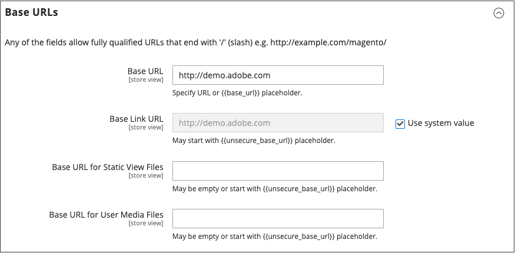

# Use a Content Delivery Network

A Content Delivery Network (CDN) can be used to store media files. Although the version of [!DNL Commerce] that is installed _on premise_ does not include an integration with any specific CDN, you can use the CDN of your choice. [Adobe Commerce on cloud infrastructure][1]{:target="_blank"} is an exception to this, and includes the Fastly CDN. See [Fastly][2]{:target="_blank"} in the [!DNL Commerce] developer documentation.

After configuring the CDN, you must complete the configuration from the Admin. The changes can be made at either the global or website level. When a CDN is used for media storage, all paths to media on store pages are changed to the CDN paths that are specified in the configuration.

## CDN workflow

1. **Browser requests media** - A page from the store opens in the customer's browser, and the browser requests the media that is specified in the HTML.
1. **Request sent to CDN; images found and served** - The request is sent first to the CDN. If the CDN has the images in storage, it serves the media files to the customer's browser.
1. **Media not found, request sent to [!DNL Commerce] web server** - If the CDN does not have the media files, the request is sent to the [!DNL Commerce] web server. If the media files are found in the file system, the web server sends them to the customer's browser.

>[!IMPORTANT]
>
>For security, when a CDN is used as media storage, JavaScript may not function properly if the CDN is located outside of your subdomain.

## Configure a content delivery network

1. On the _Admin_ sidebar, go to **[!UICONTROL Stores]** > _[!UICONTROL Settings]_ > **[!UICONTROL Configuration]**.

1. In the left panel under _[!UICONTROL General]_, choose **[!UICONTROL Web]**.

1. In the upper-left corner, set **[!UICONTROL Store View]** as needed.

1. Expand  the **[!UICONTROL Base URLs]** section and do the following:

    {width="600" zoomable="yes"}

    - Update the **[!UICONTROL Base URL for Static View Files]** with the URL of the location on the CDN where static view files are stored.

    - Update the **[!UICONTROL Base URL for User Media Files]** with the URL of the JavaScript files on the CDN.

        Both these fields can be left blank, or can start with the placeholder: `{{unsecure_base_url}}`

1. Expand  the **[!UICONTROL Base URLs (Secure)]** section and do the following:

    {width="600" zoomable="yes"}

    - Update the **[!UICONTROL Secure Base URL for Static View Files]** with the URL of the location on the CDN where static view files are stored.

    - Update the **[!UICONTROL Secure Base URL for User Media Files]** with the URL of the JavaScript files on the CDN.

      Both these fields can be left blank, or can start with the placeholder: `{{unsecure_base_url}}`

1. When complete, click **[!UICONTROL Save Config]**.

[1]: https://business.adobe.com/products/magento/magento-commerce.html
[2]: https://experienceleague.adobe.com/docs/commerce-cloud-service/user-guide/cdn/fastly.html
