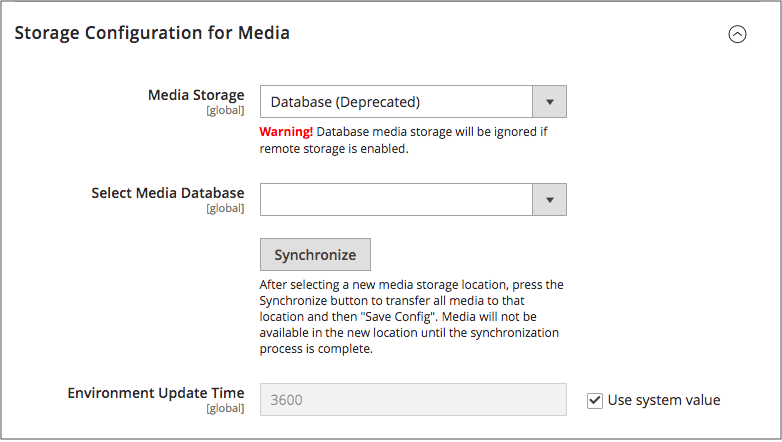

# Use a Media Database

>[!IMPORTANT]
>
>The database media storage method is deprecated as of Adobe Commerce and Magento Open Source 2.4.3.

By default, all images, compiled CSS files, and compiled JavaScript files of the [!DNL Commerce] instance are stored in the file system on the web server. You can choose to store these files in a database on a database server. One advantage of this approach is the option of automatic synchronization and reverse synchronization between the web server file system and the database. You can use the default database to store media or create a new one. To be able to use a newly created database as media storage, you must add information about it and its access credentials to the `env.php` file.

## Database workflow

1. **Browser requests media** - A page from the store opens in the customer's browser, and the browser requests the media that is specified in the HTML.

1. **System looks for media in file system** - The system searches for the media in the file system and if found, passes it to the browser.

1. **System locates media in database** - If the media is not found in the file system, a request for the media is sent to the database that is specified in the configuration.

1. **System locates media in database** - A PHP script transfers the files from the database to the file system, and sent to the customer's browser. The browser request for media triggers the script to run as follows:

    - If web server [rewrites](../merchandising-promotions/url-rewrite.md) are enabled for [!DNL Commerce] and supported by the server, the PHP script runs only when the requested media is not found in the file system.
    - If web server rewrites are disabled for [!DNL Commerce], or not supported by the server, the PHP script runs anyway, even if the required media is available in the file system.

## Use a database for media storage

1. On the _Admin_ sidebar, go to **[!UICONTROL Stores]** > _[!UICONTROL Settings]_ > **[!UICONTROL Configuration]**.

1. In the left panel, expand **[!UICONTROL Advanced]** and choose **[!UICONTROL System]**.

1. In the upper-left corner, set **[!UICONTROL Store Viewl]** to `Default Config` to apply the configuration at the global level.

1. Expand  the **[!UICONTROL Storage Configuration for Media]** section and do the following:

    <!-- zoom -->

    [_Storage Configuration for Media (Database)_](https://docs.magento.com/user-guide/configuration/advanced/system.html)

    - Set **[!UICONTROL Media Storage]** to `Database`.

    - Set **[!UICONTROL Select Media Database]** to the database you want to use.

    - Click **[!UICONTROL Synchronize]** to transfer the existing media to the newly selected database.

    - Enter the **[!UICONTROL Environment Update Time]** in seconds.

1. When complete, click **[!UICONTROL Save Config]**.
