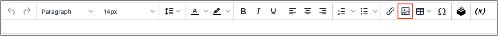
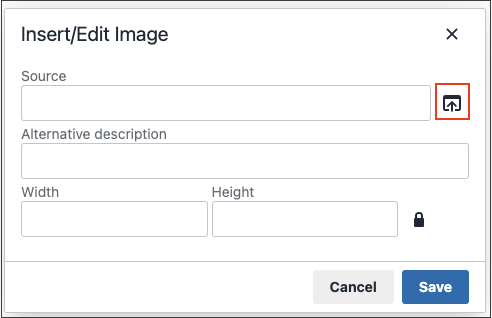
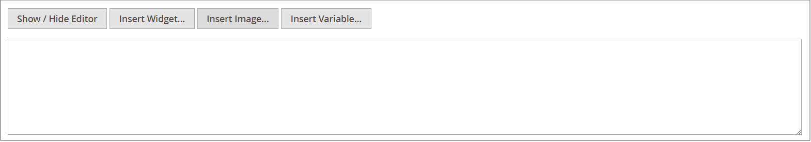

# Media storage

Media storage helps you organize and gain access to media files that are stored on the server. The path to the location of the files is determined by the [base URL](../stores-purchase/store-urls.md) configuration. Files in media storage can be accessed from the editor while working on pages and static blocks. Usually, media storage resides in the file system on the same server as the [!DNL Commerce] program files.

Alternatively, media files can be managed in a [database](media-storage-database.md), or on a separate server or [content delivery network](media-storage-content-delivery-network.md). The advantage of using alternate storage is that it minimizes the effort required to synchronize media. Synchronization performance is especially affected when multiple instances of the system are deployed on different servers that need access to the same images, CSS files, and other media files.

The editor can be configured to use either static or [dynamic media URLs](../catalog/catalog-urls.md#configure-catalog-media-url-format) for catalog content in category or product descriptions.

![[!DNL Commerce] Media Storage](./assets/media-storage.png){width="650" zoomable="yes"}

## Add files to the media storage

The first two steps are the same as if you are inserting an image.

1. On the [editor](editor.md) toolbar, click the _Insert Image_ icon.

   {width="700" zoomable="yes"}

   This action opens the _[!UICONTROL Insert/edit image]_ dialog.

1. After _[!UICONTROL Source]_, click the _Search_ icon ({width="10" zoomable="no"}).

1. In the directory tree on the left, do one of the following:

   - Navigate to the folder where you want to save the uploaded image.

   - Navigate to the place where you want to create a folder and click **Create Folder**.

      For adding a folder, enter the folder name and click **[!UICONTROL OK]**.

1. To add one or more files to Media Storage, you can either upload the files from your system or use the [Adobe Stock Integration](adobe-stock.md):

   To upload files from your system, click **[!UICONTROL Choose Files]** and do the following:

      - In the directory of your local computer, navigate to the location of the images.

      - Select each image to be uploaded.

      - Click **[!UICONTROL Open]**.

   To use assets from Adobe Stock using the [integration](adobe-stock.md):

      - Click **[!UICONTROL Search Adobe Stock]**.

      - Add a preview or licensed image from Adobe Stock (see [Using Adobe Stock Images](adobe-stock-manage.md)).

The images are uploaded to the current Media Storage folder on the server.

![[!DNL Commerce] Media Storage](./assets/media-storage.png){width="650" zoomable="yes"}

## Insert an image from media storage

Open the page or block to be edited. Then, use one of the following methods to insert an image from media storage:

### Method 1: WYSIWYG mode

1. On the [editor](editor.md) toolbar, click the _Insert Image_ icon.

1. After _[!UICONTROL Source]_, click the _Search_ icon ({width="10" zoomable="no"}).

   {width="250" zoomable="yes"}

1. In the directory tree on the left, navigate to the folder where the image is stored.

1. Select the tile of the image and click **[!UICONTROL Add Selected]**.

### Method 2: HTML mode

1. Position the cursor in the code where the `` tag is to be inserted.

1. Click **[!UICONTROL Insert Image]**.

   {width="600" zoomable="yes"}
