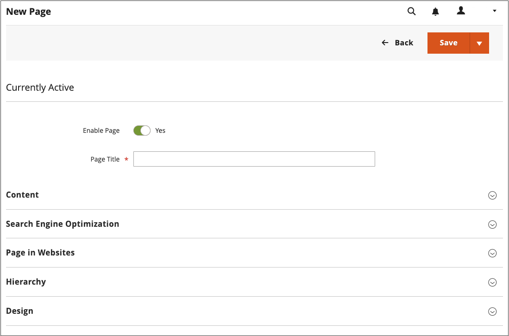
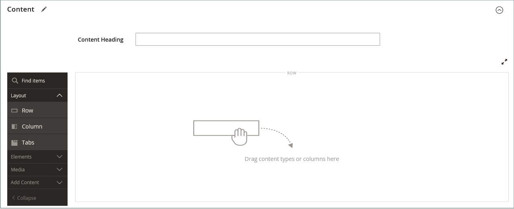
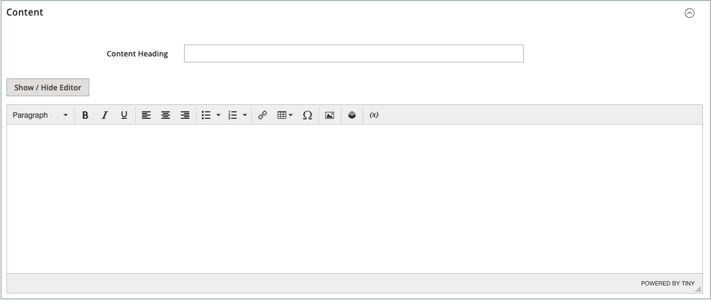
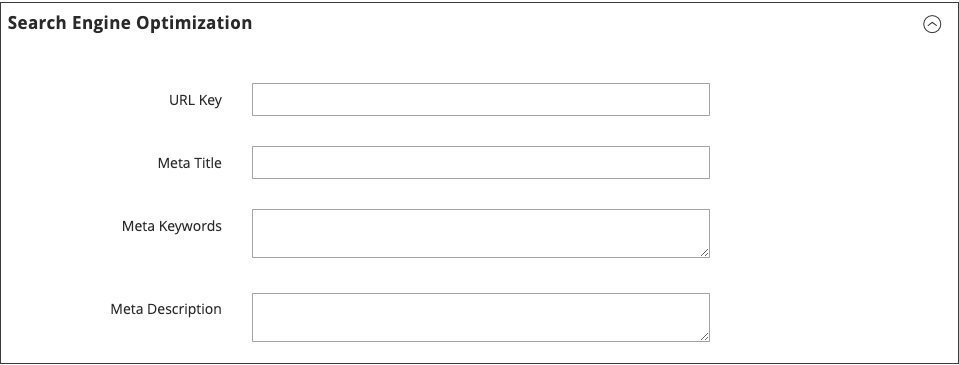
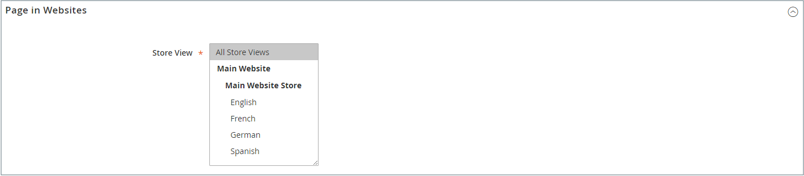
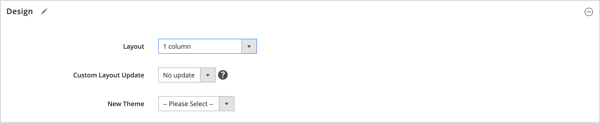
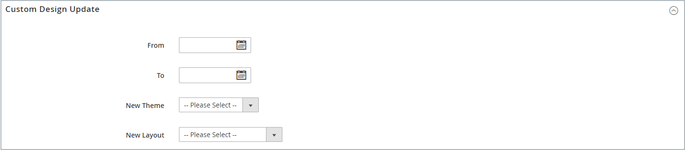
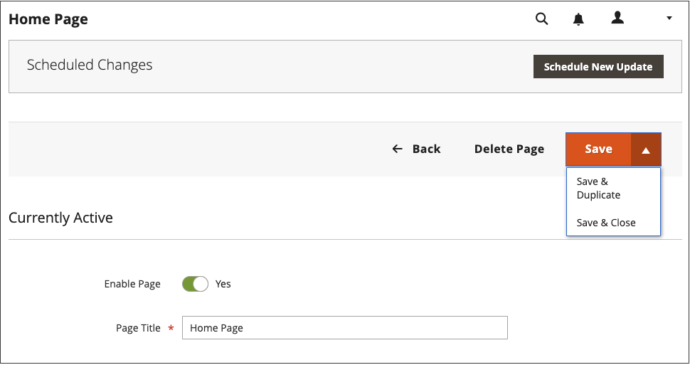
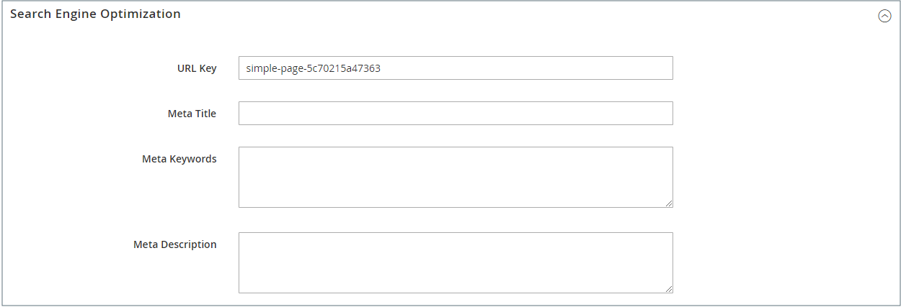

# Add and remove pages

The process of adding a content page to your store is essentially the same for any type of page that you might want to create. You can include text, images, blocks of content, variables, and widgets. Most content pages are designed for reading by search engines first, and by people second. Keep the needs of each of these two different audiences in mind when choosing the page title, and URL, and when composing the meta data, and content. When your page is complete, it can be added to your store navigation, linked to other pages, linked from the footer of your store, or used as a new [home page](page-home-new.md).

{width="700" zoomable="yes"}

## Add a page

The following instructions walk you through each step to create a basic page. Some advanced features are skipped over, but are covered in other topics.

### Step 1: Create the page

1. On the _Admin_ sidebar, go to **[!UICONTROL Content]** > _[!UICONTROL Elements]_ > **[!UICONTROL Pages]**.

1. Click **[!UICONTROL Add New Page]**.

   {width="600" zoomable="yes"}

1. If you do not want to publish the page immediately, set **[!UICONTROL Enable Page]** to `No`.

1. Enter the **[!UICONTROL Page Title]**.

   The page title appears in the [breadcrumb](../catalog/navigation-breadcrumb-trail.md) navigation.

### Step 2: Complete the content

Depending on your [Advanced Content Tools configuration](../configuration-reference/general/content-management.md), add the page content.

>[!NOTE]
>
>The Page Builder content editor does not show a preview of CMS Page elements which are not available for the default Store View. For example, you cannot preview a CMS Block which is assigned only to non-default store views . In this case, you must publish your CMS page first. Then, you can view this page on the Storefront directly. Alternatively, you can view the page from the [!UICONTROL Pages] grid in the Admin by selecting the CMS page [!UICONTROL View] in the [!UICONTROL Action] column.

#### Use the Page Builder content tools

1. Expand  **[!UICONTROL Content]**.

   {width="600" zoomable="yes"}

1. In the **[!UICONTROL Content Heading]** box, enter the heading that you want to appear at the top of the page.

   If enabled, the [Page Builder](../page-builder/introduction.md) stage and panel appear below the Content Heading. For more information, see [Workspace](../page-builder/workspace.md). If _Page Builder_ is not enabled, the editor opens in WYSIWYG mode with the toolbar at the top.

1. Complete the content, and format the text as needed.

#### Use the editor toolbar

1. Expand  **[!UICONTROL Content]**.

   {width="600" zoomable="yes"}

1. In the **[!UICONTROL Content Heading]** box, enter the heading that you want to appear at the top of the page.

1. Complete the content and format the text as needed.

   You can add [images](media-storage.md), [variables](../systems/variables-predefined.md), and [widgets](widgets.md) as needed. For more information, see [Using the Editor](editor.md).

### Step 3: Complete the SEO information

1. Expand  **[!UICONTROL Search Engine Optimization]**.

   {width="600" zoomable="yes"}

1. Either accept the default or enter another **[!UICONTROL URL Key]** that consists of all lowercase characters, with hyphens instead of spaces.

   The default URL key was created when the page was saved and is based on the Content Heading.

1. Enter a **[!UICONTROL Meta Title]** for the page.

   The meta-title should contain fewer than 70 characters and appears in the browser title bar and tab.

1. Enter your choice of high-value **[!UICONTROL Meta Keywords]** that search engines can use to index the page.

   Separate multiple words with a comma. Meta keywords are ignored by some search engines, but used by others.

1. For **[!UICONTROL Meta Description]**, enter a brief description of the page for search results listings.

   Ideally, the description should be 150-160 characters in length, with a maximum limit of 255.

1. Click **[!UICONTROL Save]**.

### Step 4: Specify the scope of the page

1. Expand  **[!UICONTROL Page in Websites]**.

   {width="600" zoomable="yes"}

1. In the **[!UICONTROL Store View]** list, select each view where the page is to be available.

   If the installation has multiple websites, select each website and store view where the page is to be available.

### Step 5: Identify the parent page (if applicable)

{{ee-feature}}

1. Expand  **[!UICONTROL Hierarchy]**.

   {width="600" zoomable="yes"}

1. If this page is a child of another page, select the checkbox of the **[!UICONTROL Parent page]**.

### Step 6: Enter design changes (optional)

1. To change the layout of the page, expand  **[!UICONTROL Design]**.

   {width="600" zoomable="yes"}

1. To change the column layout of the page, set **[!UICONTROL Layout]** to one of the following:

   - `Empty`
   - `1 column`
   - `2 columns with left bar`
   - `2 columns with right bar`
   - `3 columns`
   - `Page -- Full Width` (Requires [Page Builder](../page-builder/introduction.md))
   - `Category -- Full Width` (Requires Page Builder)
   - `Product -- Full Width` (Requires Page Builder)

1. To apply a **[!UICONTROL Custom Layout Update]**, choose the name of the file from the list.

   For more information, see [Layout Updates](layout-updates.md).

1. To change the theme of the page, set **[!UICONTROL New Theme]** to one of the following:

   - `Magento Black`
   - `Magento Luma`

1.  (Magento Open Source only) To schedule a design change, expand  **[!UICONTROL Custom Design Update]** and do the following:

   {width="600" zoomable="yes"}

   - Use the calendar () to choose the **[!UICONTROL From]** and **[!UICONTROL To]** dates for the change to take effect.

   - To apply a different theme to the page, select the name of the **[!UICONTROL New Theme]**.

   - To change the column layout of the page, choose the **[!UICONTROL Layout]** that you want to apply.

### Step 7: Preview the page

1. Click the **[!UICONTROL Save]** arrow and choose **[!UICONTROL Save & Close]** to return to the Pages grid.

1. Find the page in the grid and select **[!UICONTROL View]** in the _[!UICONTROL Action]_ column.

1. To return to the grid, click **[!UICONTROL Back]** in the upper-left corner of the browser window.

### Step 8: Publish the page

1. Select **[!UICONTROL Edit]** in the _[!UICONTROL Action]_ column of the grid.

1. Set **[!UICONTROL Enable Page]** to `Yes`.

1. Click the **[!UICONTROL Save]** arrow and choose **[!UICONTROL Save & Close]**.

## Duplicate a page

Any content page can be used as a template, and saved as a duplicate. You might use this time-saving technique to create a consistent design for content pages throughout your site. The duplicate page retains the Page Title of the original, but the URL Key and Status fields must be updated.

{width="600" zoomable="yes"}

1. On the _Admin_ sidebar, go to **[!UICONTROL Content]** > _[!UICONTROL Elements]_ > **[!UICONTROL Pages]**.

1. In the grid, find the page that you want to duplicate and click **[!UICONTROL Edit]** in the _[!UICONTROL Action]_ column.

1. Click the **[!UICONTROL Save]** arrow and choose **[!UICONTROL Save & Duplicate]**.

1. When you see the messages that the page has been saved and duplicated click **[!UICONTROL Back]** in the top button bar to return to the grid.

1. Find the duplicate page in the grid, and take note of the following:

   - The Page Title is the same as the original.
   - A unique, but temporary URL Key is assigned.
   - The Status of the page is `Disabled`.

1. Open the duplicate page in _Edit_ mode and do the following:

   - If you want to publish the page immediately, set **[!UICONTROL Enable Page]** to `Yes`.

   - Update the **[!UICONTROL Page Title]**, as needed.

   - Expand  the **[!UICONTROL Search Engine Optimization]** section and enter the unique **[!UICONTROL URL Key]** that you want to use for the duplicate page.

      {width="600" zoomable="yes"}

   - Update the remaining page content, as needed.

1. Click the **[!UICONTROL Save]** arrow and choose **[!UICONTROL Save & Close]**.

   The duplicate page in the grid reflects your changes.

## Save menu

|Command|Description|
|--- |--- |
|[!UICONTROL Save]|Save the current page, and continue working.|
|[!UICONTROL Save & New]|Save and close the current page, and begin a new page.|
|[!UICONTROL Save & Duplicate]|Save and close the current page, and open a new duplicate copy.|
|[!UICONTROL Save & Close]|Save and close the current page, and return to the Pages grid.|

{style="table-layout:auto"}

## Delete a page

There are two ways to remove a created page. You can remove it from the _[!UICONTROL Pages]_ grid or from the _[!UICONTROL Edit]_ page.

### Method 1: Remove a page from the Pages grid

1. On the _Admin_ sidebar, go to **[!UICONTROL Content]** > _[!UICONTROL Elements]_ > **[!UICONTROL Pages]**.

1. Locate the pages using filters above the grid and select the checkbox for one or more pages to be deleted.

1. In the upper-left corner of the list, set **[!UICONTROL Actions]** to `Delete`.

1. To confirm the action, click **[!UICONTROL OK]**.

### Method 2: Remove a page from the edit page

1. On the _Admin_ sidebar, go to **[!UICONTROL Content]** > _[!UICONTROL Elements]_ > **[!UICONTROL Pages]**.

1. Find the page to be deleted.

1. In the _[!UICONTROL Actions]_ column for the page entity, click **[!UICONTROL Select]** and choose **[!UICONTROL Edit]**.

1. In the button bar, click **[!UICONTROL Delete Page]**.

1. To confirm the action, click **[!UICONTROL OK]**.
