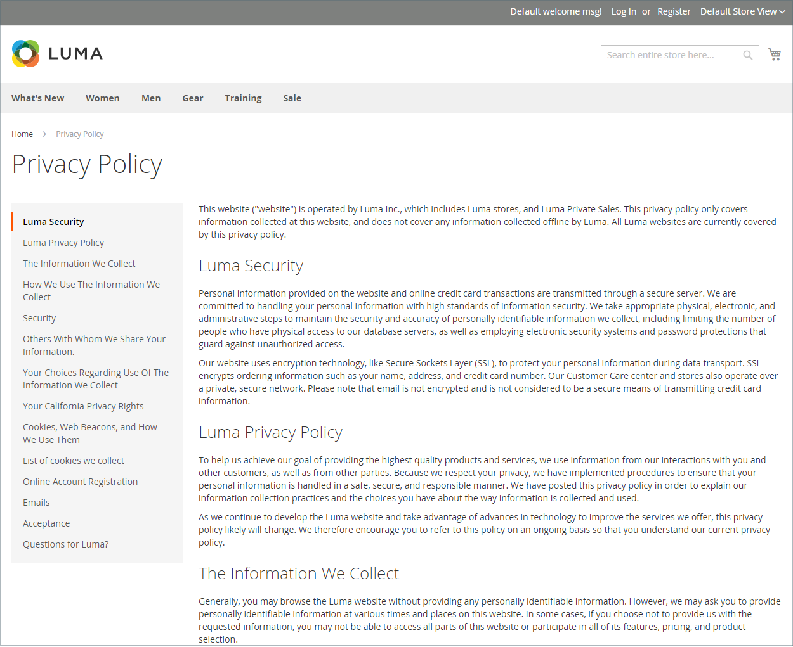
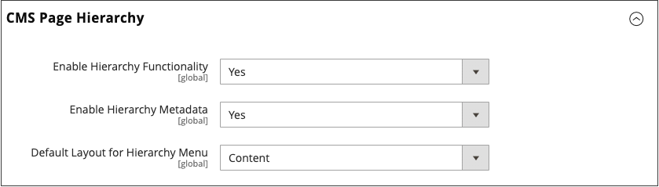
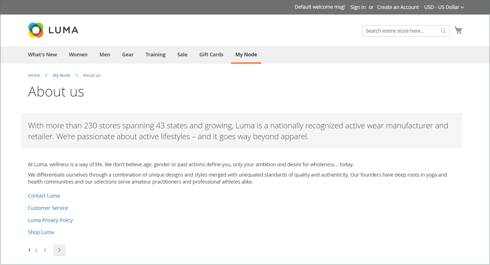
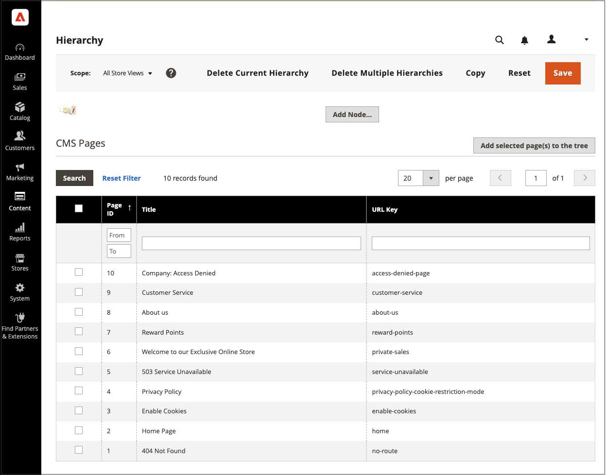
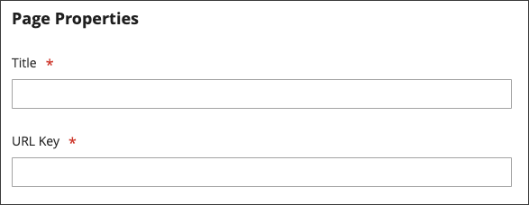
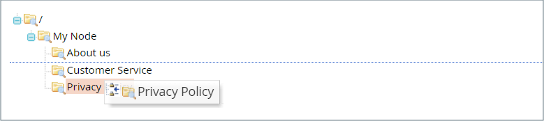
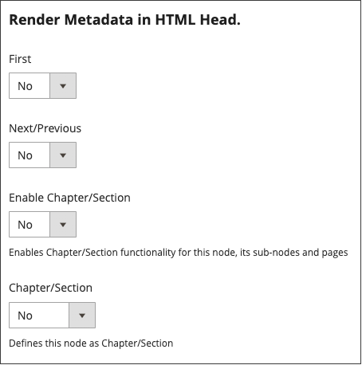
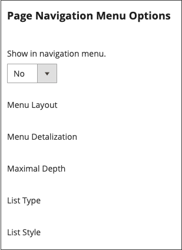

# Page hierarchy

{{ee-feature}}

The store page hierarchy system gives you the ability to organize your content pages and add pagination, navigation, and menus. The Privacy Policy page in the sample data is an example of a page with a menu on the left. If you publish a large amount of content regularly, you can use a page hierarchy to organize your content to make it easy for people to find articles of interest.

The page hierarchy system uses nodes to identify related pieces of content, and to organize content pages into parent/child relationships. A parent node is like a folder that might contain child nodes and pages. The relative position of each node and page in the hierarchy is shown as a _tree_ structure. A node might contain other nodes and content pages, and a single content page might be associated with multiple nodes and other content pages in a parent/child or neighbor relationships.

{width="600" zoomable="yes"}

## Configure page hierarchy

The configuration settings activate the page hierarchy system and metadata, and determine the default menu layout.

{width="600" zoomable="yes"}

1. On the _Admin_ sidebar, go to **[!UICONTROL Stores]** > _[!UICONTROL Settings]_ > **[!UICONTROL Configuration]**.

1. In the left panel under _[!UICONTROL General]_, choose **[!UICONTROL Content Management]**.

1. Expand  **[!UICONTROL CMS Page Hierarchy]**  and make any changes that are necessary.

1. When complete, click **[!UICONTROL Save Config]**.

|Field|Description|
|--- |--- |
|[!UICONTROL Enable Hierarchy Functionality]|Activates the use of page hierarchy for your content pages. Options: `Yes` / `No`|
|[!UICONTROL Enable Hierarchy Metadata]|WHen this option is enabled, you can associate meta data with pages in the hierarchy. Options: `Yes` / `No`|
|[!UICONTROL Default Layout for Hierarchy Menu]|Determines the default menu style. Options: `Content` / `Left Column` / `Right Column`|

{style="table-layout:auto"}

## Add a hierarchy node

The following example shows how to create a node with simple navigation to related content pages. Although a node does not have a content page associated with it, it does have a URL Key that can be referenced elsewhere in your site.

For example, you might create a node called _Press Releases_ that has navigation to individual press releases. Then, you can include the link on your _About Us_ page to the node. Or you might create a node for a collection of back issues of your newsletter.

To link to a node, use the [Widget](widgets.md) tool to create a CMS Hierarchy Node link and place the widget in a content block or page.

{width="600" zoomable="yes"}

### Step 1: Create a node

1. On the _Admin_ sidebar, go to **[!UICONTROL Content]** > _[!UICONTROL Elements]_ > **[!UICONTROL Hierarchy]**.

   {width="600" zoomable="yes"}

1. Above the grid, click **[!UICONTROL Add Node...]**.

1. Under _[!UICONTROL Page Properties]_, enter a **[!UICONTROL Title]** for the node and a suitable **[!UICONTROL URL Key]**.

   The URL key provides a unique web address for the node. It must be all lowercase characters, using hyphens to separate words, instead of spaces.

   {width="500" zoomable="yes"}

1. Click **[!UICONTROL Save]**.

   The node appears as a folder in the tree on the left of the page.

### Step 2: Add pages to the node

1. In the hierarchy tree, click to select the node.

1. Click **[!UICONTROL Add Selected Pages(s) to Tree]**.

   You can scroll up to see that each selected page appears in the tree below the node folder.

### Step 3: Define the structure

1. If necessary, drag the pages into position to reflect the order that they are to appear in the menu.

   {width="500" zoomable="yes"}

1. Click the node at the top of the hierarchy.

   The _[!UICONTROL Page Properties]_ section now displays information about the node.

1. Under **[!UICONTROL Render Metadata in HTML Head]**, do the following:

   {width="400" zoomable="yes"}

   - To identify the node as the top of the hierarchy, set **[!UICONTROL First]** to `Yes`.

   - To display a pagination control, set **[!UICONTROL Next/Previous]** to `Yes`.

   - To organize the pages in the hierarchy as a book, set **[!UICONTROL Enable Chapter/Section]** to `Yes`.

      If you don't want to include the node as part of the book, leave the default `No`.

   - To assign the node to a specific part of the book, set **[!UICONTROL Chapter/Section]** to one of the following:

      - `No` - Does not define the node as chapter/section.
      - `Chapter` - Assigns the current node as a chapter.
      - `Section` - Assigns the current node as a section.
      - `Both` - Assigns the current node as both a chapter and section.

### Step 4: Add pagination controls

1. Under _Pagination Options for Nested Pages_, set **[!UICONTROL Enable Pagination]** to `Yes`.

1. For **[!UICONTROL Frame]**, enter the number of page links that you want to include in the pagination control.

   If there are more pages in the hierarchy that can be included in the pagination control.

1. For **[!UICONTROL Frame Skip]**, enter the number of pages that you want to skip ahead (or back) for the next set of pagination links.

### Step 5: Choose the menu layout

If you want the node to appear in the menu, do the following:

1. Under _Page Navigation Menu Options_, set **[!UICONTROL Show in navigation menu]** to `Yes`.

   This setting determines if a navigational menu is generated for the page hierarchy.

   {width="300" zoomable="yes"}

1. To specify the location of the menu in relation to the content, set the **[!UICONTROL Menu Layout]**:

   - `Content` - The menu layout is in the content.
   - `Use Default` - Uses the menu style that is specified in the [configuration](../configuration-reference/general/content-management.md).
   - `Left Column` - The menu appears to the left of the content.
   - `Right Column` - The menu appears to the right of the content.

1. To specify how much detail is included in the menu, set **[!UICONTROL Menu Detalization]** to one of the following:

   - `Only Children` - Includes only subpages in the menu.
   - `Neighbours and Children` - Includes subpages and other pages that are at the same level in the hierarchy.

1. To determine the depth of the menu, enter the **[!UICONTROL Maximal Depth]** for the maximum number of levels to include.

1. To format the menu, choose a **[!UICONTROL List Type]**:

   - `Unordered` - The menu options are not numbered, and can be formatted with or without bullets. Options for unordered list type: Default / Circle / Disc / Square 
   - `Ordered` - The menu options are numbered, and can be formatted as numeric, alphabetic, or roman numerals in either upper-or lowercase.

1. Set **[!UICONTROL List Style]** to one of the following:

   - `Circle`
   - `Disc`
   - `Square`

1. If you also want the node to be visible in the navigation menu, scroll to _Main Navigation Menu Options_ and set **[!UICONTROL Show in Navigation menu]** to `Yes`.

   {width="250" zoomable="yes"}

1. Click **[!UICONTROL Save]**.
