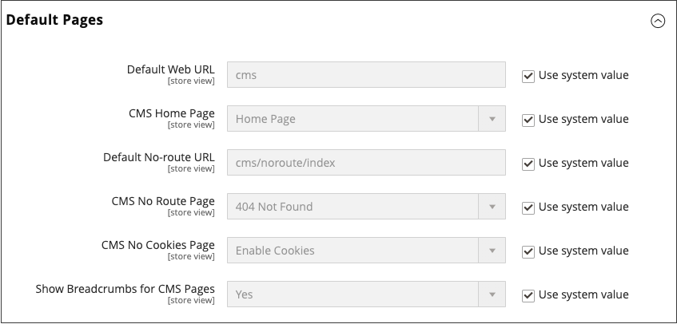

# Set the home page

You can maintain a selection of different home pages, and activate the page that you want to use as the default home page.

1. Complete the steps for [adding a page](page-add.md).

1. On the _Admin_ sidebar, go to **[!UICONTROL Stores]** > _[!UICONTROL Settings]_ > **[!UICONTROL Configuration]**.

1. In the left panel under _[!UICONTROL General]_, choose **[!UICONTROL Web]**.

1. Expand  the **[!UICONTROL Default Pages]** section and set **[!UICONTROL CMS Home Page]** to the new page.

   {width="600" zoomable="yes"}

1. Click **[!UICONTROL Save Config]**.

1. In the message at the top of the workspace, click the **[!UICONTROL Cache Management]** link and refresh any invalid caches.
