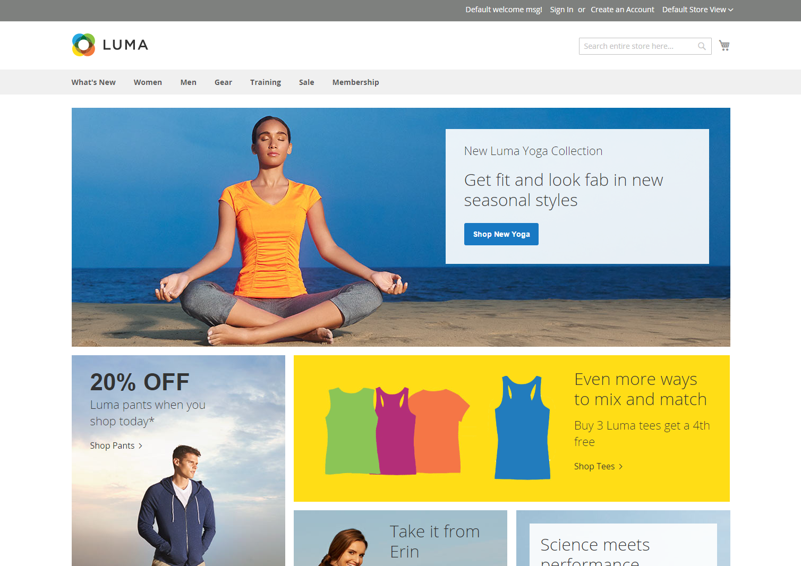
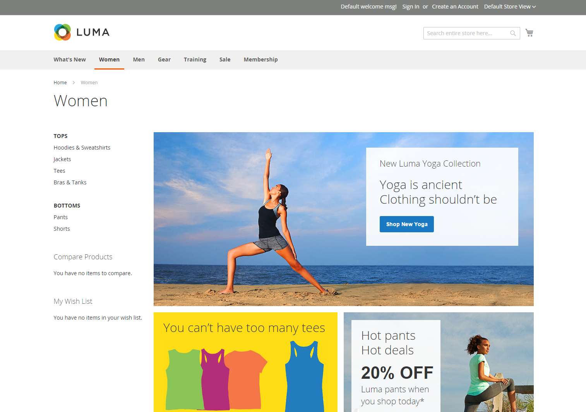
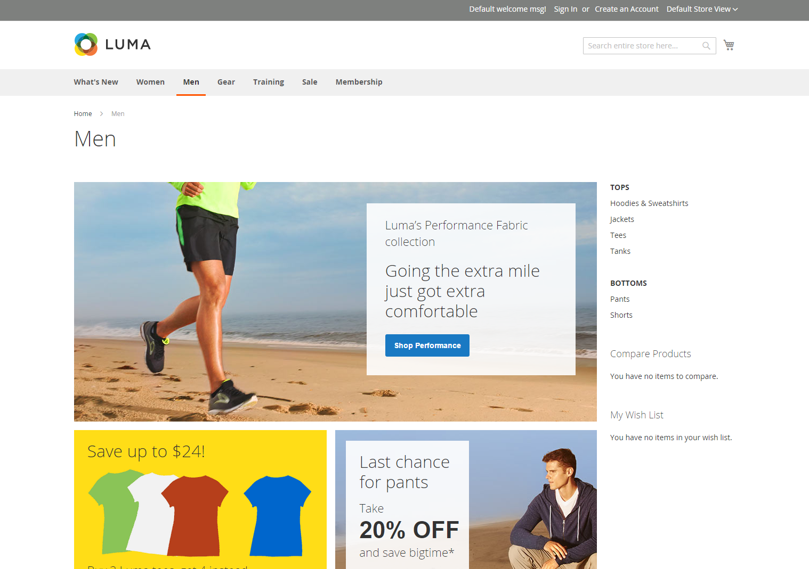
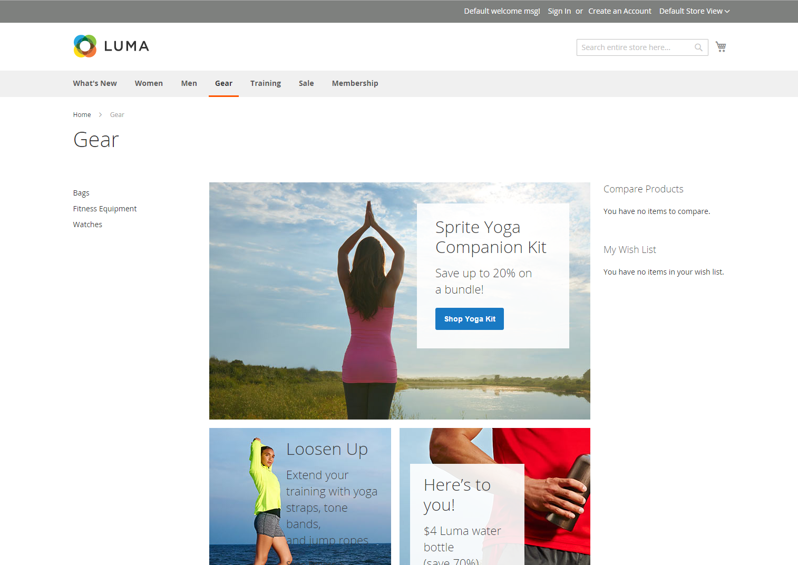

# Storefront layout examples

The column dimensions are determined by the style sheet of the theme. Some themes apply a fixed pixel width to the page layout, while others use percentages to make the page respond to the width of the window or device.

Most desktop themes have a fixed width for the main column, and all activity takes place within this enclosed area. Depending on your screen resolution, there is empty space on each side of the main column.

## One column

The content area for a one-column layout spans the full-width of the main column. This layout is often used for a home page with a large banner or slider, or for pages that require no navigation, such as a login page, splash page, video, or full-page advertisement.

{width="700" zoomable="yes"}

## Two columns with left bar

The content area of this layout is divided into two columns. The main content column floats to the right, and the side bar floats to the left.

{width="700" zoomable="yes"}

## Two columns with right bar

This layout is a mirror image of the other two-column layout. This time, the side bar floats to the right, and the main content column floats to the left.

{width="700" zoomable="yes"}

## Three columns

A three-column layout has a main content area with two side columns. The left side bar and main content column are wrapped together, and float as a unit to the left. The other side bar floats to the right.

{width="700" zoomable="yes"}
