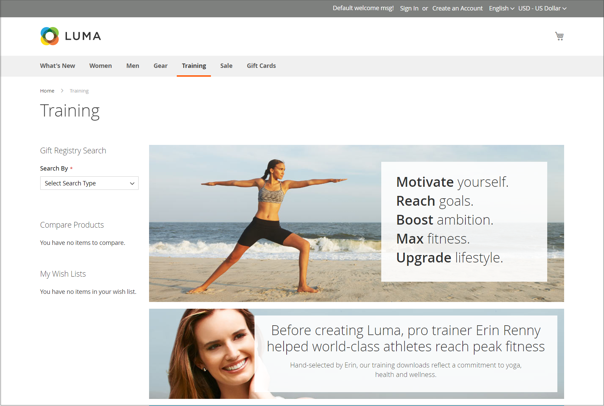
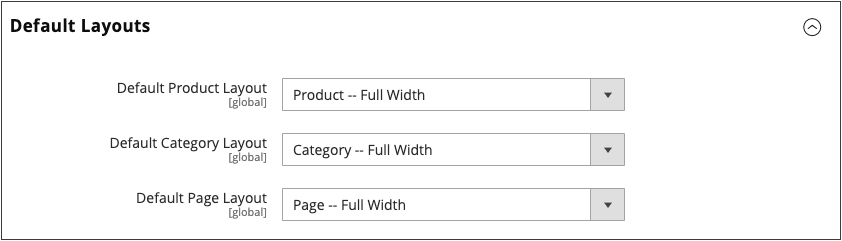
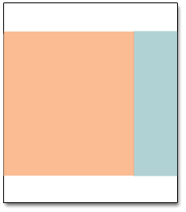

# Page Layouts

The layout of each page in your store consists of distinct sections, or containers, that define the header, footer, and content areas of the page. Depending on the layout, each page might have one, two, three columns, or more. You can think of the layout as the _floor plan_ of the page, and assign a specific layout to be used as the default for CMS, product, and category pages.

On the page, content blocks float to fill the available space, according to the section of the [page layout](layout-updates.md) where they are assigned to appear. You will discover that if you change the layout from a three-column to a two-column layout, the content of the main area expands to fill the available space, and any blocks that are associated with the unused side bar seem to disappear. However, if you restore the three-column layout, the blocks reappear. This fluid approach, or _liquid layout_, makes it possible to change the page layout without having to rework the content. If you are used to working with individual HTML pages, you will discover that this modular, _building block_ approach requires a different way of thinking.

<!-- zoom -->

## Configure default layouts

1. On the _Admin_ sidebar, go to **Stores** > _Settings_ > **Configuration**.

1. In the left panel under _General_, choose **Web**.

1. Expand  the **Default Layouts** section.

   <!-- zoom -->

   [Default Layouts](https://docs.magento.com/user-guide/configuration/general/web.html#default-layouts)

1. Choose the **Default Product Layout** that you want to use for product pages.

   This determines the layout that is used by default for product pages.

   - `No layout updates` - Layout updates are not available for product pages.
   - `Empty` - Uses a blank layout for product pages.
   - `1 column` - Uses a single column layout for product pages.
   - `2 columns with left bar` - Uses a two-column layout with the sidebar on the left for product pages.
   - `2 columns with right bar` - Uses a two-column layout with the sidebar on the right for product pages.
   - `3 columns` - Uses a three-column layout with sidebars on the left and right for product pages.

   When [Page Builder](../page-builder/introduction.md) is enabled, there are additional full width options available. You can then use the Page Builder content tools to design the layout for your product pages.

   - `Page -- Full Width` - Uses the _Page - Full Width_  layout for product pages.
   - `Category -- Full Width` - Uses the _Category - Full Width_ layout for product pages.
   - `Product -- Full Width` - (Recommended) Uses the _Product - Full Width_ layout for product pages.

1. Choose the **Default Category Layout** that you want to use for category pages.

   This determines the layout that is used by default for category pages.

   - `No layout updates` - Layout updates are not available for category pages.
   - `Empty` - Uses a blank layout for category pages.
   - `1 column` - Uses a single column layout for category pages.
   - `2 columns with left bar` - Uses a two-column layout with the sidebar on the left for category pages.
   - `2 columns with right bar` - Uses a two-column layout with the sidebar on the right for category pages.
   - `3 columns` - Uses a three-column layout with sidebars on the left and right for category pages.

   When [Page Builder](../page-builder/introduction.md) is enabled, there are additional full width options available. You can then use the Page Builder content tools to design the layout for your category pages.

   - `Page -- Full Width` - Uses the _Page - Full Width_ layout for category pages.
   - `Category -- Full Width` - (Recommended) Uses the _Category - Full Width_ layout for category pages.
   - `Product -- Full Width` - Uses the _Product - Full Width_ layout for category pages.

1. Choose the **Default Page Layout** that you want to use for CMS pages.

   This determines the layout that is used by default for CMS pages.

   - `No layout updates` - Layout updates are not available for CMS pages.
   - `Empty` - Uses a blank layout for CMS pages.
   - `1 column` - Uses a single column layout for CMS pages.
   - `2 columns with left bar` - Uses a two-column layout with the sidebar on the left for CMS pages.
   - `2 columns with right bar` - Uses a two-column layout with the sidebar on the right for CMS pages.
   - `3 columns` - Uses a three-column layout with sidebars on the left and right for CMS pages.

   When [Page Builder](../page-builder/introduction.md) is enabled, there are additional full width options available. You can then use the Page Builder content tools to design the layout for your CMS pages.

   - `Page -- Full Width` - (Recommended) Uses the _Page - Full Width_ layout for CMS pages.
   - `Category - Full Width` - Uses the _Category - Full Width_ layout for CMS pages.
   - `Product - Full Width` - Uses the _Product - Full Width_ layout for CMS pages.

1. When complete, click **Save Config**.

## Standard Page Layouts

### One Column

The _1 Column_ [layout](page-layout.md) can be used to create a dramatic home page with a large image or focal point. It is also a good choice for a landing page, or any other page that has a combination of text, images, and video.

### Two columns with left bar

The _2 Columns with Left Bar_ layout is often used for pages with navigation on the left, such as a catalog or search results pages with layered navigation. It is also an excellent choice for home pages that need additional navigation or blocks of supporting content on the left.

### Two columns with right bar

With a _2 Columns with Right Bar_ layout, the main content area is large enough for an eye-catching image or banner. This layout is also often used for Product pages with blocks of supporting content on the right.

### Three columns

The _3 Column_ layout has a center column that is wide enough for the main text of the page, with room on each side for additional navigation and blocks of supporting content.

### Empty

The _Empty_ layout can be used to define custom page layouts. To learn more, see the [Designer’s Guide][1].

[1]: https://info2.magento.com/rs/magentosoftware/images/magentodesignguide.pdf
