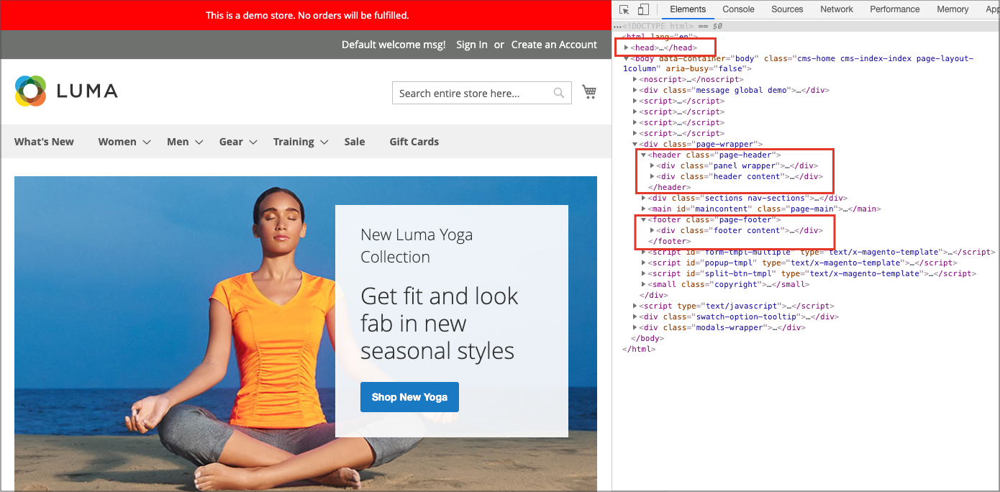
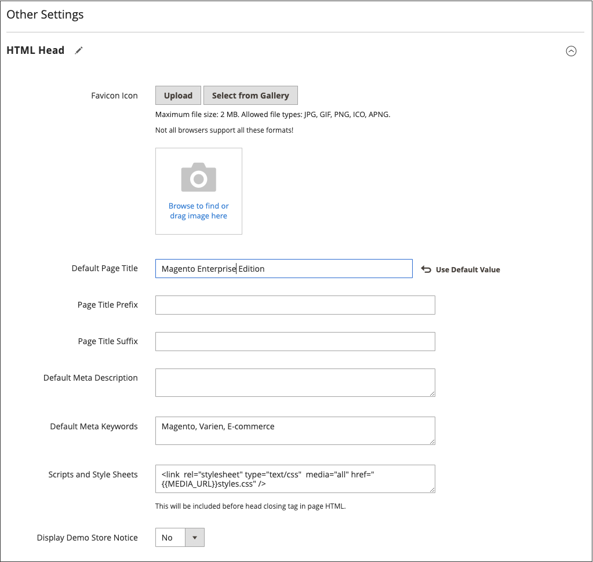
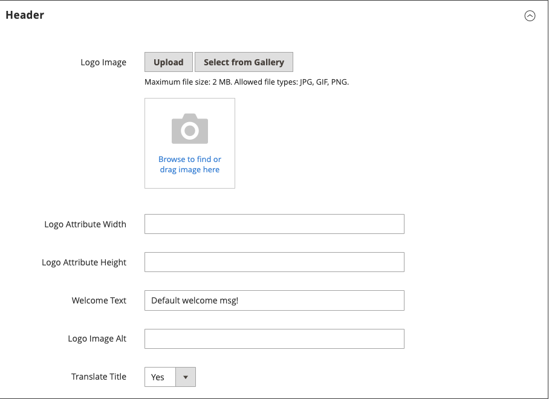
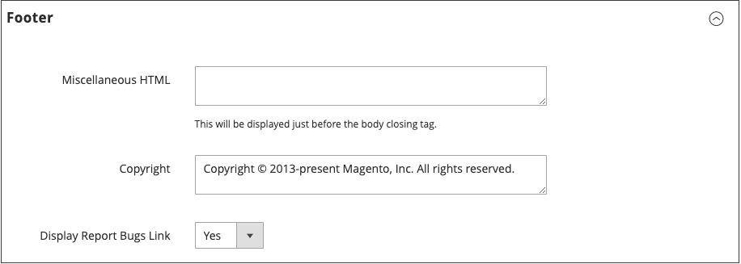

# Page Setup

The main sections of the page are controlled, in part, by a set of standard HTML tags. Some of these tags can be used determine the selection of fonts, color, size, background colors, and images that are used in each section of the page. Other settings control page elements such as the logo in the header, and the copyright notice in the footer. These sections correspond to the underlying structure of the HTML page, and many of the basic properties can be set from the Admin.

- [HTML Head](#html-head)
- [Header](#header)
- [Footer](#footer)

<!-- zoom -->

## HTML Head

The settings in the HTML Head section correspond to the `<head>` tag of an HTML page, and can be configured for each store view. In addition to meta data for the page title, description, and keywords, the section includes a link to the favicon, and miscellaneous scripts. Instructions for search engine robots and the display of the store demo notice are also configured in this section.

### Configure the HTML Head

1. On the _Admin_ sidebar, go to **Content** > _Design_ > **Configuration**.

1. Find the store view that you want to configure and click **Edit** in the _Action_ column.

1. Under _Other Settings_, expand  the **HTML Head** section.

   <!-- zoom -->

1. Update the [favicon](../getting-started/storefront-branding.md#add-a-favicon) if needed.

1. Update the page title settings according to your needs:

   - **Default Page Title**
   - **Page Title Prefix**
   - **Page Title Suffix**

   You can use a suffix and/or prefix with the default title to create a two-or three part title. You can add a vertical bar or colon as a separator between the prefix or suffix and the default title.

1. Add or modify meta data to support Search Engine Optimization (SEO) and help steer customers to your store from search results:

   - **Default Meta Description**
   - **Default Meta Keywords**

1. Enter any **Scripts and Style Sheets** as needed.

1. Enable or disable the [demo store notice](../getting-started/storefront-branding.md#set-the-store-demo-notice) if needed.

1. When complete, click **Save Configuration**.

### HTML Head field descriptions

|Field|Scope|Description|
|--- |--- |--- |
|Favicon Icon|Store View|Uploads the small graphic image that appears in the address bar and tab of the browser. Allowed file types: ICO, PNG, APNG, GIF, and JPG (JPEG). Not all browsers support these formats.|
|Default Page Title|Store View|The title that appears at the title bar of each page when viewed in a  browser. The default title is used for all pages, unless another title is specified for individual pages.|
|Page Title Prefix|Store View|A prefix can be added before the title to create a two- or three-part title. A vertical bar or colon can be used  as a separator at the end of the prefix to differentiate it from the text of the main title.|
|Page Title Suffix|Store View|A suffix can be added after the title to create a two-or three part title. A vertical bar or colon can be used as a separator at the end of the prefix to differentiate it from the text of the main title.|
|Default Meta Description|Store View|The description provides a summary of your site for search engine listings and should not be more than 160 characters in length.|
|Default Meta Keywords|Store View|A series of keywords that describe your store, each separated by a comma.|
|Scripts and Style Sheets|Store View|Contains scripts that must be included in the HTML before the closing `<head>` tag. For example, any third-party JavaScript that must be placed before the `<body>` tag can be entered here.|
|Display Demo Store Notice|Store View|Controls the display of the demo store notice at the top of the page. Options include: Yes / No|

{style="table-layout:auto"}

## Header

The Header configuration identifies the path to your store logo and specifies the logo alt text and welcome message.

<!-- zoom -->

### Configure the header

1. On the _Admin_ sidebar, go to **Content** > _Design_ > **Configuration**.

1. Find the store view that you want to configure and click **Edit** in the _Action_ column.

1. Under _Other Settings_, expand  the **Header** section.

1. Make any changes needed for the store view:

   - [Logo](../getting-started/storefront-branding.md#upload-your-logo) settings
   - [Welcome message](../getting-started/storefront-branding.md#change-the-welcome-message) settings

1. When complete, click **Save Configuration**.

### Header field descriptions

|Field|Scope|Description|
|--- |--- |--- |
|Logo Image|Store View|Identifies the path to the logo that appears in the header. Supported file types: PNG, GIF, JPG (JPEG)|
|Logo Attribute Width|Store View|The width of your logo image in pixels.|
|Logo Attribute Height|Store View|The height of your logo image in pixels.|
|Welcome Text|Store View|The welcome message appears in the header of the page and  includes the name of customers who are logged in.|
|Logo Image Alt|Store View|The Alt text that is associated with the logo.|
|Translate Title|Store View|Determines if the `Page Title` or `Meta Title` should be translated.|

{style="table-layout:auto"}

## Footer

The Footer configuration section is where you can update the [copyright notice](../getting-started/storefront-branding.md#change-the-copyright-notice) that appears at the bottom of the page, and enter miscellaneous scripts that must be positioned before the closing `<body>` tag.

<!-- zoom -->

### Configure the footer

1. On the _Admin_ sidebar, go to **Content** > _Design_ > **Configuration**.

1. Find the store view that you want to configure and click **Edit** in the _Action_ column.

1. Under _Other Settings_, expand  the **Footer** section.

1. Make any changes necessary to the **Copyright** and **Miscellaneous HTML** settings.

1. When complete, click **Save Configuration**.

## Footer field descriptions

|Field|Scope|Description|
|--- |--- |--- |
|Miscellaneous HTML|Store View|An input box where you can upload miscellaneous scripts to the server that must be placed just before the closing `<body>` tag.|
|Copyright|Store View|The copyright statement that appears at the bottom of each page. To include the copyright symbol, use the HTML character entity `\&copy;` as in the following: `\&copy; 2021 Commerce Demo Store. All Rights Reserved.` Make sure to replace the sample copyright notice with your own.|
|Display Report Bugs Link|Store View|Allows the bug report link (supported for some themes) to be enabled or disabled.|

{style="table-layout:auto"}
