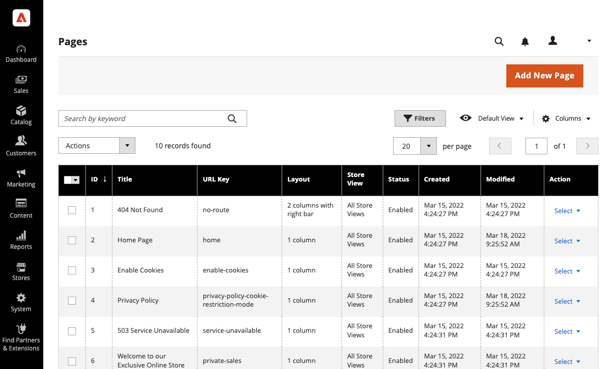
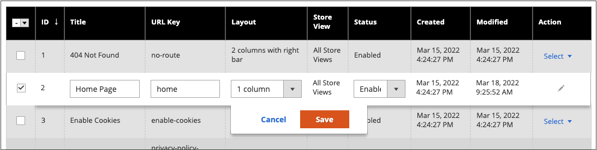
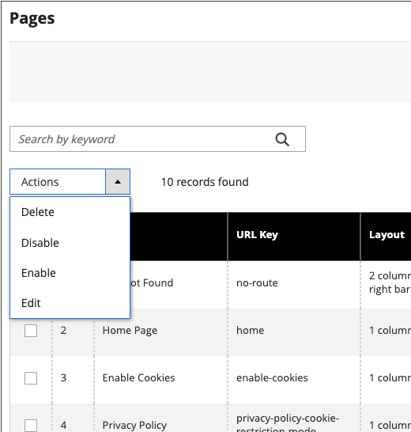
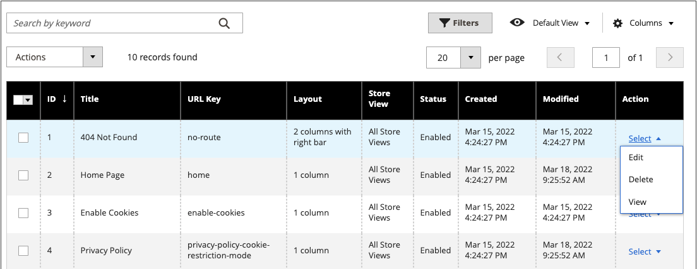
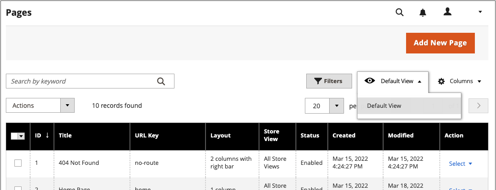
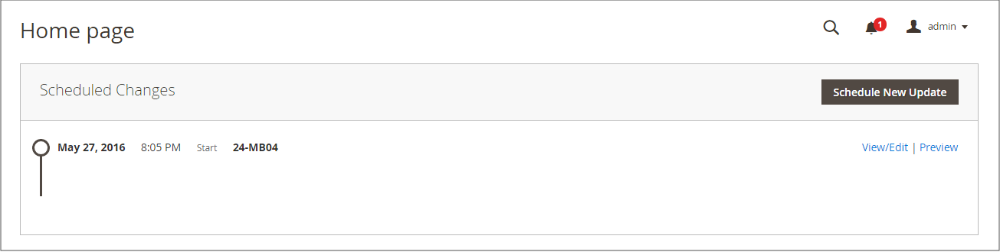

# Page workspace controls

The page workspace includes tools to help you quickly find the pages you need, and commands to perform routine maintenance on individual or multiple pages. You can also quickly update page properties from the grid.

{width="700" zoomable="yes"}

## Quickly update page properties

1. On the _Admin_ sidebar, go to **[!UICONTROL Content]** > _[!UICONTROL Elements]_ > **[!UICONTROL Pages]**.
1. Click any row in the grid.

   {width="600" zoomable="yes"}

   To select multiple records, select the checkbox of each row that you want to update.

1. Update any of the following properties:

   - **[!UICONTROL Title]**
   - **[!UICONTROL URL Key]**
   - **[!UICONTROL Status]**
   - **[!UICONTROL Layout]**

1. When complete, click **[!UICONTROL Save]**.

## Workspace controls

|Control|Description|
|--- |--- |
|[!UICONTROL Add New Page]|Adds a page.|
|[!UICONTROL Search]|Initiates a catalog search based on the current filters.|
|[!UICONTROL Actions]|Lists all actions that can be applied to selected items in the list. To apply an action to a page, or to multiple pages, select the checkbox in the first column of each record that is subject to the action. Options: `Delete` / `Disable` / `Enable` / `Edit`|
|[!UICONTROL Select]|The control in the header of the first column can be used to select multiple records as the target of action. Select the checkbox in the first column of each record that you want to select. Options: `Select All` / `Deselect All`|
|[!UICONTROL Save Edits]|Applies the current action to selected records.|
|[!UICONTROL Edit]|Opens the record in edit mode. You can accomplish the same thing by clicking anywhere on the row.|

{style="table-layout:auto"}

## Columns

|Column|Description|
|--- |--- |
|[!UICONTROL Select]|The checkbox in the first column is used to select multiple records. Options: `Select All` / `Deselect All`|
|[!UICONTROL ID]|The ID is an incrementing number that is assigned to each page.|
|[!UICONTROL Title]|The title that appears at the top of the page.|
|[!UICONTROL URL Key]|The URL key is similar to a file name, and identifies the page in the URL.|
|[!UICONTROL Layout]|Determines if the page appears with sidebars to the right or left of the main content area. Options: `1 column` / `2 columns with left bar` / `2 columns with right bar` / `3 columns` / `Empty`|
|[!UICONTROL Store View]|Used to associate the page with a specific store view.|
|[!UICONTROL Status]|Indicates if the page is online or offline. Options: `Enabled` / `Disabled`|
|[!UICONTROL Created]|The date the page was created.|
|[!UICONTROL Modified]|The date the page was last modified.|
|[!UICONTROL Action]|The actions that can be applied to an individual record include: **[!UICONTROL Edit]** - Opens the page in edit mode. **[!UICONTROL Delete]** - Deletes the page. **[!UICONTROL View]** - Displays the page in preview mode.  |

{style="table-layout:auto"}

## Other columns

|Column|Description|
|--- |--- |
|[!UICONTROL Custom design from/to]|Specifies the start and end date when the selected design is applied to the page.  (Magento Open Source only).|
|[!UICONTROL Custom Theme]|Applies a custom theme to the page|
|[!UICONTROL Custom Layout]|Determines the custom layout of the page|
|[!UICONTROL Meta Title]|Meta title for the page|
|[!UICONTROL Meta Keywords]|The meta keywords for the page|
|[!UICONTROL Meta Description]|The meta description for the page|

{style="table-layout:auto"}

## Page Search

The Search box in the upper left of the _[!UICONTROL Pages]_ grid can be used to find specific pages by keyword. For a more advanced search, you can [filter](../getting-started/admin-grid-controls.md) the search by multiple parameters.

### Search by keyword

1. Enter a search term into the page search box.

1. To display the results, click the Search () icon.

   The results include all pages that contain the keyword.

### Filter the search results

1. If necessary, click **[!UICONTROL Clear All]** to clear the previous search criteria.

1. To display the selection of search filters, click the **[!UICONTROL Filters]** !([Funnel icon](../assets/icon-filter-search.png)) tab.

1. Complete as many of the filters as necessary to describe the pages that you want to find.

1. Click **[!UICONTROL Apply Filters]** to display the results.

### Search filters

|Filter|Description|
|--- |--- |
|[!UICONTROL ID]|Filter the search by page record ID.|
|[!UICONTROL Title]|Filter the search based on the page title.|
|[!UICONTROL URL Key]|Filter the search by the URL Key.|
|[!UICONTROL Created]|Filter the search by the date the page was created.|
|[!UICONTROL Modified]|Filter the search based on the date the page was last modified.|
|[!UICONTROL Store View]|Filter the search based on store view. Options: `All available` / `Store Views`|
|[!UICONTROL Layout]|Filter the search based on page layout. Options: `1 column` / `2 columns with left bar` / `2 columns with right bar` / `3 columns` / `Empty`|
|[!UICONTROL Status]|Filter the search on the page status. Options: `Disabled` / `Published`|
|[!UICONTROL Custom design from / to]|Filter the search by the start and end date when the selected design is applied to the page.  (Magento Open Source only).|
|[!UICONTROL Asset]|Filter the search by the page title assets|
|[!UICONTROL Custom Layout]|Filter the search based on a custom layout. Options: `1 column` / `2 columns with left bar` / `2 columns with right bar` / `3 columns` / `Empty` / `Page -- Full Width` / `Category -- Full Width` / `Product -- Full Width`|
|[!UICONTROL Custom Theme]|Filter the search based on a custom theme. Default options: `Magento Blank` / `Magento Luma`|
|[!UICONTROL Meta Keywords]|Filter the search based on the meta keywords for the page.|
|[!UICONTROL Meta Title]|Filter the search based on the meta title for the page.|
|[!UICONTROL Meta Description]|Filter the search based on the meta description for the page.|

{style="table-layout:auto"}

### Search tools

|Tool|Description|
|--- |--- |
|[!UICONTROL Apply Filters]|Applies all filters to the search results.|
|[!UICONTROL Cancel]|Cancels the current search.|
|[!UICONTROL Clear All]|Clears all search filters.|

{style="table-layout:auto"}

## Page Actions

Pages can be edited, disabled, enabled, and deleted. To apply an action to an individual page, select the checkbox in the first column. To select or deselect all pages, use the selection control at the top of the column.

{width="400" zoomable="yes"}

### Single Action

Use the _[!UICONTROL Action]_ column on the far right to apply any of the following actions to the individual page:

- [!UICONTROL Edit] - opens the page in edit mode
- [!UICONTROL Delete] - deletes the page (requires confirmation)
- [!UICONTROL View] - opens a page directly on the storefront

{width="600" zoomable="yes"}

### Mass Actions

Apply any of the following actions to several selected pages at the same time using the _[!UICONTROL Action]_ selector at the top-left corner:

- [!UICONTROL Delete] - deletes the pages (requires confirmation)
- [!UICONTROL Disable] - disables the pages on the storefront
- [!UICONTROL Enable] - enables the pages on the storefront
- [!UICONTROL Edit] - opens columns on the grid in edit mode (**[!UICONTROL Title]**, **[!UICONTROL URL Key]**, **[!UICONTROL Layout]**, and **[!UICONTROL Status]**)

## Page Grid Layout

The selection of columns and their order in the grid can be changed according to your preference. To keep the new column arrangement, you can save it as a view.

### Change the selection of columns

In the upper-right corner, click the _Columns_ () control and do the following:

- Select the checkbox of any column that you want to add to the grid.

- Clear the checkbox of any column that you want to remove from the grid.

### Move a column

1. Click the header of the column and hold.

1. Drag the column to the new position and release.

### Save a view

1. Click the _View_ () control and then click **[!UICONTROL Save View As]**.

1. Enter a name for the view.

1. To save the view, click the _Arrow_ ().

   The name of the view now appears as the current view.

### Change the view

Click the _View_ () control and do one of the following:

- Choose the view that you want to use.

- Change the name of a view by clicking the Edit () icon and updating the name.

   {width="600" zoomable="yes"}

## Scheduled Changes

{{ee-feature}}

Page changes can be applied on schedule, and grouped with other content changes. You can create a campaign based on scheduled changes to a page, or apply the changes to an existing campaign. For more information, see [Content Staging](content-staging.md).

>[!NOTE]
>
>If a campaign is linked to more than one page, the campaign can be edited only from the [Content Staging Dashboard](content-staging-dashboard.md).

>[!NOTE]
>
>The [!UICONTROL Custom Design Update] tab has been removed in  Adobe Commerce and cannot be modified directly on the page. You must create a scheduled update for these activations.

>[!NOTE]
>
>All scheduled updates are applied consecutively, which means that any entity can have only one scheduled update at one point. Any scheduled update is applied to all store views within its time frame. As a result, an entity cannot have a different scheduled update for different store views at the same time. All entity attribute values within all store views, which are not affected by the current scheduled update, are taken from the default values, and not from the previous scheduled update.

{width="600" zoomable="yes"}

>[!NOTE]
>
>Campaign Start Date and End Date must be defined by using the **_default_** Admin time zone, which is converted from the local time zone of each website. Consider an example where you have multiple websites in different time zones, but you want to start a campaign based on a US time zone. In this case, you must schedule a separate update for each local time zone, and set **[!UICONTROL Start Date]** and **[!UICONTROL End Date]** in converted from each local website time zone to the default Admin time zone.

Also, you can schedule and preview changes for product updates. For more information, see [Scheduling an Update](content-staging-scheduled-update.md).
