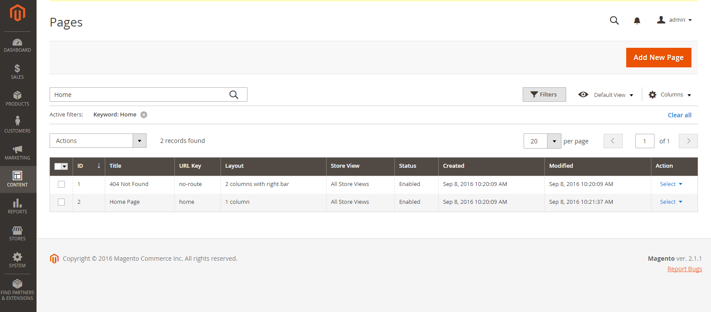
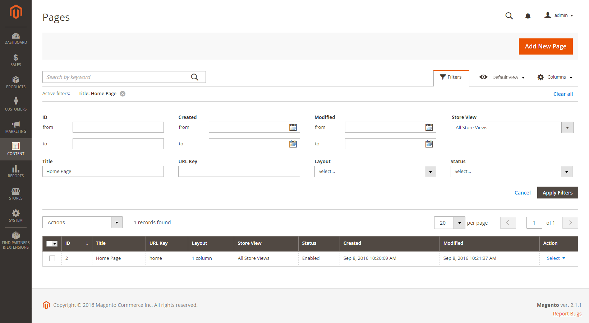
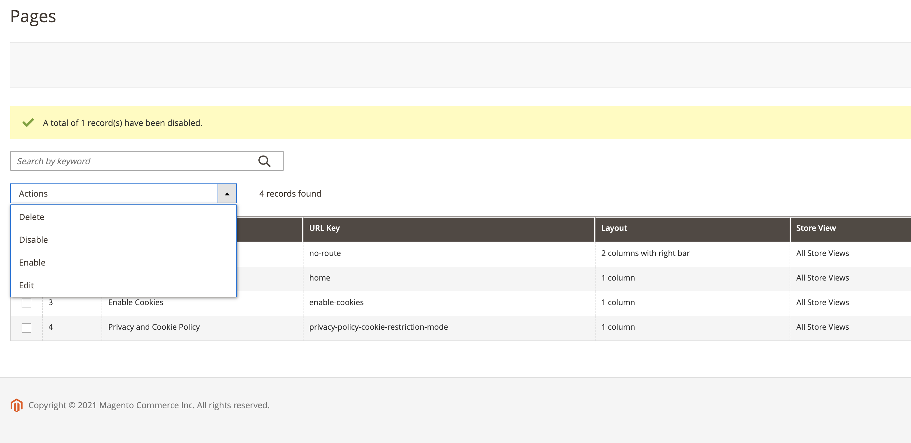
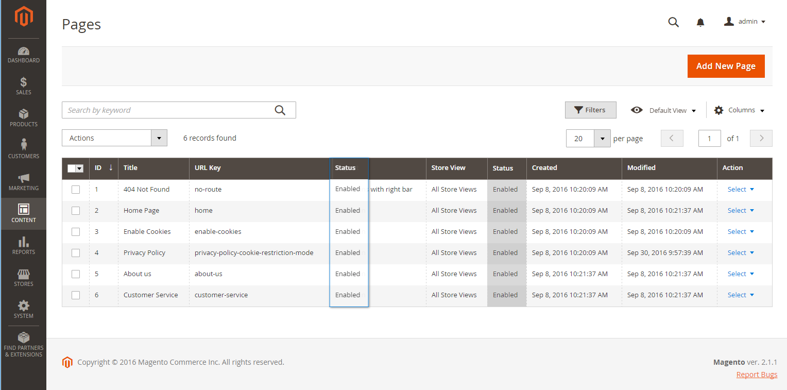
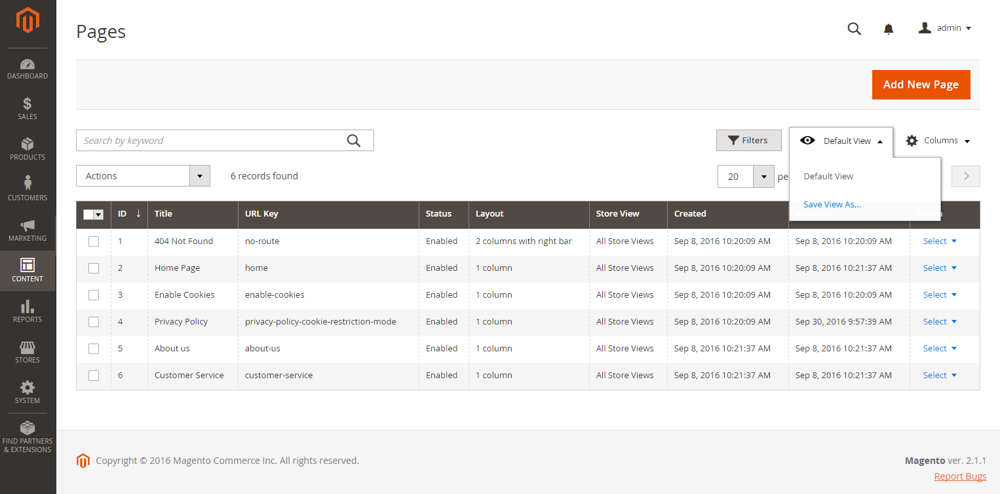

# Page Workspace Controls

The page workspace includes tools to help you quickly find the pages you need, and commands to perform routine maintenance on individual or multiple pages. You can also quickly update page properties from the grid.

<!-- zoom -->

## Quickly update page properties

1. Click any row in the grid.

   <!-- zoom -->

   To select multiple records, select the checkbox of each row that you want to update.

1. Update any of the following properties:

   - **Title**
   - **URL Key**
   - **Status**
   - **Layout**

1. When complete, click **Save**.

## Workspace controls

|Control|Description|
|--- |--- |
|Add New Page|Adds a new page.|
|Search|Initiates a catalog search based on the current filters.|
|Actions|Lists all actions that can be applied to selected items in the list. To apply an action to a page, or to multiple pages, select the checkbox in the first column of each record that is subject to the action. Options: Delete / Disable / Enable / Edit|
|Select|The control in the header of the first column can be used to select multiple records as the target of action. Select the checkbox in the first column of each record that you want to select. Options: Select All / Deselect All|
|Save Edits|Applies the current action to selected records.|
|Edit|Opens the record in edit mode. You can accomplish the same thing by clicking anywhere on the row.|

{style="table-layout:auto"}

## Columns

|Column|Description|
|--- |--- |
|Select|The checkbox in the first column is used to select multiple records. Options: Select All / Deselect All|
|ID|The ID is an incrementing number that is assigned to each page.|
|Title|The title that appears at the top of the page.|
|URL Key|The URL key is similar to a file name, and identifies the page in the URL.|
|Layout|Determines if the page appears with sidebars to the right or left of the main content area. Options: 1 column / 2 columns with left bar / 2 columns with right bar / 3 columns / Empty|
|Store View|Used to associate the page with a specific store view.|
|Status|Indicates if the page is currently online or offline. Options: Enabled / Disabled|
|Created|The date the page was created.|
|Modified|The date the page was last modified.|
|Action|The actions that can be applied to an individual record include: **Edit** - Opens the page in edit mode. **Delete** - Deletes the page. **View** - Displays the page in preview mode.  |

{style="table-layout:auto"}

## Other columns

|Column|Description|
|--- |--- |
|Custom design from/to|Specifies the start and end date when the selected design is applied to the product page|
|Custom Theme|Applies a custom theme to the page|
|Custom Layout|Determines the custom layout of the page|
|Meta Title|Meta title for the page|
|Meta Keywords|The page meta keywords|
|Meta Description|The page meta description|

{style="table-layout:auto"}

## Page Search

The Search box in the upper-left of the _Pages_ grid can be used to find specific pages by keyword. For a more advanced search, you can [filter](https://docs.magento.com/user-guide/stores/admin-grid-controls.html) the search by multiple parameters.

<!-- zoom -->

### Search by keyword

1. Enter a search term into the page search box.

1. Click the Search () icon to display the results.

   The results include all pages that contain the keyword.

### Filter the search results

1. If necessary, click **Clear All** to clear the previous search criteria.

1. Click the **Filters**  tab to display the selection of search filters.

1. Complete as many of the filters as necessary to describe the page(s) that you want to find.

1. Click **Apply Filters** to display the results.

<!-- zoom -->

### Search filters

|Filter|Description|
|--- |--- |
|ID|Filter the search by page record ID.|
|Title|Filter the search based on the page title.|
|URL Key|Filter the search by the URL Key.|
|Created|Filter the search by the date the page was created.|
|Modified|Filter the search based on the date the page was last modified.|
|Store View|Filter the search based on store view. Options: All available / Store Views|
|Layout|Filter the search based on page layout. Options: 1 column / 2 columns with left bar / 2 columns with right bar / 3 columns / Empty|
|Status|Filter the search on the page status. Options: Disables / Published|
|Custom design from / to|Filter the search by the start and end date when the selected design is applied to the product page|
|Asset|Filter the search by the page title assets|
|Custom Layout|Filter the search based on custom layout. Options: 1 column / 2 columns with left bar / 2 columns with right bar / 3 columns / Empty / Page -- Full Width / Category -- Full Width / Product -- Full Width|
|Custom Theme|Filter the search based on custom theme. Options: Magento Blank / Magento Luma|
|Meta Keywords|Filter the search based on the page meta keywords.|
|Meta Title|Filter the search based on the page meta title.|
|Meta Description|Filter the search based on the page meta description.|

{style="table-layout:auto"}

### Search tools

|Tool|Description|
|--- |--- |
|Apply Filters|Applies all filters to the search results.|
|Cancel|Cancels the current search.|
|Clear All|Clears all search filters.|

{style="table-layout:auto"}

## Page Actions

Pages can be edited, disabled, enabled, and deleted. To apply an action to an individual page, select the checkbox in the first column. To select or deselect all pages, use the selection control at the top of the column.

<!-- zoom -->

### Single Action

Use the _Action_ column on the far right to apply any of the following actions to the individual page:

- Edit - opens the page in edit mode
- Delete - deletes the page (requires confirmation)
- View - opens a page directly on the storefront

<!-- zoom -->

### Mass Actions

Use the _Action_ selector at the top-left corner to apply any of the following actions to several selected pages at the same time:

- Delete - deletes the pages (requires confirmation)
- Disable - disables the pages on the storefront
- Enable - enables the pages on the storefront
- Edit - opens columns on the grid in edit mode (**Title**, **URL Key**, **Layout**, and **Status**)

<!-- zoom -->

## Page Grid Layout

The selection of columns and their order in the grid can be changed according to your preference. To keep the new column arrangement, you can save it as a view.

<!-- zoom -->

### Change the selection of columns

In the upper-right corner, click the _Columns_ () control and do the following:

- Select the checkbox of any column you want to add to the grid.

- Clear the checkbox of any column you want to remove from the grid.

### Move a column

1. Click the header of the column and hold.

1. Drag the column to the new position and release.

### Save a view

1. Click the _View_ () control and then click **Save View As**.

   <!-- zoom -->

1. Enter a name for the view.

1. Click the _Arrow_ () to save the view.

   The name of the view now appears as the current view.

### Change the view

Click the _View_ () control and do one of the following:

- Choose the view that you want to use.

- Change the name of a view by clicking the Edit () icon and updating the name.

<!-- zoom -->

## Scheduled Changes

{{ee-feature}}

Page changes can be applied on schedule, and grouped with other content changes. You can create a new campaign based on scheduled changes to a page, or apply the changes to an existing campaign. For more information, see [Content Staging](content-staging.md).

>[!NOTE]
>
>All scheduled updates are applied consecutively. This means that any entity can have only one scheduled update at one point of time. Any scheduled update is applied to all store views within its time frame. As a result, an entity cannot have different scheduled updates for different store views at the same time. All entity attribute values within all store views, which are not affected by the current scheduled update, are taken from the default values, and not from the previous scheduled update.

<!-- zoom -->

>[!NOTE]
>
>Campaign **Start Date** and **End Date** must be defined by using the **_default_** Admin time zone, which is converted from each website local time zone. For example, if you have multiple websites in different time zones, but you want to start campaign based on a US time zone, you need to schedule separate update for each local time zone, and set **Start Date** and **End Date** in converted from each local website time zone to default Admin time zone.

Also, you can schedule and preview changes for product updates. For more information, see [Scheduling an Update](content-staging-scheduled-update.md).
