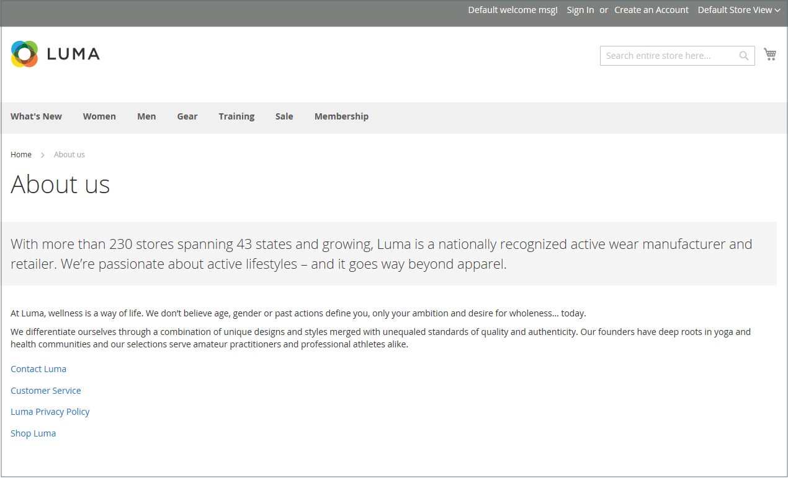
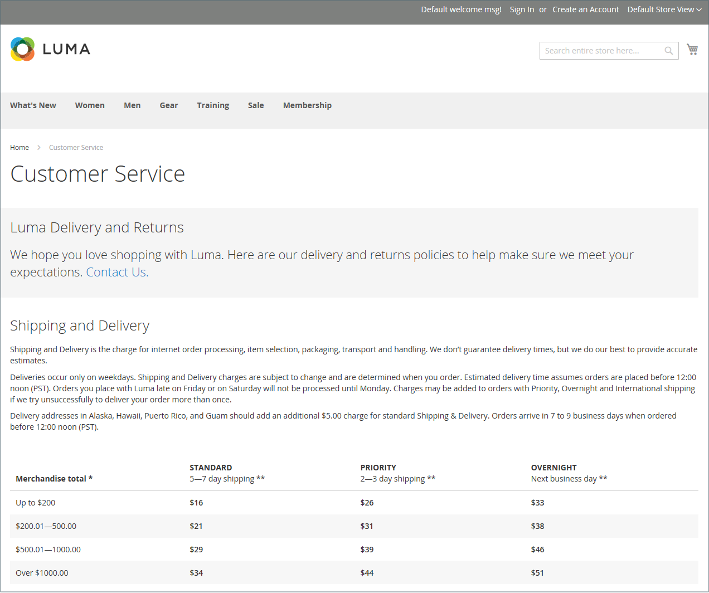
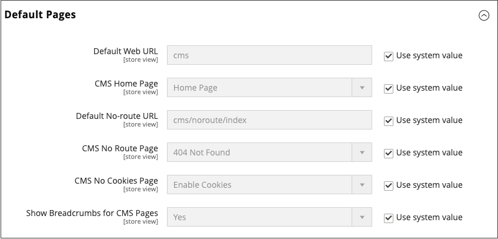

# Pages

Content can be viewed in terms of its shelf life, just as any product in a store. Did you know that the shelf life of social media content is less than 24 hours? The potential shelf life of the content you create can help you decide where to invest your resources.

Content with a long shelf life is sometimes referred to as _evergreen content_. Examples of evergreen content include customer success stories, _how to_ instructions, and Frequently Asked Questions (FAQ). In contrast, content that is perishable by nature includes events, industry news, and press releases.

{width="700" zoomable="yes"}

## Core Content pages

The [!DNL Commerce] demo store has examples of core content pages to help you get started. All of these pages can be modified to meet your needs. Look at the following pages in your store and make sure that the content conveys your message, voice, and brand.

### Home

The demo [Home](../getting-started/storefront.md#home-page) page includes a banner, an image carousel, several static blocks with links, and a list of new products.

### Privacy Policy

The store [Privacy Policy](../getting-started/privacy-policy.md) page should be updated with your own information. As a best practice, your privacy policy should explain to your customers the type of information that your company collects and how it is used.

### 404 Not Found

The 404 Page Not Found page is named for the response code that is returned when a page cannot be found. URL redirects reduce the number of times that this page appears. However, for those times when it is necessary, you might as well take advantage of the opportunity to offer some links to products that the customer might find interesting.

### Access Denied

{{b2b-feature}}

The [Access Denied](../b2b/account-company-roles-permissions.md) page appears when the permissions that are assigned to a company user prevent access to the page.

### Enable Cookies

The [Enable Cookies](../getting-started/compliance-cookie-law.md) page appears when visitors to your site do not have cookies enabled in their browsers. The page provides step-by-step, illustrated instructions to enable cookies for the most popular browsers.

### Service Unavailable

The [503 Service Unavailable](../configuration-reference/general/general.md) page is named for the response code that is returned when the server is unavailable.

### About Us

The About Us page is linked from the footer of your store. You can include images, video, links to press releases and announcements. The sample page has an image on the right, and a decorative one to indicate the end of the page.

### Customer Service

The Customer Service page is another node in the page hierarchy. The two headers on the page have content that only becomes visible when the customer clicks the header.

{width="700" zoomable="yes"}

## Configure default pages

The _Default Pages_ configuration determines the landing page that is associated with the [base URL](../stores-purchase/store-urls.md) and the corresponding home page. It also determines which page appears when a _Page Not Found_ error occurs, and if a [breadcrumb trail](../catalog/navigation-breadcrumb-trail.md) appears at the top of each page.

1. On the _Admin_ sidebar, go to  **[!UICONTROL Stores]** > _[!UICONTROL Settings]_ > **[!UICONTROL Configuration]**.

1. In the left panel under _[!UICONTROL General]_, choose **[!UICONTROL Web]**.

1. Expand  the **[!UICONTROL Default Pages]** section.

   {width="500" zoomable="yes"}

   |Field|[Scope](../getting-started/websites-stores-views.md#scope-settings)|Description|
   |--- |--- |--- |
   |[!UICONTROL Default Web URL]|Store View|Indicates the landing page that is associated with the base URL. By default, this field is set to `cms` to indicate a page from the [!DNL Commerce] content management system. You can also use a different type of landing page, such as a blog. For example, if a blog is installed on the server at `magento/blog`, you can enter the folder name `blog` as a relative path to the selection of pages.|
   |[!UICONTROL CMS Home Page]|Store View|To choose the home page for the store, simply select the CMS page from the list. By default, the CMS Home Page lists the entire selection of CMS pages that are available for your store.|
   |[!UICONTROL Default No-route URL]|Store View|Contains the URL of the default page that you want to appear when a `404 Page not Found` error occurs. The default value is `cms/noroute/index`.|
   |[!UICONTROL CMS No Route Page]|Store View|Identifies a specific CMS page that you want to appear when a 404 Page Not Found error occurs. The default page is `404 Not Found`.|
   |[!UICONTROL CMS No Cookies Page]|Store View|Identifies a specific CMS page that appears when cookies are not enabled for the browser. The page explains why cookies are used, and how to enable them for each browser. The default page is `Enable Cookies`.|
   |[!UICONTROL Show Breadcrumbs for CMS Pages]|Store View|Determines if a breadcrumb trail appears on all CMS pages in the catalog. Options: `Yes` / `No`|

   {style="table-layout:auto"}

1. For **[!UICONTROL Default Web URL]**, enter the relative path to the folder in the [!DNL Commerce] installation that contains the landing page.

   The default setting, `cms`, indicates a page from the [!DNL Commerce] content management system.

   >[!NOTE]
   >
   >For a specific store view, clear the **[!UICONTROL Use Default]** checkbox next to _[!UICONTROL Default Web URL]_, and any other default settings to be changed.

1. Set **[!UICONTROL CMS Home Page]** to the CMS page to be used as the home page. Other created pages may be used as the home page, such as:

   - Welcome to the Exclusive Online Store
   - Rewards Points
   - About Us
   - Customer Service
   - Enable Cookies
   - Privacy Policy
   - Company: Access Denied

1. For **[!UICONTROL Default No-route URL]**, enter the relative path to the folder in the [!DNL Commerce] installation where the page is redirected when a _404 Page Not Found_ error occurs.

   The default value is `cms/index/noRoute`.

1. Set **[!UICONTROL CMS No Route Page]** to the CMS page that appears when a _404 Page Not Found_ error occurs.

1. Set **[!UICONTROL CMS No Cookies Page]** to the CMS page that appears when cookies are disabled in the browser. The page explains why cookies are used, and how to enable them for each browser. The default page is `Enable Cookies`.

1. If you want a breadcrumb trail to appear at the top of all CMS pages, set **[!UICONTROL Show Breadcrumbs for CMS Pages]** to `Yes`.

1. When complete, click **[!UICONTROL Save Config]**.
