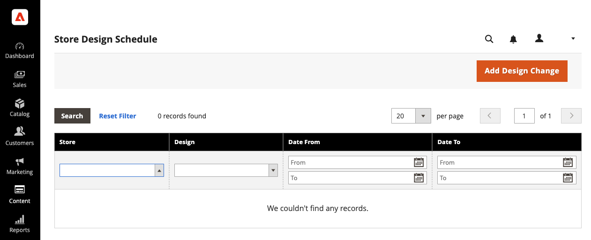
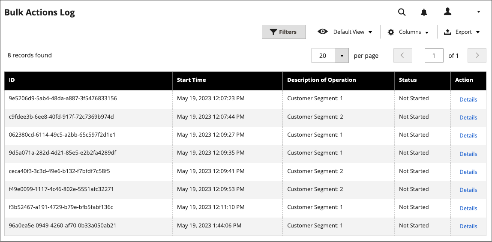
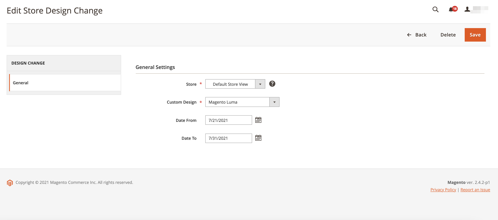

# Schedule Design Changes

Schedule your theme design changes in advance so that they go into effect according to your business cycles and events. You can use scheduled design changes for seasonal changes, promotions, or just to add variation.

<!-- zoom -->

## Schedule a design change

1. On the _Admin_ sidebar, go to **[!UICONTROL Content]** > _[!UICONTROL Design]_ > **[!UICONTROL Schedule]**.

1. Click **[!UICONTROL Add Design Change]**.

   <!-- zoom -->

1. Set **[!UICONTROL Store]** to the store view where you want to apply the changes.

1. Set **[!UICONTROL Custom Design]** to the theme, or variation of a theme, to be used.

1. For the **[!UICONTROL Date From]** and **[!UICONTROL Date To]**, click the _Calendar_ () icon to choose the start and end values for the period when the change is in effect.

1. When complete, click **[!UICONTROL Save]**.

## Edit scheduled design change

1. On the _Admin_ sidebar, go to **[!UICONTROL Content]** > _[!UICONTROL Design]_ > **[!UICONTROL Schedule]**.

1. Select the item that you want to edit.

1. Make the necessary changes.

1. When complete, click **[!UICONTROL Save]**.

## Delete scheduled design change

1. On the _Admin_ sidebar, go to **[!UICONTROL Content]** > _[!UICONTROL Design]_ > **[!UICONTROL Schedule]**.

1. Select the item that you want to delete.

1. In the button bar at the top of the page, click **[!UICONTROL Delete]**.

1. To confirm the action, click **[!UICONTROL OK]**.

   <!-- zoom -->
