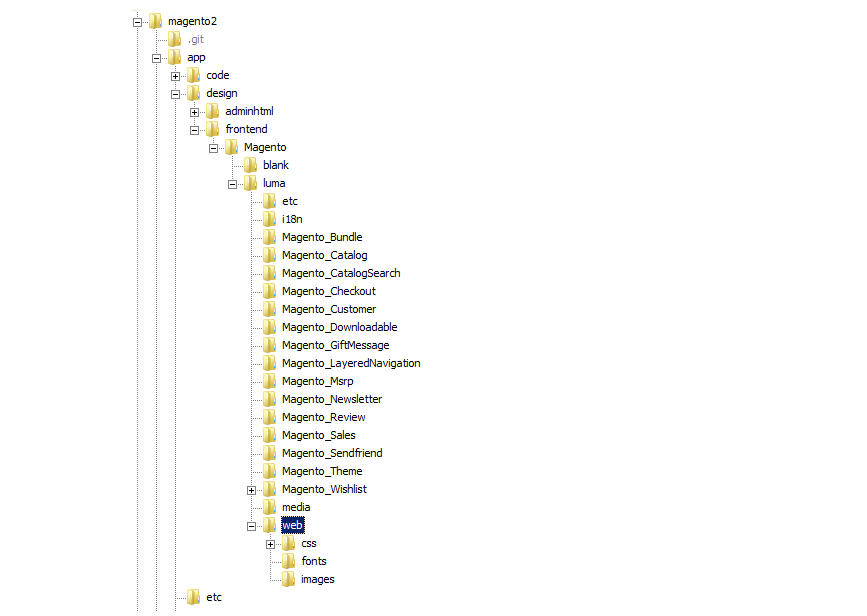

# Theme Assets

The term _static files_ refers to the collection of assets, such as CSS, fonts, images, and JavaScript, that is used by a theme. The location of static files is specified in the [Base URL](https://docs.magento.com/user-guide/stores/store-urls.html) configuration. You can add a digital signature to the URL of each static file to make it possible for browsers to detect when a newer version is available. The newer version of the file is used if the signature differs from what is stored in the browser cache.

For a standard installation, the assets associated with a theme are organized in the `web` folder at the following location below the Commerce root.

   `[commerce_root]/app/design/frontend/Magento/[theme_name]/web`

<!-- zoom -->

## Add a digital signature to static file URLs

1. On the _Admin_ sidebar, go to **Stores** > _Settings_ > **Configuration**.

1. In the left panel, expand **Advanced** and choose **Developer**.

1. Expand  the **Static Files Settings** section.

   <!-- zoom -->

1. Set **Sign Static Files** to `Yes`.

1. When complete, click **Save Config**.

|File type|Description|
|--- |--- |
|CSS|Control the visual styling that is associated with the skin. Example location on server: `[commerce]/app/design/frontend/Magento/[theme]/web/css`|
|Fonts|Supply the fonts that are available to be used by the theme. Location on server: `[commerce]/app/design/frontend/Magento/[theme]/web/fonts`|
|Images|Provide the graphical assets used by the theme, including buttons, background textures, and so on. Example location on server: `[commerce]/app/design/frontend/Magento/[theme]/web/images`|
|JS|Theme-specific JavaScript routines and callable functions. Example location on server: `[commerce]/app/design/frontend/Magento/[theme]/web/js`|

{style="table-layout:auto"}

## Merge CSS files

As part of an effort to optimize your site and reduce page load time, you can reduce the number of separate CSS files by merging them into a single, condensed file. If you open a merged CSS file, you will find one continuous stream of text, with line breaks removed. You cannot edit the merged file, so it is best to wait until you are out of the development mode and no longer making frequent changes to the CSS.

>[!NOTE]
>
>CSS files can be merged from the _Admin_ panel only when working in [Developer Mode](https://docs.magento.com/user-guide/magento/installation-modes.html).

1. On the _Admin_ sidebar, go to **Stores** > _Settings_ > **Configuration**.

1. In the left panel, expand **Advanced** and choose **Developer**.

1. Expand  the **CSS Settings** section.

   <!-- zoom -->
   
   [*CSS Settings*](https://docs.magento.com/user-guide/configuration/advanced/developer.html#css-settings)

1. Set **Merge CSS Files** to `Yes`.

1. When complete, click **Save Config**.

## Merge JavaScript files

Multiple JavaScript files can be merged into a single, condensed file to reduce page load time. If you open a merged JavaScript file, you will find one continuous stream of text, with line breaks removed. If you are finished with the development process and the code contains no errors, you might consider merging the files.

>[!NOTE]
>
>JavaScript files can be merged from the _Admin_ panel only when working in [Developer Mode](https://docs.magento.com/user-guide/magento/installation-modes.html).

1. On the _Admin_ sidebar, go to **Stores** > _Settings_ > **Configuration**.

1. In the left panel, expand **Advanced** and choose **Developer**.

1. Expand  the **JavaScript Settings** section.

   <!-- zoom -->

   [*JavaScript Settings*](https://docs.magento.com/user-guide/configuration/advanced/developer.html#javascript-settings)

1. Set **Merge JavaScript Files** to `Yes`.

1. When complete, click **Save Config**.
