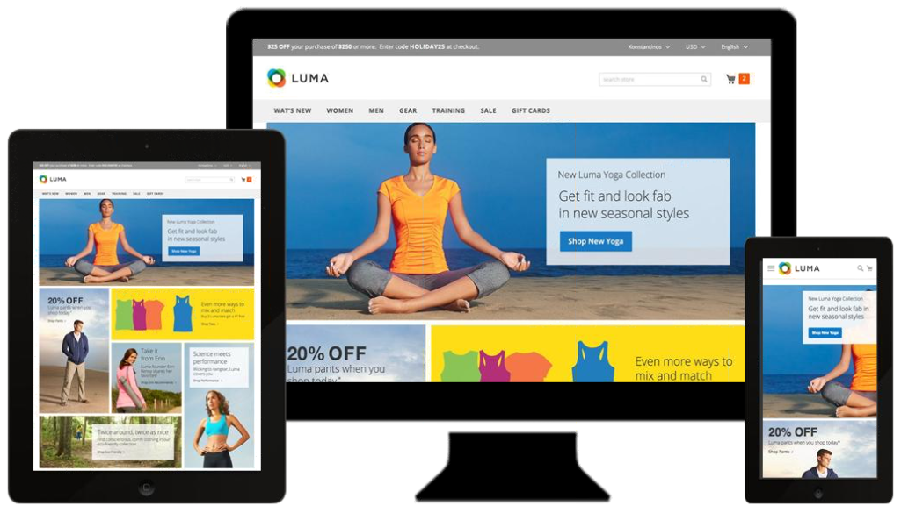
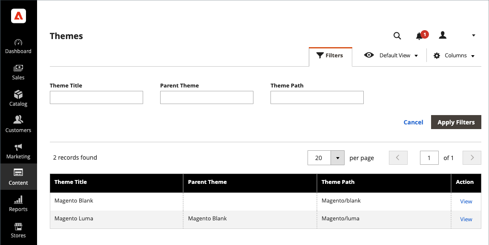
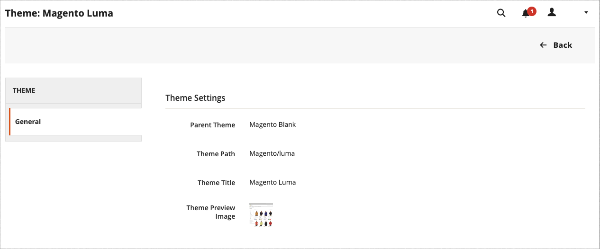
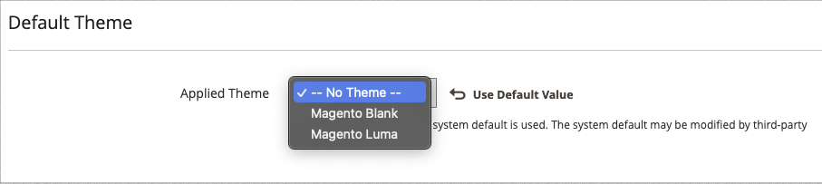
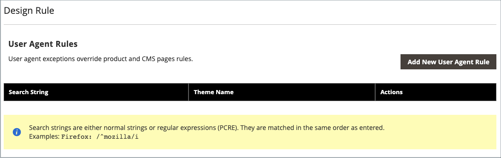

# Themes

A theme is a collection of files that determines the visual presentation of your store. When you first install [!DNL Commerce], the design elements of the store are based on the _Default_ theme. In addition to the initial default theme that comes with your [!DNL Commerce] installation, there is a wide variety of available themes that you can use _as is_ or modify for your needs.

A responsive theme adjusts the page layout to fit the view port of the device. The sample _Luma_ theme has a flexible, responsive layout that can be viewed from the desktop, tablet, or mobile device.

[!DNL Commerce] themes include layout files, template files, translation files, and skins. A skin is a collection of supporting CSS, images, and JavaScript files that together, create the visual presentation and interactions that your customers experience when they visit your store. Themes and skins can be modified and customized by a developer or designer who understands [!DNL Commerce] theme design and has access to your server. To learn more, see the [_Frontend Developer Guide_][1].

<!-- zoom -->

## The Default theme

The _[!DNL Magento Blank]_ responsive theme renders the display of your storefront for different devices and incorporates best practices for desktop, table, and mobile devices. Some themes are designed for use only with specific devices. When [!DNL Commerce] detects a specific browser ID, or user agent, it uses the theme that is configured for the specific browser. The search string can also include Perl-Compatible Regular Expressions (PCRE).

{width="700" zoomable="yes"}

### Filter the theme grid

1. On the _Admin_ sidebar, go to **[!UICONTROL Content]** > _[!UICONTROL Design]_ > **[!UICONTROL Themes]**.

1. Click **[!UICONTROL Filters]**.

1. Enter an ID range, theme name (or title), folder path, or parent theme.

1. Click **[!UICONTROL Apply Filters]** to update the list of themes.

## View the current theme settings

1. On the _Admin_ sidebar, go to **[!UICONTROL Content]** > _[!UICONTROL Design]_ >  **[!UICONTROL Themes]**.

1. In the list of installed themes, find the theme that you want to examine and click the row to display the settings.

1. To view a sample page, click the **[!UICONTROL Theme Preview Image]**.

{width="600" zoomable="yes"}

## Apply a default theme

1. On the _Admin_ sidebar, go to **[!UICONTROL Content]** > _[!UICONTROL Design]_ >  **[!UICONTROL Configuration]**.

1. Find the store view that you want to configure and click **[!UICONTROL Edit]** in the _[!UICONTROL Action]_ column.

1. Under _[!UICONTROL Default Theme]_, set **[!UICONTROL Applied Theme]** to the one that you want to use for the current view.

   {width="600" zoomable="yes"}

1. When complete, click **[!UICONTROL Save Configuration]**.

## Add a user agent rule

1. On the _Admin_ sidebar, go to **[!UICONTROL Content]** > _[!UICONTROL Design]_ >  **[!UICONTROL Configuration]**.

1. Under _[!UICONTROL Design Rule]_, click **[!UICONTROL Add New User Agent Rule]**.

   {width="600" zoomable="yes"}

1. For **[!UICONTROL Search String]**, enter the browser ID for the specific device.

   Search strings are matched in the order that they are entered. For example, for Firefox enter:

    `/^mozilla/i`

1. To enter additional devices, repeat the process.

1. When complete, click **[!UICONTROL Save Configuration]**.

[1]: https://developer.adobe.com/commerce/frontend-core/guide/themes/
