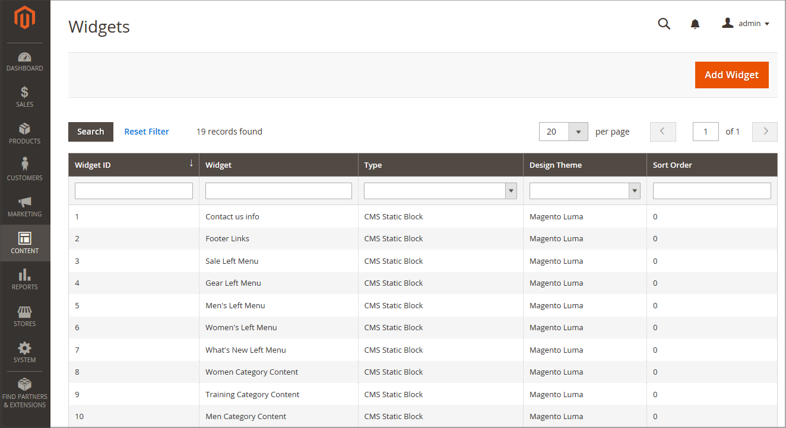
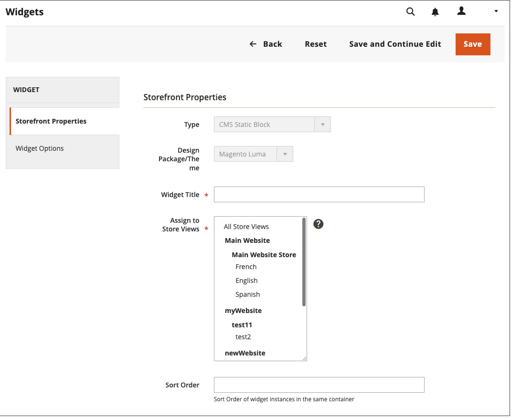

# Create and manage widgets

Widgets are reusable components. You can easily create widgets, and modify existing ones to automatically update content across your store. You can also delete widgets that are no longer in use.

{width="700" zoomable="yes"}

## Create a widget

The process of creating a widget is nearly the same for each [widget type](widgets.md#widget-types). You can follow the first part of the instructions, and then complete the last part for the specific type of widget you want.

### Step 1: Choose the type

1. On the _Admin_ sidebar, go to **[!UICONTROL Content]** > _[!UICONTROL Elements]_ > **[!UICONTROL Widgets]**.

1. Click **[!UICONTROL Add Widget]**.

1. In the _[!UICONTROL Settings]_ section:

   - Set **[!UICONTROL Type]** to the widget type that you want to create.

   - Verify that the **[!UICONTROL Design Theme]** is set to the current theme.

      {width="600" zoomable="yes"}

1. Click **[!UICONTROL Continue]**.

### Step 2: Specify storefront properties and layout

1. In the _[!UICONTROL Storefront Properties]_ section:

   - For **[!UICONTROL Widget Title]**, enter a descriptive title for the widget.

      This title is visible only from the Admin.

   - For **[!UICONTROL Assign to Store Views]**, select the store views where you want the widget to be visible.

      You can select a specific store view, or `All Store Views`. To select multiple views, hold down the Ctrl key (PC) or the Command key (Mac) and click each option.

   - (Optional) For **[!UICONTROL Sort Order]**, enter a number to determine the order this item appears with others in the same part of the page. (`0` = first, `1` = second, `3` = third, and so on.)

      {width="600" zoomable="yes"}

1. In the _[!UICONTROL Layout Updates]_ section, click **[!UICONTROL Add Layout Update]**.

1. Set **[!UICONTROL Display On]** to the type of page where it is to appear.

1. In the **[!UICONTROL Container]** list, choose the area of the page layout where it is to be placed.

   {width="600" zoomable="yes"}

1. If the widget is a link, set **[!UICONTROL Template]** to one of the following:

   - `Block Template` - Formats the content so it can be placed as standalone unit on the page.
   - `Inline Template` - Formats the content so it can be placed inside other content. For example, a link that goes inside a paragraph of text.

### Step 3: Complete the widget options

The options for each widget type vary slightly, but the process is essentially the same. The following example displays the product list for a specific category, with pagination controls.

1. In the left panel, choose **[!UICONTROL Widget Options]**.

1. Click **[!UICONTROL Select Block]**.

1. Enter a **[!UICONTROL Title]** to appear above the list, such as `Featured Products`.

1. For pagination controls, set **[!UICONTROL Display Page Control]** to `Yes`  and do the following:

   - Enter the **[!UICONTROL Number of Products per Page]**.

   - Enter the total **[!UICONTROL Number of Products to Display]**.

   - Set **[!UICONTROL Condition]** to the category of products to be featured.

      The process is the same as setting a condition for a [price rule](../merchandising-promotions/price-rules-catalog.md).

### Step 4: Save and check the result

1. When complete, click **[!UICONTROL Save]**.

1. When prompted, follow the instructions at the top of the workspace to update the cache as needed.

1. Return to your storefront to verify that the widget is working correctly.

   To move it to a different location, you can reopen the widget and try a different page or block reference.

## Widget creation demo

To learn about creating widgets, watch this video:

>[!VIDEO](https://video.tv.adobe.com/v/343786?quality=12&learn=on)

## Edit a widget

1. On the _Admin_ sidebar, go to **[!UICONTROL Content]** > _[!UICONTROL Elements]_ > **[!UICONTROL Widgets]**.

1. Locate the widget by using the filters above the grid and then click the widget name.

1. Make needed changes.

   Review the steps for creating a widget for information about the widget options.

1. Click the **[!UICONTROL Save]**.

## Delete a widget

1. On the _Admin_ sidebar, go to **[!UICONTROL Content]** > _[!UICONTROL Elements]_ > **[!UICONTROL Widgets]**.

1. Locate the widgets by using the filters above the grid and then select the checkbox of the widgets to be deleted.

1. In the upper-left corner of the list, set **[!UICONTROL Actions]** to `Delete`.

1. When complete, click **[!UICONTROL Submit]**.

1. To confirm the action, click **[!UICONTROL OK]**.
