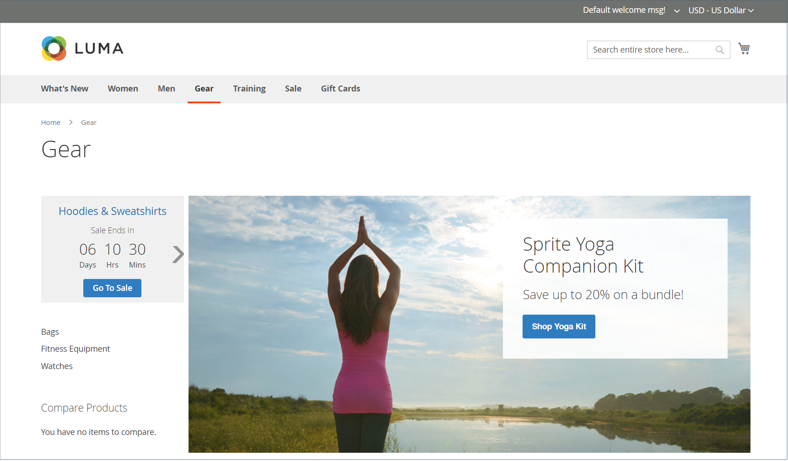
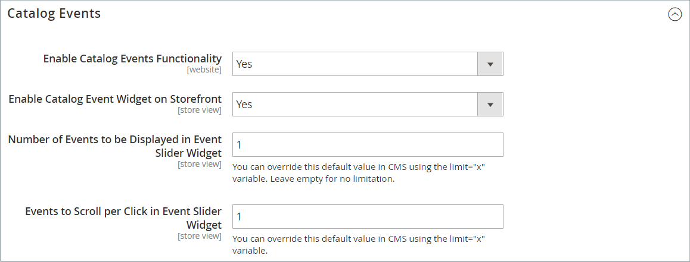
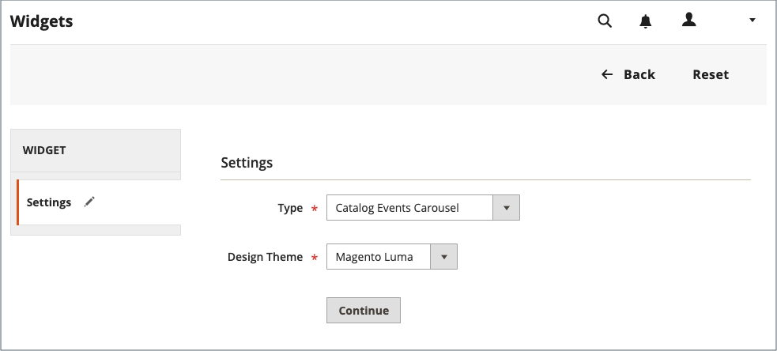
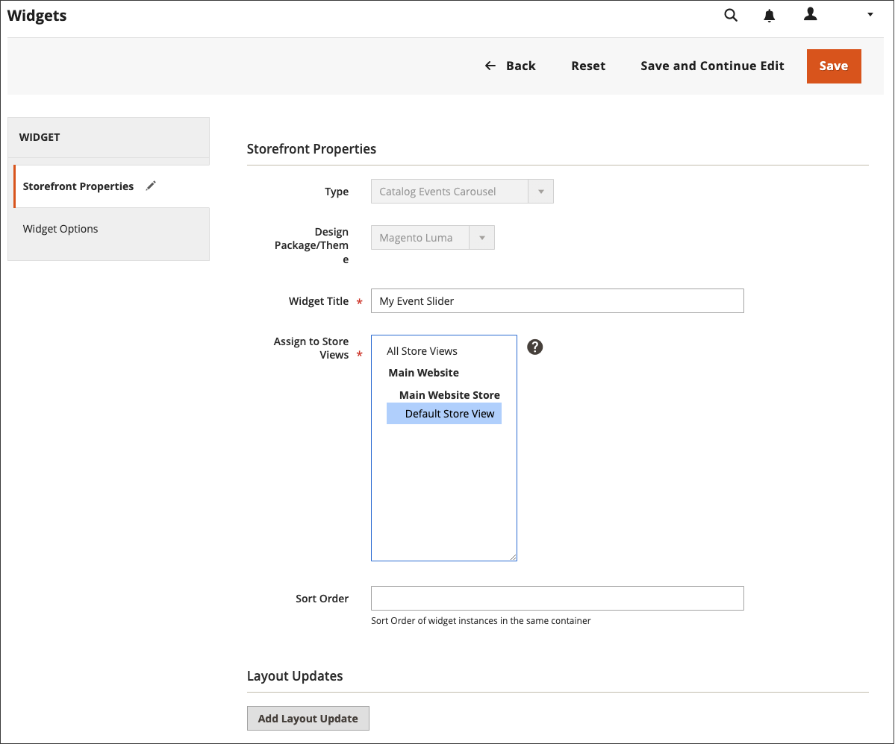
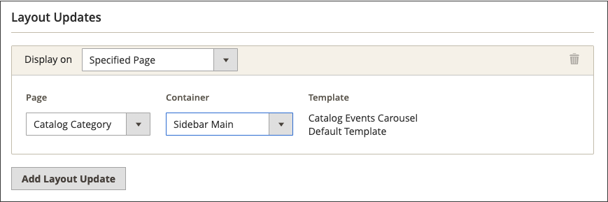
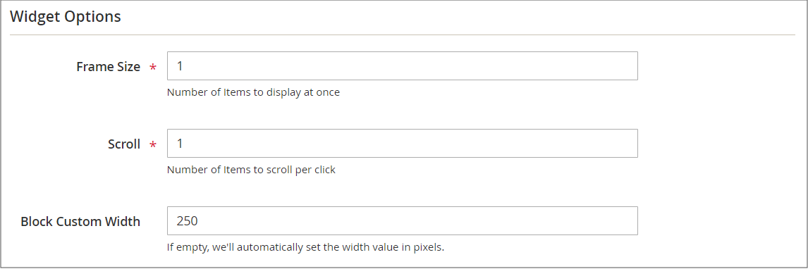

# Catalog Events Carousel Widget

{{ee-feature}}

The Catalog Events Carousel widget displays a slider of upcoming events with a countdown ticker for each event. You can choose the pages and area of the page layout where you want the carousel to appear, and control the width and number of events that appear at one time. The result you get depends on your theme, where it is positioned to appear on the page, and the options that you choose.

{width="700" zoomable="yes"}

## Step 1: Enable the catalog carousel widget

Before you begin, follow the [instructions](../merchandising-promotions/event-configure.md) to configure the _Catalog Event_ widget so that it is enabled for the storefront.

{width="500" zoomable="yes"}

## Step 2: Create the widget

1. On the _Admin_ sidebar, go to **[!UICONTROL Content]** > _[!UICONTROL Elements]_ > **[!UICONTROL Widgets]**.

1. In the upper-right corner, click **[!UICONTROL Add Widget]**.

1. In the _[!UICONTROL Settings]_ section, do the following:

   - Set **[!UICONTROL Type]** to `Catalog Events Carousel`.

   - Choose the **[!UICONTROL Design Theme]** that is used by the store.

1. Click **[!UICONTROL Continue]**.

   {width="500" zoomable="yes"}

1. In the _[!UICONTROL Storefront Properties]_ section, do the following:

   - For **[!UICONTROL Widget Title]**, enter a descriptive title for the widget.

      This title is visible only from the _Admin_.

   - For **[!UICONTROL Assign to Store Views]**, select the store views where you want the widget to be visible.

      You can select a specific store view, or `All Store Views`. To select multiple views, hold down the Ctrl key (PC) or the Command key (Mac) and click each option.

   - (Optional) For **[!UICONTROL Sort Order]**, enter a number to determine the order this item appears with others in the same part of the page. (`0` = first, `1` = second, `3` = third, and so on.)

      {width="600" zoomable="yes"}

## Step 3: Choose the location

1. In the _Layout Updates_ section, click **[!UICONTROL Add Layout Update]**.

1. Set **[!UICONTROL Display On]** to `Specified Page`.

1. Set **[!UICONTROL Page]** to `CMS Home Page`.

1. Set **[!UICONTROL Container]** one fo the following:

   - `Main Content Area`
   - `Sidebar Additional`
   - `Sidebar Main`

   >[!NOTE]
   >
   >The results vary according to theme and page layout. You must also specify the _[!UICONTROL Catalog Events Carousel Default Template]_ in the category configuration.

1. If you want the events carousel to appear in another location in the storefront, click **[!UICONTROL Add Layout Update]** and repeat these steps for that location.

   {width="600" zoomable="yes"}

1. Click **[!UICONTROL Save and Continue Edit]**.

   For now, you can ignore the message to refresh the cache.

## Step 4: Configure the options

1. In the left panel, choose **[!UICONTROL Widget Options]**.

1. For **[!UICONTROL Frame Size]**, enter the number of events that you want to list in the slider at the same time.

   To view only one event at a time, enter `1`.

1. For **[!UICONTROL Scroll]**, enter the number of event listings that you want to scroll per click.

   To scroll to the next event, enter `1`.

1. For a custom width, enter the number of pixels for **[!UICONTROL Block Custom Width]**.

   The custom width for the example on the following page is set to 250 pixels.

   {width="400" zoomable="yes"}

1. When complete, click **[!UICONTROL Save]**.

1. When prompted to refresh the cache, click the link in the message at the top of the page and follow the instructions.
