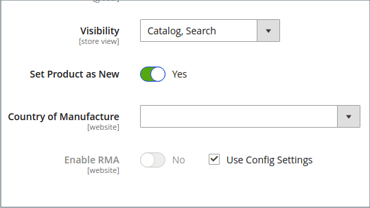
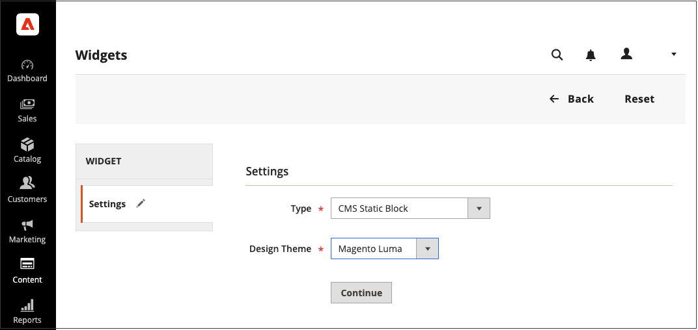
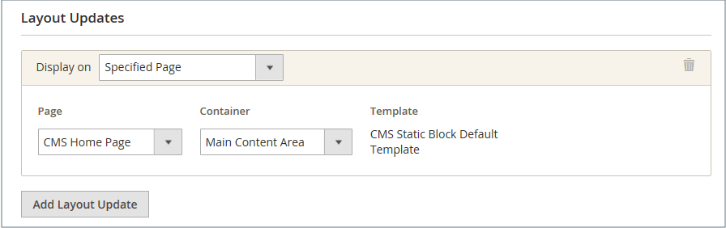
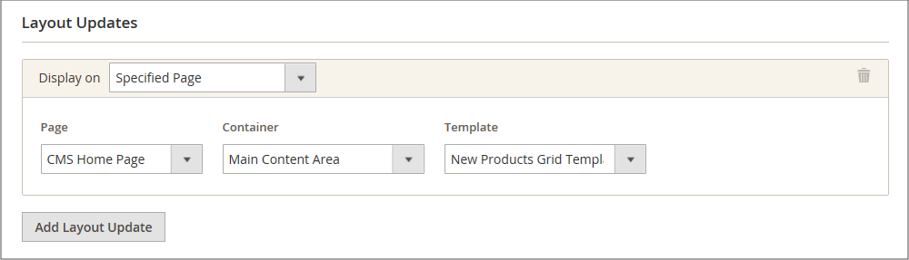
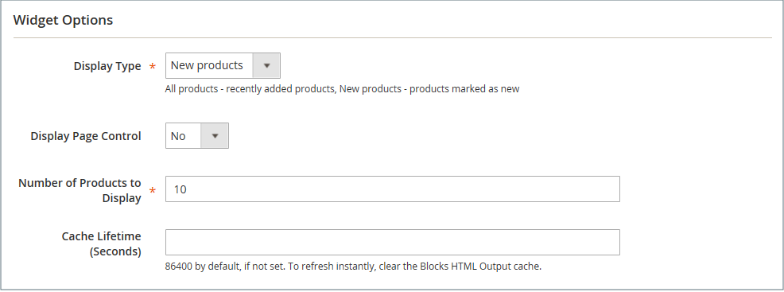

# New Products List

The list of new products is an example of dynamic content, and consists of live data that is pulled from your product catalog. By default, the _New Products_ list includes the first eight of the most recently added products. However, it can also be configured to include only products within a specified date range.

{width="700" zoomable="yes"}

## Step 1: Set each product as new

 This step applies to Magento Open Source only.

 For Adobe Commerce stores, see [Scheduling an Update](content-staging-scheduled-update.md) and then continue to Step 2 on this page.

_[!UICONTROL Set Product as New]_ date range setting can be configured only in scheduled updates.

Setting a product as new adds the product to the _New products_ list. You can change the setting back at any point when you no longer want to include it in the list.

1. On the _Admin_ sidebar, go to **[!UICONTROL Catalog]** > **[!UICONTROL Products]**.

1. Find each product that you want to feature and open in edit mode.

1. For **[!UICONTROL Set Product as New]**, toggle the option to set the product as a new product or not.

   {width="400" zoomable="yes"}

1. When complete, click **[!UICONTROL Save]**.

1. When you are prompted to reindex and refresh the page cache, click the links at the top of the page and follow the instructions.

## Step 2: Create the widget

The code that determines the content of the New Products list and its placement in your store is generated by the Widget tool.

1. On the _Admin_ sidebar, go to **[!UICONTROL Content]** > _[!UICONTROL Elements]_ > **[!UICONTROL Widgets]**.

1. In the upper-right corner, click **[!UICONTROL Add Widget]**.

1. In the _[!UICONTROL Settings]_ section, do the following:

   - Set **[!UICONTROL Type]** to `Catalog New Products List`.

   - Choose the **[!UICONTROL Design Theme]** that is used by the store.

1. Click **[!UICONTROL Continue]**.

   {width="600" zoomable="yes"}

1. In the _[!UICONTROL Storefront Properties]_ section, do the following:

   - For **[!UICONTROL Widget Title]**, enter a descriptive title for the widget. (This title is visible only from the _Admin_.)

   - For **[!UICONTROL Assign to Store Views]**, select the store views where the widget will be visible.

      You can select a specific store view, or `All Store Views`. To select multiple views, hold down the Ctrl key (PC) or the Command key (Mac) and click each option.

   - (Optional) For **[!UICONTROL Sort Order]**, enter a number to determine the order this item appears with others in the same part of the page. (`0` = first, `1` = second, `3` = third, and so on.)

   {width="600" zoomable="yes"}

## Step 3: Choose the location

1. In the _[!UICONTROL Layout Updates]_ section, click **[!UICONTROL Add Layout Update]**.

1. Set **[!UICONTROL Display On]** to `Specified Page.`

1. Set **[!UICONTROL Page]** to `CMS Home Page`.

1. Set **[!UICONTROL Block Reference]** to `Main Content Area`.

1. Set **[!UICONTROL Template]** to one of the following:

   - `New Product List Template`
   - `New Products Grid Template`

      {width="600" zoomable="yes"}

1. Click **[!UICONTROL Save and Continue Edit]**.

   For now, you can ignore the message to refresh the cache.

## Step 4: Configure the List

1. In the left panel, choose **[!UICONTROL Widget Options]**.

1. Set **[!UICONTROL Display Products]** to one of the following:

   - `All Products` - Lists products in sequence, starting with those most recently added.
   - `New Products` - Lists only the products that are identified as _new_. A product is considered to be new during the date range that is specified in _[!UICONTROL Set Product As New From/To]_. The list will be empty if the date range expires without any new products defined. 

1. To provide navigation control for lists with multiple pages, set **[!UICONTROL Display Page Control]** to `Yes`.

   For **[!UICONTROL Number of Products per Page]**, enter the number of products you want to appear on each page.

1. Set **[!UICONTROL Number of Products to Display]** to the number of new products that you want to include in the list.

   The default setting is `10`.

1. For **[!UICONTROL Cache Lifetime (Seconds)]**, choose how often you want to refresh the list of new products.

   By default, the cache is set to 86,400 seconds (24 hours).

      {width="600" zoomable="yes"}

1. When complete, click **[!UICONTROL Save]**.

1. When prompted to refresh the cache, click the link in the message at the top of the page and follow the instructions.

## Step 5: Preview your work

1. On the _Admin_ sidebar, go to **[!UICONTROL Content]** > _[!UICONTROL Elements]_ > **[!UICONTROL Pages]**.

1. Find the page in the grid where the _New Products_ list is to appear and click the **[!UICONTROL Preview]** link in the _[!UICONTROL Action]_ column.
