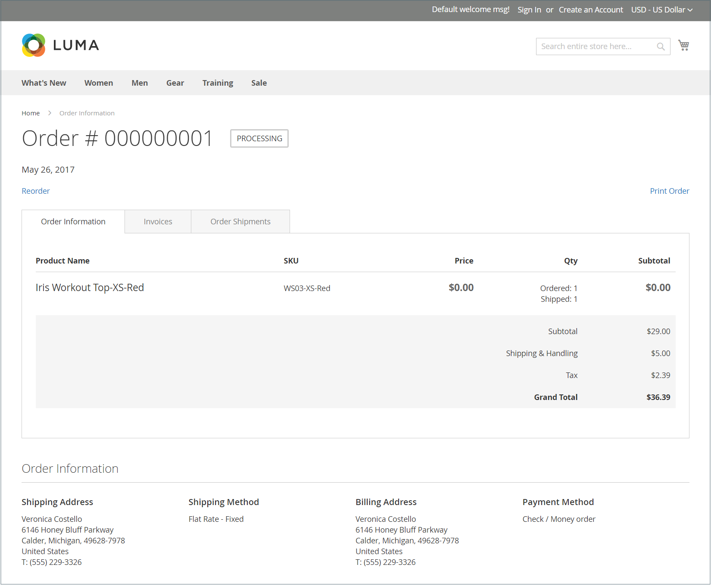

# Orders and Returns Widget

The _Orders and Returns_ widget gives guests the ability to check the status of their orders, print invoices, and track shipments. When the widget is added to the storefront, it is visible only for guests and for customers who are not logged in to their accounts. Guests can find orders by providing the Order ID, Billing Last Name, and either the Email Address or ZIP Code.

{width="600" zoomable="yes"}

## Use the Orders and Returns widget

1. Use the **[!UICONTROL Find Order By]** option to choose one of the following parameters to be used to find the order:

   - Email Address
   - ZIP Code

1. Enter the **[!UICONTROL Order ID]** and **[!UICONTROL Billing Last Name]**.

1. Enter either the billing **[!UICONTROL Email Address]** or **[!UICONTROL ZIP Code]** that is associated with the order.

1. Click **[!UICONTROL Search]** to retrieve the order.

   {width="700" zoomable="yes"}

## Set up the Orders and Returns widget

1. On the _Admin_ sidebar, go to **[!UICONTROL Content]** > _[!UICONTROL Elements]_ > **[!UICONTROL Widgets]**.

1. In the upper-right corner, click **[!UICONTROL Add Widget]**.

1. In the _[!UICONTROL Settings]_ section, do the following:

   - Set **[!UICONTROL Type]** to `Orders and Returns`.

   - Choose the **[!UICONTROL Design Theme]** that is used by the store.

1. Click **[!UICONTROL Continue]**.

1. In the _[!UICONTROL Storefront Properties]_ section, do the following:

   - For **[!UICONTROL Widget Title]**, enter a descriptive title for the widget.

      This title is visible only from the Admin.

   - For **[!UICONTROL Assign to Store Views]**, select the store views where the widget will be visible.

      You can select a specific store view, or `All Store Views`. To select multiple views, hold down the Ctrl key (PC) or the Command key (Mac) and click each option.

   - (Optional) For **[!UICONTROL Sort Order]**, enter a number to determine the order this item appears with others in the same part of the page. (`0` = first, `1` = second, `3` = third, and so on.)

1. In the _[!UICONTROL Layout Updates]_ section, click **[!UICONTROL Add Layout Update]** and do the following:

   - Set **[!UICONTROL Display On]** to the type of page where you want the widget to appear.

   - Complete the rest of the layout update information to determine where the widget is displayed on the page.

1. When complete, click **[!UICONTROL Save]**.

1. When prompted to refresh the cache, click the link in the message at the top of the page and follow the instructions.
