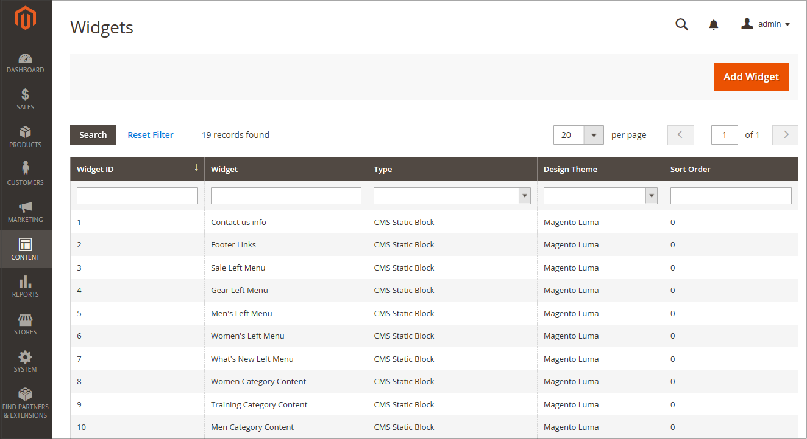
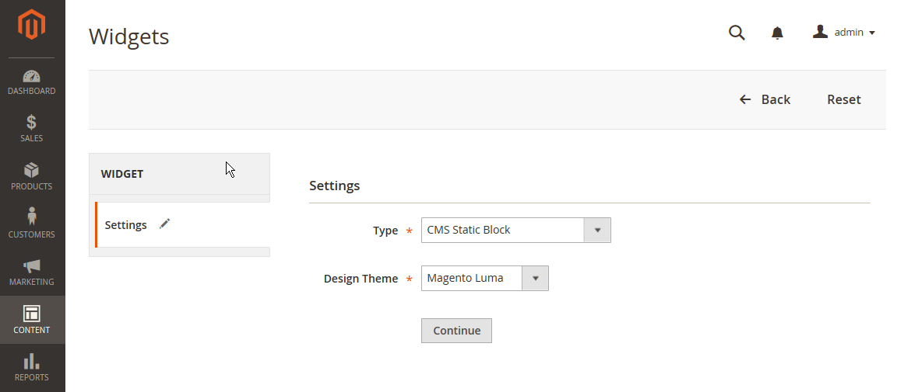
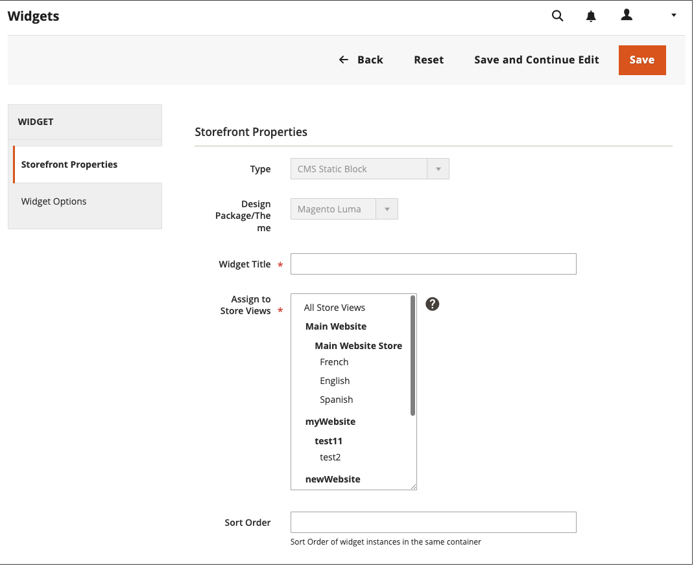
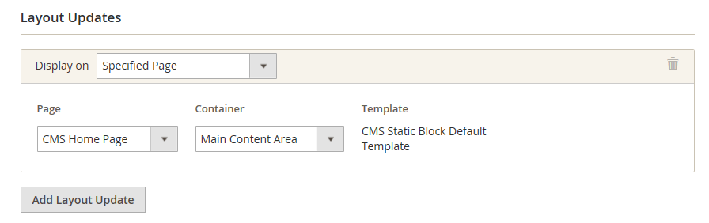

# Use a widget to position a block

The _CMS Static Block_ [widget](widgets.md) gives you the ability to place an existing [content block](blocks.md) nearly anywhere in your store.

{width="700" zoomable="yes"}

## Step 1: Choose the widget type

1. On the _Admin_ sidebar, go to **[!UICONTROL Content]** > _[!UICONTROL Elements]_ > **[!UICONTROL Widgets]**.

1. In the upper-right corner, click **[!UICONTROL Add Widget]**.

1. In the _Settings_ section, set **[!UICONTROL Type]** to `CMS Static Block` and click **[!UICONTROL Continue]**.

1. Verify that the **[!UICONTROL Design Theme]** is set to the current theme and click **[!UICONTROL Continue]**.

   {width="600" zoomable="yes"}

1. In the _[!UICONTROL Storefront Properties]_ section, do the following:

   - For **[!UICONTROL Widget Title]**, enter a descriptive title for the widget.

      This title is visible only from the _Admin_.

   - For **[!UICONTROL Assign to Store Views]**, select the store views where the widget is visible.

      You can select a specific store view, or `All Store Views`. To select multiple views, hold down the Ctrl key (PC) or the Command key (Mac) and click each option.

   - (Optional) For **[!UICONTROL Sort Order]**, enter a number to determine the order this item appears with others in the same part of the page. (`0` = first, `1` = second, `3` = third, and so on.)

      {width="600" zoomable="yes"}

## Step 2: Complete the widget layout updates

1. In the _[!UICONTROL Layout Updates]_ section, click **[!UICONTROL Add Layout Update]**.

1. Set **[!UICONTROL Display On]** to the category, product, or page where you want the block to appear.

1. To place the block on a specific page, do the following:

   - Choose the **[!UICONTROL Page]** where you want the block to appear.

   - Choose the **[!UICONTROL Block Reference]** that identifies the place where the block is displayed on the page.

   - Accept the default setting for **[!UICONTROL Template]**, which is set to `CMS Static Block Default Template`.

      {width="600" zoomable="yes"}

### Layout update options

|Field|Description|
|--- |--- |
|**_[!UICONTROL Categories]_**||
|[!UICONTROL Anchor Categories]|Displays the widget on the anchor category page. **[!UICONTROL Categories]** - Categories where the anchor is displayed. Options: `All` / `Specific Categories` **[!UICONTROL Container]** - Set the container to the part of the page layout where you want to display the widget. **[!UICONTROL Template]** - Determines the theme of the layout.|
|[!UICONTROL Non-Anchor Categories]|Displays the widget on the non-anchor category page. **[!UICONTROL Categories]** - Categories where the anchor is displayed. Options: `All` / `Specific Categories` **[!UICONTROL Container]** - Set the container to the part of the page layout where you want to display the widget. **[!UICONTROL Template]** - Determines the theme of the layout.|
|**_[!UICONTROL Products]_**||
|All Product Types|Displays the widget on either a specific type of product page, or on all product pages.  **[!UICONTROL Products]** - Products for which the widget is displayed. Options: `All` /` Specific Products` **[!UICONTROL Container]** - Set the container to the part of the page layout where you want to display the widget. **[!UICONTROL Template]** - Determines the theme of the layout.|
|**_[!UICONTROL Generic Pages]_**||
|[!UICONTROL All Pages]|Displays the widget on all pages.  **[!UICONTROL Container]** - Set the container to the part of the page layout where you want to display the widget. **[!UICONTROL Template]** - Determines the theme of the layout.|
|[!UICONTROL Specified Page]|Displays the widget on a specific page. Options: **[!UICONTROL Page]** - Pages for which the widget is displayed. **[!UICONTROL Container]** - Set the container to the part of the page layout where you want to display the widget. **Template** - Determines the theme of the layout.|
|[!UICONTROL Page Layouts]|Displays the widget on pages with a certain layout.  **[!UICONTROL Page]** - Pages for which the widget is displayed. **[!UICONTROL Container]** - Set the container to the part of the page layout where you want to display the widget. **[!UICONTROL Template]** - Determines the theme of the layout.|

{style="table-layout:auto"}

## Step 3: Place the block

1. In the left panel, select **[!UICONTROL Widget Options]**.

1. Click **[!UICONTROL Select Block…]** and choose the block that you want to place from the list.

1. When complete, click **[!UICONTROL Save]**.

   The app now appears in the list.

1. When prompted, follow the instructions at the top of the page to update the index and page cache.

1. Return to your storefront to verify that the block appears in the correct location.

   To move the block, you can reopen the widget or try a different page or block reference.
