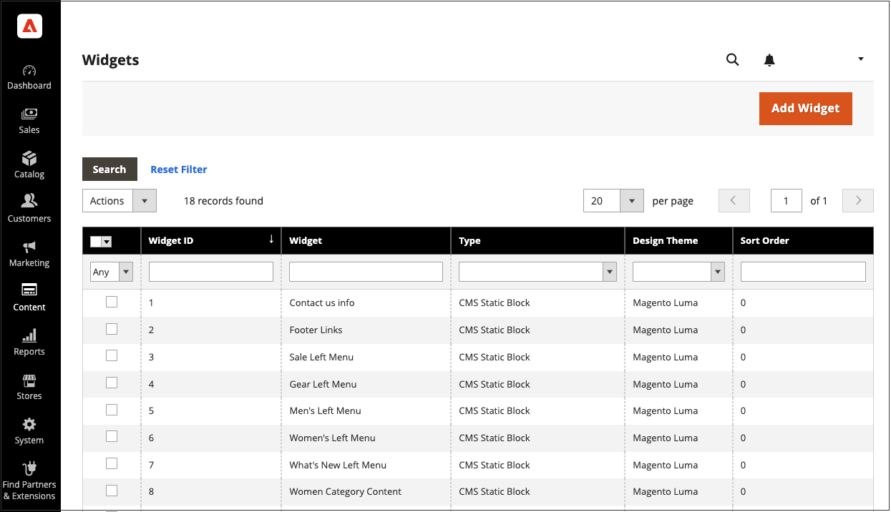

# Widgets

A widget is a snippet of code that makes it possible to display a wide range of content and place it at specific block references in your store. Many widgets display real-time, dynamic data and create opportunities for your customers to interact with your store. The Widget tool makes it easy to place a widget within existing content, such as blocks with images and text, and interactive elements most anywhere in your store.

You can use widgets to create landing pages for marketing campaigns, and to display promotional content at specific locations throughout the store. Widgets can also be used to add interactive elements and action blocks for external review systems, video chats, voting, and subscription forms, or to provide navigation elements for tag clouds and image sliders.

{{$include /help/_includes/directives-caution.md}}

{width="700" zoomable="yes"}

## Widget Types

When you [create a widget](widget-create.md), you must set the type. This type determines how the widget functions.

|Type|Description|
|--- |--- |
|[!UICONTROL CMS Hierarchy Node Link]|Use this option to display a link to a specific node in the page hierarchy that can be incorporated into other content.|
|[!UICONTROL CMS Page Link]|Use this option to specify custom text and a title that links to a specific CMS page. When the link is complete, it can be used in content pages and blocks.|
|[!UICONTROL CMS Static Block]|Use this option to display a block of content at a specific location on a page.|
|[!UICONTROL Catalog Category Link]|Use this option to display either an inline or block-style link to a selected catalog category. When the link is complete, it can be used in content pages and blocks.|
|[!UICONTROL Catalog Events Carousel]|Use this option to display a list of upcoming catalog events.|
|[!UICONTROL Catalog New Products List]|Use this option to display a block of products which have been designated as new, during the time specified in the product record.|
|[!UICONTROL Catalog Product Link]|Use this option to display either an inline or block-style link  to a selected catalog product. When the link is complete, it can be used in content pages and blocks.|
|[!UICONTROL Catalog Products List]|Use this option to display a list of products from the catalog.|
|[!UICONTROL Dynamic Blocks Rotator]|Use this option to display a single dynamic block, or an assortment of dynamic blocks in a series, random order, or shuffled. The dynamic block can be triggered by a price rule, and placed on a specific page and location, or configured to appear on all pages.|
|[!UICONTROL Gift Registry Search]|Use this option to give shoppers the ability to search for public gift registries by name or Registry ID.|
|[!UICONTROL Order by SKU]|Order by SKU can be displayed in the store as a convenience for all shoppers, or made available only to specific customer groups. Shoppers can either enter the SKU and quantity information directly into the Order by SKU block, or upload a CSV file from their customer account.|
|[!UICONTROL Orders and Returns]|Use this option to give guests the ability to check the status of their orders and submit requests to return merchandise. The widget appears only for guests and customers who are not logged in to their accounts.|
|[!UICONTROL Recently Compared Products]|Displays the  block of recently compared products. You can specify the number of products included, and format them as a list or product grid.|
|[!UICONTROL Recently Viewed Products]|Use this option to display the block of recently viewed products. You can specify the number of products included and format them as a list or product grid.|
|[!UICONTROL Wish List Search]|Use this option to give a customer the ability to search for publicly available wish lists by the name or email address of the wish list owner. Store customers can find wish lists that belong to other customers, view them and order products from them, or add the products to their own wish lists.|

{style="table-layout:auto"}
