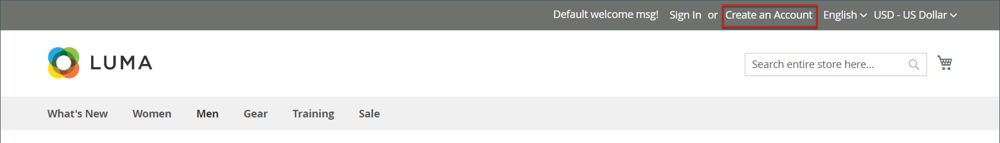
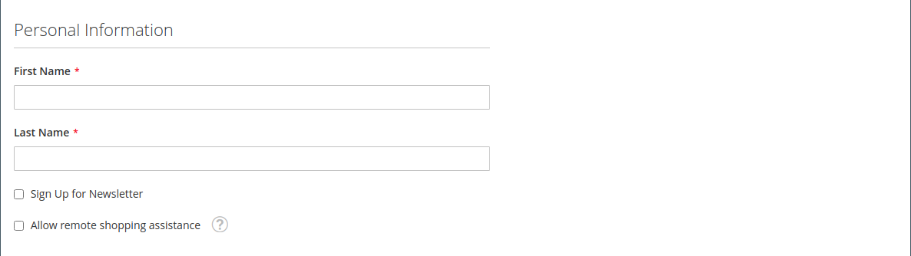
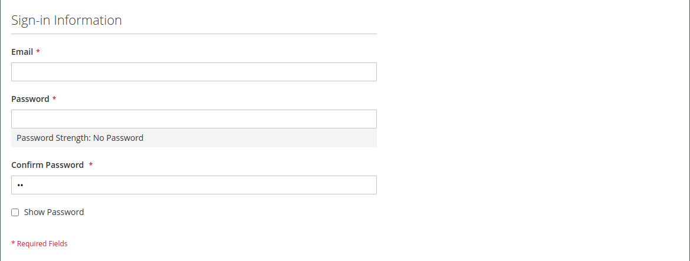
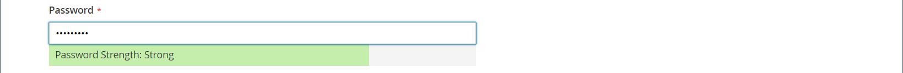
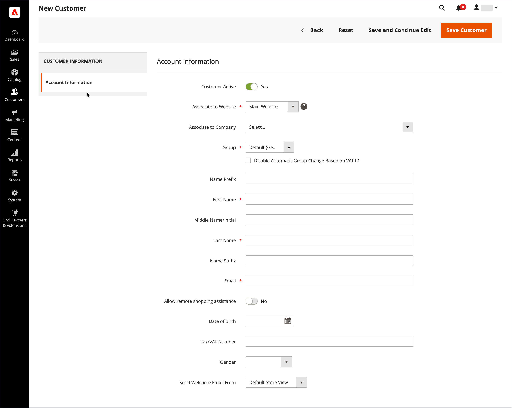
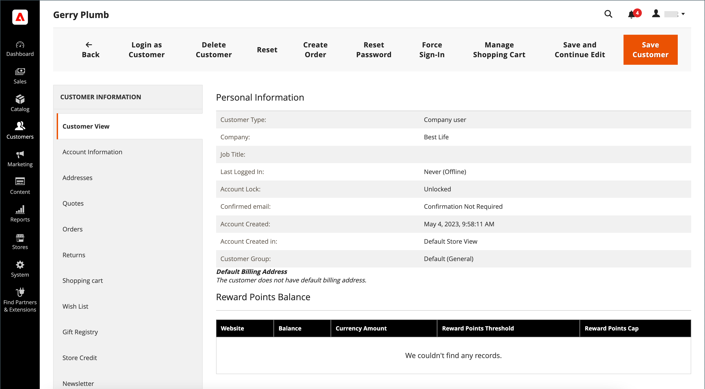
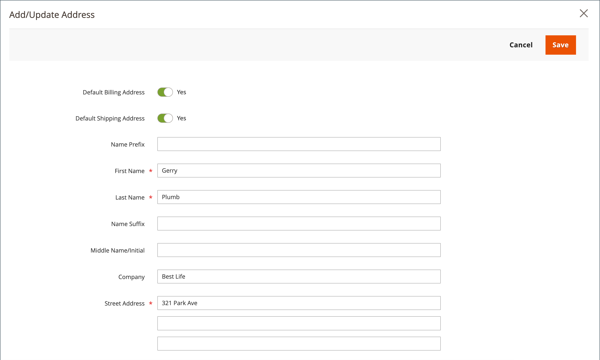
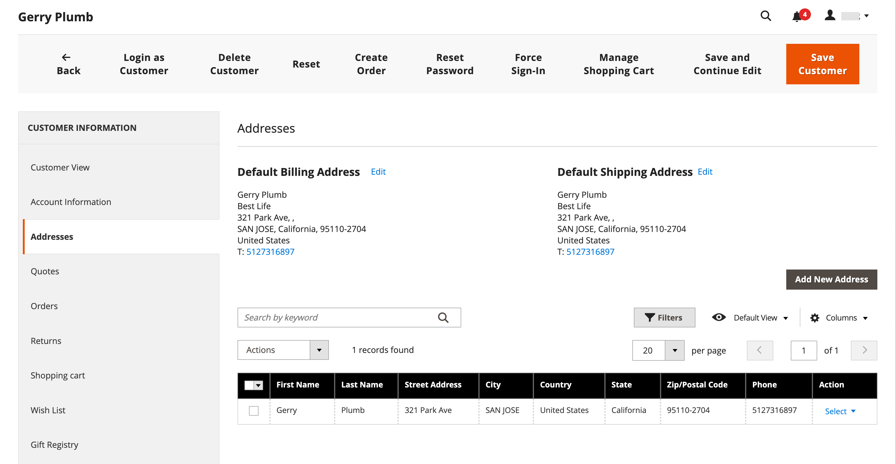

# Create an individual customer account

Visitors to your store can open an account to manage their purchases and activities. Customers usually create their own accounts from your store. However, you can also create customer accounts directly from the Admin, which is useful for helping customers over the phone.

The following instructions represent the default customer account configuration. To change the selection and behavior of some of the fields in the form, see [Configuring Customer Accounts](../customers/customer-account-scope.md).

As a store administrator, you can also set the [new account options](../customers/account-options-new.md) to send a confirmation email to new registered customers, which helps to ensure that registered accounts are valid.

## Create account from the storefront

A store customer creates an account on the storefront.

1. From the storefront, clicks **[!UICONTROL Create an Account]** in the upper-right corner of the header.

   {width="700" zoomable="yes"}

1. Under **[!UICONTROL Personal Information]**, enters their **[!UICONTROL First Name]** and **[!UICONTROL Last Name]**.

   {width="700" zoomable="yes"}

1. If they want to add their name and email address to the list of newsletter subscribers, the customer selects the **[!UICONTROL Sign Up for Newsletter]** checkbox.

   >[!INFO]
   >
   > This option appears even if the store doesn't publish a newsletter.

1. If they want store support staff to [see what they see](../customers/login-as-customer.md) and provide remote assistance, the customer selects the **[!UICONTROL Allow remote shopping assistance]** checkbox.

1. Under **[!UICONTROL Sign-in Information]**, enters their **[!UICONTROL Email]** address.

   >[!INFO]
   >
   > This email address becomes part of their sign-in credentials, and cannot be associated with any other customer account.

   {width="600" zoomable="yes"}

1. Enters a **[!UICONTROL Password]** that includes three of the following types of information:

   - Lowercase characters
   - Uppercase characters
   - Numbers
   - Special characters

   After they press **[!UICONTROL Enter]**, the strength of the password is evaluated and appears below the field. If the password is considered to be _Weak_, try another until it evaluated as _Strong_.

   {width="600" zoomable="yes"}

1. Then, the customer enters it again to **[!UICONTROL Confirm Password]**.

1. If needed, clicks **[!UICONTROL Show Password]** to view the password you entered.

1. When complete, clicks **Create an Account**.

The customer can then use their email address and password to [sign in](../customers/customer-sign-in.md) to their account and complete the address information.

## Create an account from the Admin

As a merchant, you can create a customer account from the Admin.

1. On the _Admin_ sidebar, go to **[!UICONTROL Customers]** > **[!UICONTROL All Customers]**.

1. Click **[!UICONTROL Add New Customer]**.

### Step 1: Complete the account information

{width="700" zoomable="yes"}

1. In the **[!UICONTROL Account Information]** section, do the following:

   - For a multisite installation, set **[!UICONTROL Associate to Website]** to the web site where the customer account applies.
   - If applicable, assign the customer to a different **[!UICONTROL Customer Group]**.
   - If you are using [VAT ID Validation](../stores-purchase/vat.md) and want to **[!UICONTROL Disable Automatic Group Change Based on VAT ID]**, select the checkbox.

1. Complete the required fields:

   - **[!UICONTROL First Name]**
   - **[!UICONTROL Last Name]**
   - **[!UICONTROL Email]**

1. Complete the optional fields as needed:

   - **[!UICONTROL Name Prefix]**
   - **[!UICONTROL Middle Name/Initial]**
   - **[!UICONTROL Name Suffix]**
   - **[!UICONTROL Date of Birth]**
   - **[!UICONTROL Tax/VAT Number]**
   - **[!UICONTROL Gender]**

   >[!WARNING]
   >
   >In keeping with current security and privacy best practices, be aware of any potential legal and security risks associated with the storage of customers' full date of birth (month, day, year) with other personal identifiers. It is recommended that you limit the storage of customers' full birth dates and suggested that you use customer year of birth as an alternative.

1. Set **[!UICONTROL Send Welcome Email From]** to the store view from which the _Welcome_ email is to be sent.

   >[!INFO]
   >
   > If the store has views for different [languages](../stores-purchase/store-localize.md), this setting determines the language of the Welcome email.

1. Click **[!UICONTROL Save and Continue Edit]** at the top of the page.

   >[!INFO]
   >
   >After the customer account is saved, the full set of options appears in the left panel and in the menu at the top of the page. The _[!UICONTROL Customer View]_ tab displays a summary of the account.

   {width="600" zoomable="yes"}

### Step 2: Complete the address information

1. In the left panel, choose **[!UICONTROL Addresses]** and click **[!UICONTROL Add New Addresses]**.

1. If the same address is used for both billing and shipping, toggle both options.

   - **[!UICONTROL Default Billing Address]**
   - **[!UICONTROL Default Shipping Address]**

   {width="600" zoomable="yes"}

1. Scroll down and complete the required address fields in the second column.

   - **[!UICONTROL Street Address]**
   - **[!UICONTROL City]**
   - **[!UICONTROL Country]**
   - **[!UICONTROL State/Province]**
   - **[!UICONTROL ZIP/Postal Code]**

1. Enter the **[!UICONTROL Phone Number]** for this address.

1. If applicable, enter the **[!UICONTROL VAT Number]** associated with the customer.

1. If this address is the only one that is needed for the account, click **[!UICONTROL Save]**.

   Otherwise, click **[!UICONTROL Save and Continue Edit]** and repeat the previous steps to add additional addresses.

   The new address is displayed in the [!UICONTROL Addresses] page with the selected _[!UICONTROL Default Billing]_ and _[!UICONTROL Default Shipping]_ addresses above the full list.

   {width="600" zoomable="yes"}

### Step 3: Reset the password

Customer accounts created from the Admin do not initially have passwords assigned.

1. Find the new customer account in the grid.

1. Click **[!UICONTROL Edit]** in the _[!UICONTROL Action]_ column.

1. In the menu bar at the top of the page, click **[!UICONTROL Reset Password]**.

1. Notification is sent to the account owner, with instructions for setting the password.

## Button bar

Additional buttons become available when the profile is saved for the first time. To learn more, see [Update a customer profile](../customers/update-account.md).

|Button|Description|
|--- |--- |
|**[!UICONTROL Back]**|Returns to the _[!UICONTROL Customers]_ page without saving changes.|
|**[!UICONTROL Delete Customer]**|Deletes the current customer. Completed orders associated with the customer are not removed.|
|**[!UICONTROL Reset]**|Resets any unsaved changes in the customer form to their previous values.|
|**[!UICONTROL Create Order]**|Creates an order for the customer.|
|**[!UICONTROL Reset Password]**|Sends a [reset password](../customers/password-reset.md) link to the customer by email.|
|**[!UICONTROL Force Sign-in]**|Revokes the OAuth access tokens that are associated with the customer account. This function can be used only with customer accounts that have been assigned OAuth tokens as part of a web API [integration](../systems/integrations.md). To learn more, see [OAuth-based authentication](https://developer.adobe.com/commerce/webapi/get-started/authentication/gs-authentication-oauth/) in the developer documentation.|
|**[!UICONTROL Manage Shopping Cart]**|Allows the administrator to manage the shopping cart for the customer.|
|**[!UICONTROL Save and Continue Edit]**|Saves changes and keeps the customer profile open.|
|**[!UICONTROL Save Customer]**|Saves changes and closes the customer profile.|

{style="table-layout:auto"}

## Field descriptions

### [!UICONTROL Account Information]

|Field|Description|
|--- |--- |
|**[!UICONTROL Associate to Website]**|Identifies the website associated with the customer account.|
|**[!UICONTROL Group]**|Identifies the [customer group](../customers/customer-groups.md) where the customer is a member. If applicable, select the checkbox to disable automatic group change based on VAT.|
|**[!UICONTROL Name Prefix]**|If used, the prefix  that is associated with the customer's name (such as Mr., Ms., or Dr.). The prefix values are determined by the [configuration](../configuration-reference/customers/customer-configuration.md). Depending on the configuration, the input control might be a text field or a list of options.|
|**[!UICONTROL First Name]**|The customer's first name.|
|**[!UICONTROL Middle Name / Initial]**|The middle name or initial of the customer. This field is included only if specified in the [configuration](../configuration-reference/customers/customer-configuration.md) topic.|
|**[!UICONTROL Last Name]**|The customer's last name.|
|**[!UICONTROL Name Suffix]**|If used, the suffix that is associated with the customer's name (such as  Jr., Sr., or III). The suffix values are determined by the [configuration](../configuration-reference/customers/customer-configuration.md). Depending on the configuration, the input control might be a text field or a drop-down list of options.|
|**[!UICONTROL Email]**|The customer's email address.|
|**[!UICONTROL Date of Birth]**|The customer's date of birth. The date of birth is included if specified in the [configuration](../configuration-reference/customers/customer-configuration.md) topic.   In keeping with current security and privacy best practices, be aware of any potential legal and security risks associated with the storage of customers' full date of birth (month, day, year) with other personal identifiers. It is recommended that you limit the storage of customers' full birth dates and suggest using customer year of birth as an alternative.|
|**[!UICONTROL Tax / VAT Number]**|The customer's Tax or Value Added Tax number, if applicable.|
|**[!UICONTROL Gender]**|Identifies the customer's gender. The gender is included if specified in the [configuration](../configuration-reference/customers/customer-configuration.md). Options: `Male` / `Female` / `Not Specified`|
|**[!UICONTROL Send Welcome Email From]**|If you have multiple store views, this setting identifies the store view from which the Welcome message is sent. If store views are used for different languages, this setting determines the language of the Welcome email.|

### [!UICONTROL Addresses]

|Field|Description|
|--- |--- |
|**[!UICONTROL New Addresses]**|Identifies the type of new address. Options: `Default Billing Address` / `Default Shipping Address`|
|**[!UICONTROL Add New Addresses]**|Displays another New Address section to identify the type of the address to be entered.|
|**[!UICONTROL Company]**|The company name, if applicable for this address.|
|**[!UICONTROL Street Address]**|The street address of the customer. A second line of the street address is available if specified in the [configuration](../configuration-reference/customers/customer-configuration.md) topic.|
|**[!UICONTROL City]**|The city where the customer address is located.|
|**[!UICONTROL Country]**|The country where the customer address is located.|
|**[!UICONTROL State/Province]**|The state or province where the customer address is located.|
|**[!UICONTROL Zip/Postal Code]**|The ZIP or postal code where the customer address is located.|
|**[!UICONTROL Phone Number]**|The customer's phone number that is associated with address.|
|**[!UICONTROL VAT Number]**|If applicable, the value added tax number that applies to the customer at this address.|
