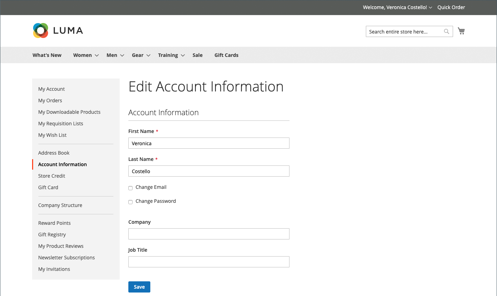
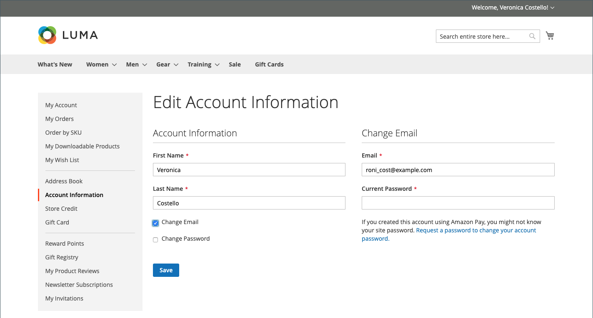
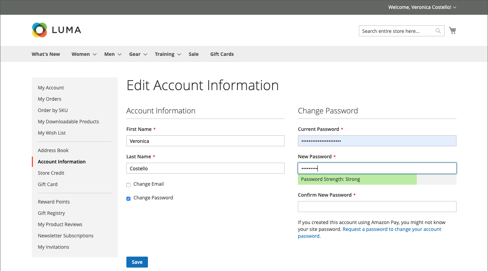

# Account Information

The basic account information includes your name and email address, and password, and can be maintained from your account dashboard.

## Update your account information

In the sidebar of your account, choose **[!UICONTROL Account Information]** and do any of the following:

### Update your name

1. Update your **[!UICONTROL First Name]** and **[!UICONTROL Last Name]** as needed.

   >[!INFO]
   >
   > Additional fields appear as part of the name if the [Customer Configuration](https://docs.magento.com/user-guide/configuration/customers/customer-configuration.html) includes a prefix, middle initial, and suffix.

1. Click **[!UICONTROL Save]**.

### Change your email address

1. Select the **[!UICONTROL Change Email]** checkbox.

1. Enter your new **[!UICONTROL Email]** address.

1. Enter your **[!UICONTROL Current Password]**.

1. Click **[!UICONTROL Save]**.

    

### Change your password

1. Select the **[!UICONTROL Change Password]** checkbox.

1. Enter your **[!UICONTROL New Password]**.

   >[!IMPORTANT]
   >
   > Choose a strong password that is at least eight characters long. Your password can include a combination of upper and lowercase letters, numbers, and symbols. Use the password strength indicator to help you choose the best password. Then, save it in a secure location.

1. When you are ready, enter it again to confirm.

    
