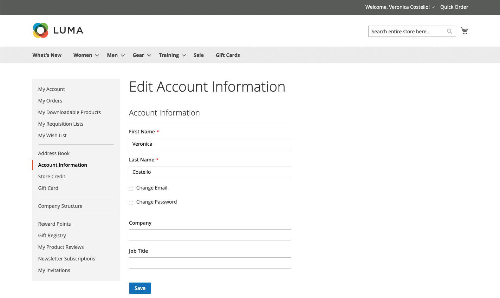
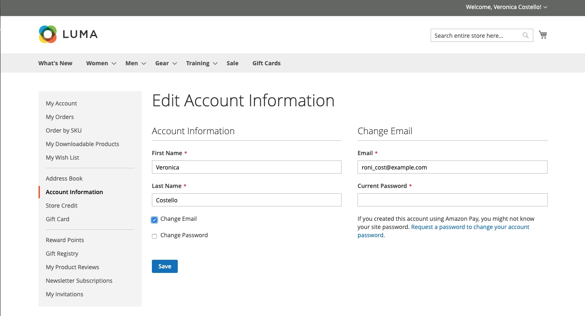
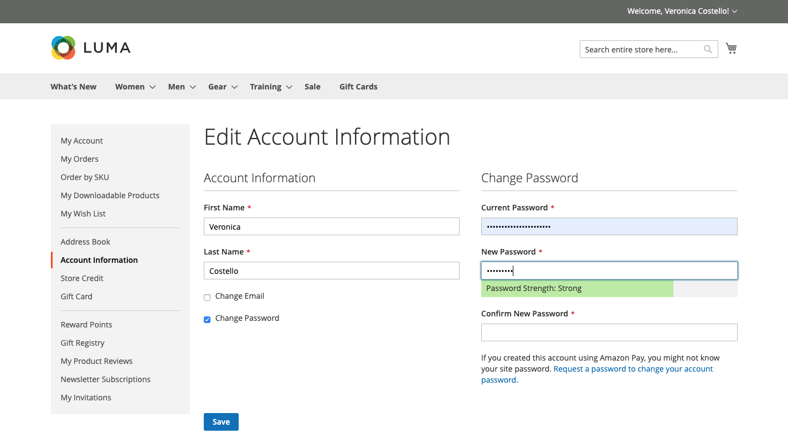

# Customer account information

The basic customer account information includes your name and email address, and password, and can be maintained from the customer account dashboard on the storefront.

{width="700" zoomable="yes"}

In the sidebar of your account, the customer can choose **[!UICONTROL Account Information]** and do any of the following to update their account information.

## Update the name for the account name 

To update the name for the account, the customer changes the values in the **[!UICONTROL First Name]** and **[!UICONTROL Last Name]** fields as needed.

>[!INFO]
>
>Additional fields appear as part of the name if the [customer configuration](../configuration-reference/customers/customer-configuration.md) includes a prefix, middle initial, and suffix.

## Change email address

1. The customer selects the **[!UICONTROL Change Email]** checkbox.

1. Enters their new **[!UICONTROL Email]** address.

1. Enters their **[!UICONTROL Current Password]**.

   {width="700" zoomable="yes"}

1. Clicks **[!UICONTROL Save]**.

## Change password

1. The customer selects the **[!UICONTROL Change Password]** checkbox.

1. Enters their **[!UICONTROL Current Password]**.

1. Enters their **[!UICONTROL New Password]**.

   >[!INFO]
   >
   >The password should  be at least eight characters long, and can include a combination of upper and lowercase letters, numbers, and symbols. The password strength indicator helps the customer to choose the best password.

   {width="700" zoomable="yes"}

1. Enters it again to confirm.
