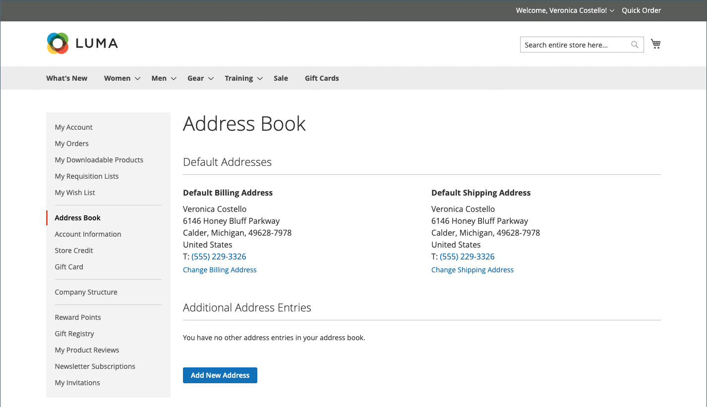
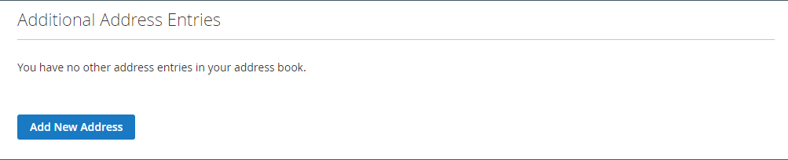
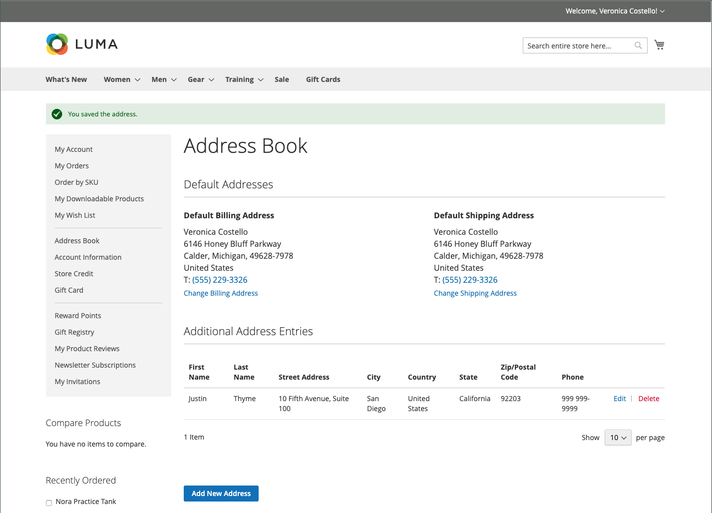

# The customer address book

Customers who keep their address books current can speed through the checkout process. The address book contains the customer's default billing and shipping addresses, and any additional addresses that they use frequently. Additional address entries are easy to access and maintain from the grid. Each customer address book can manage over 3,000 address book entries without impacting performance.

{width="700" zoomable="yes"}

## Add an address

1. In the left navigation of their customer account, the customer chooses **[!UICONTROL Address Book]**.

1. On the _[!UICONTROL Address Book]_ page under _Additional Address Entries_, clicks **[!UICONTROL Add New Address]**.

   {width="600" zoomable="yes"}

1. Defines the new address item.

1. Completes the contact and address information.

   >[!INFO]
   >
   >By default, the customer's first and last names initially appear in the form.

1. Selects the following checkboxes to indicate how the address is to be used.

   Selects both checkboxes if the same address is used for both billing and shipping.

   * [!UICONTROL Use as my default billing address]
   * [!UICONTROL Use as my default shipping address]

1. When complete, clicks **[!UICONTROL Save Address]**.

   >[!INFO]
   >
   >The new address is listed under [!UICONTROL Additional Address Entries].

   

## Edit an address

1. In the left navigation of their customer account, the customer selects **[!UICONTROL Address Book]**.

1. Finds the address entry to be edited.

1. Clicks **[!UICONTROL Edit]**.

1. Makes any needed changes.

   >[!INFO]
   >
   >The customer can set this address as the default **[!UICONTROL Shipping or Billing]** address by selecting the _Use as my default billing address_ checkboxes.

1. When changes are complete, clicks **[!UICONTROL Save Address]**.

## Change the default address

1. In the left navigation of their customer account, the customer selects **[!UICONTROL Address Book]**.

1. Chooses one of the edit methods:

   * Clicks **[!UICONTROL Change Billing/Shipping Address]** in the _[!UICONTROL Default Addresses]_ section.

   * Clicks **[!UICONTROL Edit]** in the _[!UICONTROL Additional Address Entries]_ grid.

1. Makes the necessary changes, and clicks **[!UICONTROL Save Address]**.

## Delete an address

1. In the left navigation of their customer account, the customer selects **[!UICONTROL Address Book]**.

1. Finds the address entry to be deleted.

1. Clicks **[!UICONTROL Delete]** in the _[!UICONTROL Additional Address Entries]_ grid.

1. To confirm the action, clicks **[!UICONTROL OK]**.

   >[!IMPORTANT]
   >
   >The default billing and shipping addresses cannot be deleted.
