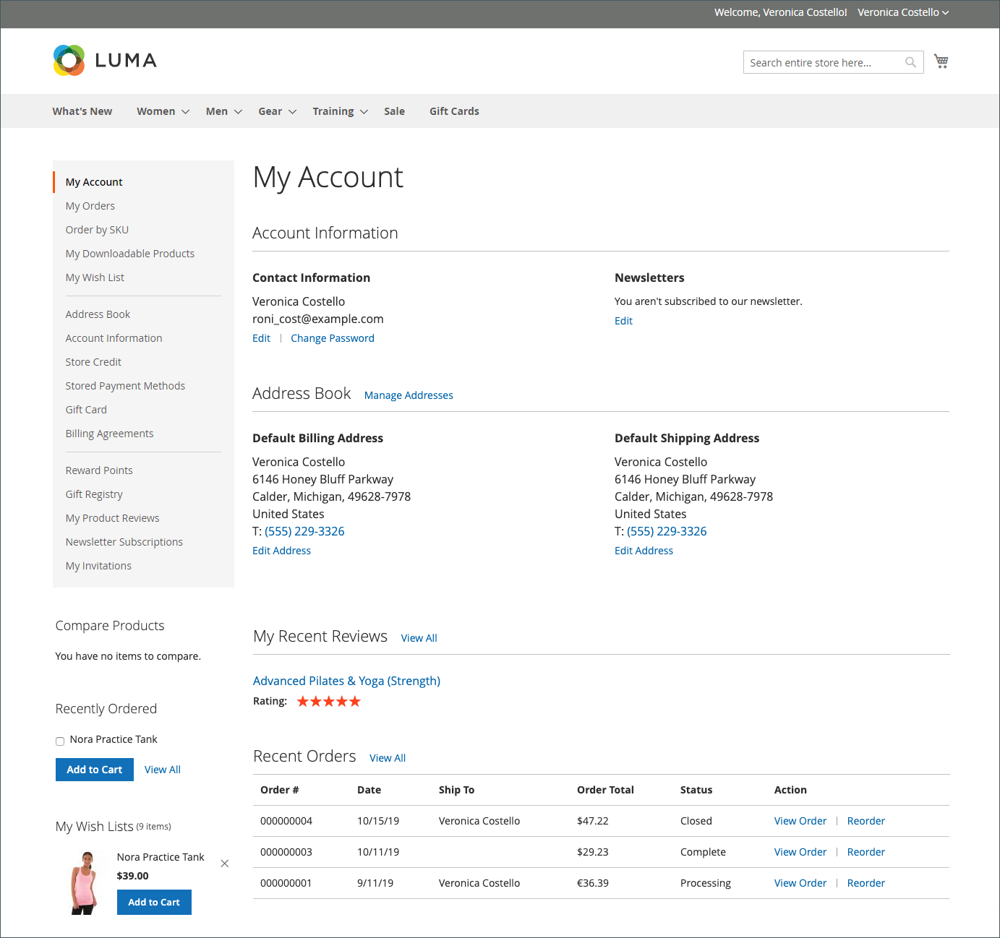

# My Account

The **[!UICONTROL My Account]** section of the customer dashboard gives customers an overview of their information and activity related to your store.

The **[!UICONTROL My Account]** page consist of following sections:

* [**[!UICONTROL Account Information]**](../customers/account-dashboard-account-information.md)
* [**[!UICONTROL Address Book]**](../customers/account-dashboard-address-book.md)
* [**[!UICONTROL My Recent Reviews]**](../merchandising-promotions/product-reviews.md#product-reviews-on-the-storefront)
* [**[!UICONTROL Recent Orders]**](../stores-purchase/orders-storefront.md#view-recently-ordered-products)

