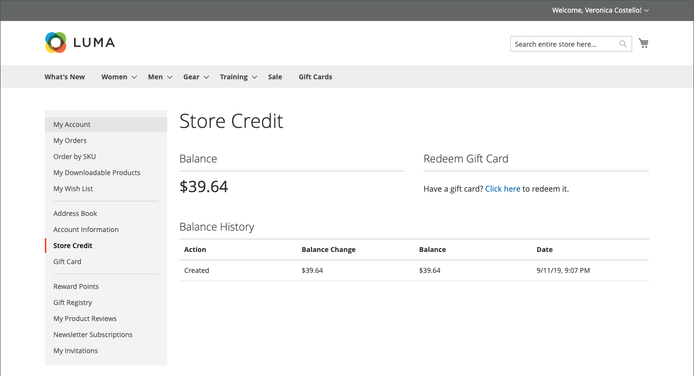
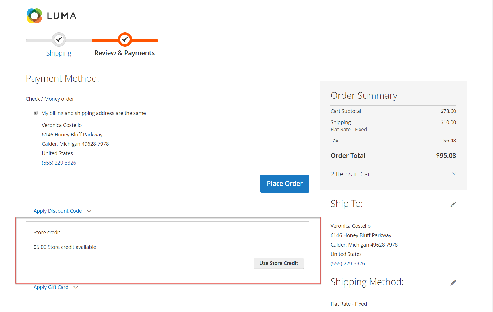
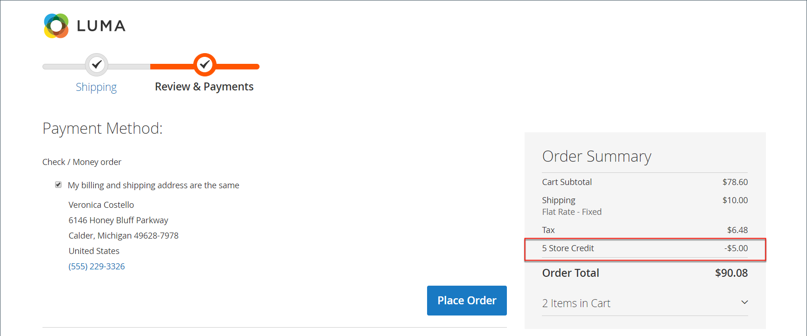

# Store credit in the customer account dashboard

{{ee-feature}}

The _[!UICONTROL Store Credit]_ page of the customer account dashboard lists amounts from returns and refunds that can be applied to future purchases. Customers can also redeem the value from a gift card.

{width="700" zoomable="yes"}

## Apply store credit during checkout

1. Customer determines the amount of available store credit.

   During the _Review & Payments_ step, the available amount appears under **[!UICONTROL Store Credit]**.

1. To apply the amount to the order, the customer clicks **[!UICONTROL Use Store Credit]**.

   {width="600" zoomable="yes"}

1. The order total is recalculated and the amount of store credit that is applied appears in the Order Summary.

   {width="600" zoomable="yes"}

1. When ready, clicks **[!UICONTROL Place Order]**.

## View store credit balance and history

There are two methods for viewing credit balance and history:

Method 1: **From the customer account dashboard**

1. From the storefront, the customer logs in to account.

1. Chooses **[!UICONTROL Store Credit]** in the left panel.

Method 2: **From the _Review & Payments_ page**

1. The customer adds a product to the cart.

1. Proceeds to the checkout page.

1. Passes the **[!UICONTROL Shipping]** step.

1. If store credit is available, the customer clicks **Use Store Credit**.

1. If the customer changes their mind about using the store credit, clicks **[!UICONTROL Remove]** in the _[!UICONTROL Order Summary]_ section.
