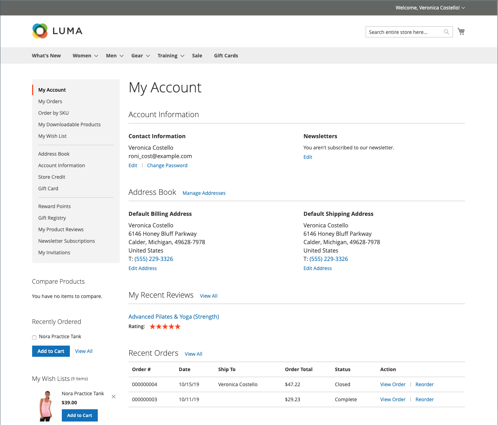
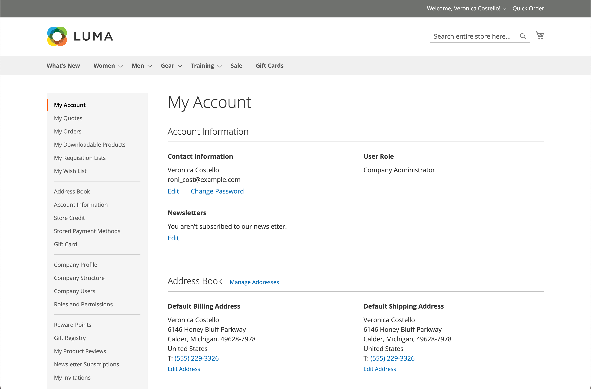

# Customer account dashboard

Customers can manage and monitor their own information and activities from their account dashboard. Customers can reorder, track orders, manage shipping addresses and payment methods, product reviews, newsletter subscriptions, and more.

{width="700" zoomable="yes"}

>[!NOTE]
>
> With the installation and enablement of Adobe Commerce B2B, the buying experience can be personalized with company-specific features. The full range of B2B account dashboard options (purchase orders, requisition lists, and negotiated quotes) can be enabled for customers who are associated with a company. For more information about the B2B features, see the [Adobe Commerce B2B User Guide](../b2b/introduction.md).

{width="700" zoomable="yes"}

## Account dashboard side navigation

The following table contains information about all sections available in the customer account dashboard left navigation.

| Section                                                                                                                                              | Description                                                                                                                                                                                                                                                                                                                                                    |
|------------------------------------------------------------------------------------------------------------------------------------------------------|----------------------------------------------------------------------------------------------------------------------------------------------------------------------------------------------------------------------------------------------------------------------------------------------------------------------------------------------------------------|
| [**[!UICONTROL My Account]**](../customers/account-dashboard-my-account.md)                                                                          | Displays summary information for your account, including contact information, default addresses from your address book, and recent orders.                                                                                                                                                                                                                     |
| [**[!UICONTROL My Orders]**](../stores-purchase/orders-storefront.md#view-recently-ordered-products)                                                 | Displays a list of all customer orders, with a link to each. If enabled in the configuration, any order can be reordered by simply clicking the Reorder link.                                                                                                                                                                                                  |
| [**[!UICONTROL My Downloadable Products]**](../catalog/product-create-downloadable.md#storefront-experience)                                         | Lists all downloadable products that the customer has purchased, with a link to each.                                                                                                                                                                                                                                                                          |
| [**[!UICONTROL My Wish List]**](../stores-purchase/wishlist-storefront.md)                                                                           | Manage your wish lists, and place orders from wish list items.                                                                                                                                                                                                                                                                                                 |
| [**[!UICONTROL Address Book]**](../customers/account-dashboard-address-book.md)                                                                      | The customer address book includes the default billing and shipping address, and additional address entries.                                                                                                                                                                                                                                                   |
| [**[!UICONTROL Account Information]**](../customers/account-dashboard-account-information.md)                                                        | Customers can update their account information and change their password as needed. The store Admin can also update customer accounts and access the information to offer shopping assistance.                                                                                                                                                                 |
| [**[!UICONTROL Billing Agreements]**](../stores-purchase/paypal-billing-agreements.md#storefront-experience)                                         | Displays a list of any customer billing agreements.                                                                                                                                                                                                                                                                                                            |
| [**[!UICONTROL My Product Reviews]**](../merchandising-promotions/product-reviews.md#product-reviews-on-the-storefront)                              | Displays a list of all product reviews submitted by the customer, with a link to each.                                                                                                                                                                                                                                                                         |
| [**[!UICONTROL Newsletter Subscriptions]**](../merchandising-promotions/newsletters.md)                                                              | Lists all available newsletters, with a check mark next the items to which the customer is subscribed.                                                                                                                                                                                                                                                         |
|  [**[!UICONTROL Order by SKU]**](../stores-purchase/order-by-sku.md#order-by-sku-from-a-customer-account) | Gives you the ability to add individual items to the cart by SKU or to import a list of products to be ordered from a CSV file.                                                                                                                                                                                                                                |
|  [**[!UICONTROL Store Credit]**](../customers/account-dashboard-store-credit.md)                          | Displays the current amount of store credit from returns, refunds, and redeemed gift card that can be applied to purchases.                                                                                                                                                                                                                                    |
| [**[!UICONTROL Stored Payment Methods]**](../stores-purchase/stored-payment-methods.md)                                                              | Lists any payment methods with secure vaults that are used by the customer to store credit card information.                                                                                                                                                                                                                                                   |
|  [**[!UICONTROL Gift Card]**](../catalog/product-gift-card-create.md)                                     | Allows customers to check the current balance on available gift cards and to redeem gift cards for store credit.                                                                                                                                                                                                                                               |
|  [**[!UICONTROL Reward Points]**](../merchandising-promotions/rewards-loyalty.md)                         | Lists all reward points the customer has earned that can be applied toward purchases.                                                                                                                                                                                                                                                                          |
|  [**[!UICONTROL Gift Registry]**](../merchandising-promotions/gift-registries.md)                         | Used to list and maintains gift registries, and  add new ones.                                                                                                                                                                                                                                                                                                 |
|  [**[!UICONTROL My Invitations]**](../merchandising-promotions/invitations.md)                            | Lists all invitations that the customer has created and sent for scheduled events.                                                                                                                                                                                                                                                                             |
|  [**[!UICONTROL My Purchase Orders]**](../b2b/account-dashboard-my-purchase-orders.md)                   | (Companies Only) Lists all purchase orders submitted or controlled by the customer, with a link to detailed information.                                                                                                                                                                                                                                       |
|  [**[!UICONTROL My Quotes]**](../b2b/account-dashboard-my-quotes.md)                                     | (Companies Only) Lists all quotes submitted by the customer, with a link to detailed information.                                                                                                                                                                                                                                                              |
|  [**[!UICONTROL My Requisition Lists]**](../b2b/account-dashboard-requisition-lists-manage.md)           | (Companies Only) Maintains all requisition lists created by the customer.                                                                                                                                                                                                                                                                                      |
|  [**[!UICONTROL Company Profile]**](../b2b/account-company-manage.md#update-a-company-profile)           | (Companies Only) A designated company administrator can manage company information, including the company name and address, company administrator contact information, and payment information.                                                                                                                                                                |
|  [**[!UICONTROL Company Credit]**](../b2b/credit-company.md#storefront-credit-information)               | (Companies Only) Shows the current outstanding balance, available credit, and the credit limit that is allocated to the account, followed by a list of outstanding invoices. The Company Credit section appears in the dashboard only when [Payment on Account](../b2b/enable-basic-features.md#configure-payment-on-account) is enabled in the configuration. |
|  [**[!UICONTROL Company Structure]**](../b2b/account-company-structure.md)                               | (Companies Only) Used by the company administrator to define the business structure of the company.                                                                                                                                                                                                                                                            |
|  [**[!UICONTROL Company Users]**](../b2b/account-company-users.md)                                       | (Companies Only) Used by the company administrator to create user accounts for company buyers.                                                                                                                                                                                                                                                                 |
|  [**[!UICONTROL Roles and Permissions]**](../b2b/account-company-roles-permissions.md)                   | (Companies Only) Used by the company administrator to define roles for company users with various levels of permission.                                                                                                                                                                                                                                        |
|  [**[!UICONTROL Approval Rules]**](../b2b/account-dashboard-approval-rules.md)                           | (Companies Only) Used to define approval rules for purchase orders.                                                                                                                                                                                                                                                                                            |

{style="table-layout:auto"}
