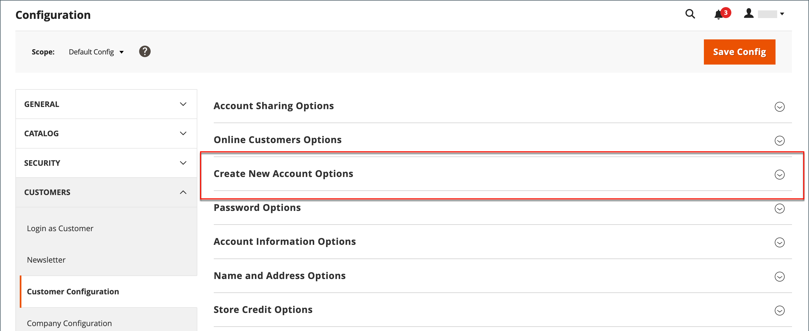

# New customer account options

In the _[!UICONTROL Create New Account Options]_ section of the configuration, the basic account options are combined with more advanced options that relate to VAT ID Validation and custom integrations. The following instructions cover only the most frequently used options. To learn about automatic customer group assignments, see [VAT Validation](../stores-purchase/vat.md).

{width="600" zoomable="yes"}

## Set up the basic customer account options

1. On the _Admin_ sidebar, go to **[!UICONTROL Stores]** > _[!UICONTROL Settings]_ > **[!UICONTROL Configuration]**.

1. In the left panel, expand **[!UICONTROL Customers]** and choose **[!UICONTROL Customer Configuration]**.

1. Expand the **[!UICONTROL Create New Account Options]** section:

  {width="600" zoomable="yes"}

1. Set each of the options according to the customer experience that you need to support on your storefront:

   - Set **[!UICONTROL Default Group]** to the customer group that is assigned to new customers when an account is created.

   - If you have a _Value Added Tax_ number and want it to be visible to customers, set **[!UICONTROL Show VAT Number on Storefront]** to `Yes`.

   - To require a customer's email during Admin order creation for a customer, set **[!UICONTROL Email is required field for Admin order creation]** to `Yes`.

   - Enter the **[!UICONTROL Default Email Domain]** for the store, such as `mystore.com`

   - Set **[!UICONTROL Default Welcome Email]** to the template that is used for the Welcome email sent to new customers.

   - Set **[!UICONTROL Default Welcome Email without Password]** to the template that is used when a customer account is created that does not yet have a password. For example, a customer account created from the Admin does not yet have a password assigned.

   - Set **[!UICONTROL Email Sender]** to the store contact that appears as the sender of the Welcome email.

   - To require customers to confirm their request to open an account with your store, set **[!UICONTROL Require Emails Confirmation]** to `Yes`. Then, set **[!UICONTROL Confirmation Link Email]** to the template that is used for the confirmation email.

   - Set **[!UICONTROL Welcome Email]** to the template that is used for the Welcome message that is sent after the account is confirmed.

  {width="600" zoomable="yes"}

  For detailed information about each of the options available in this configuration option set, see the _Create New Account Options_ [configuration reference](../configuration-reference/customers/customer-configuration.md).

1. When complete, click **[!UICONTROL Save Config]**.
