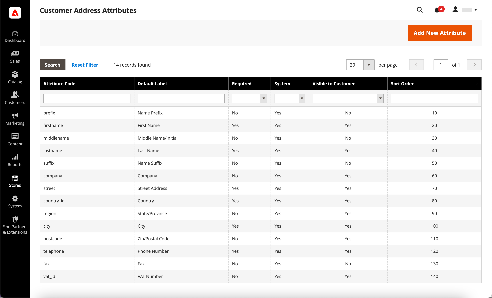
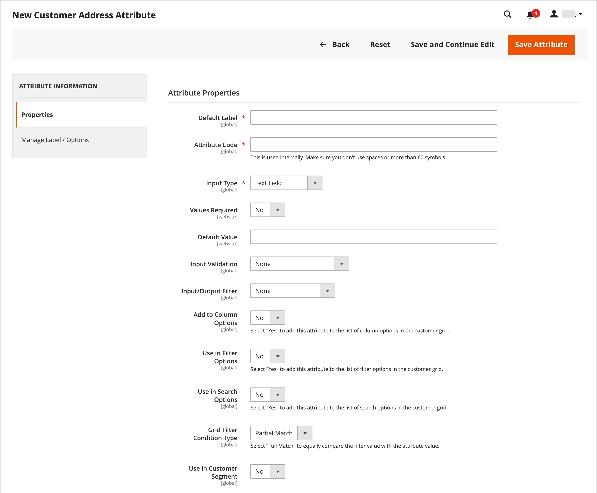
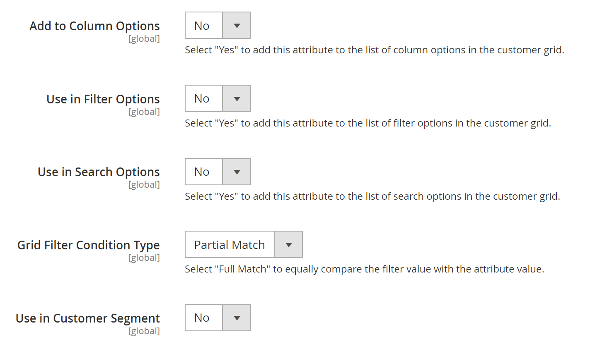
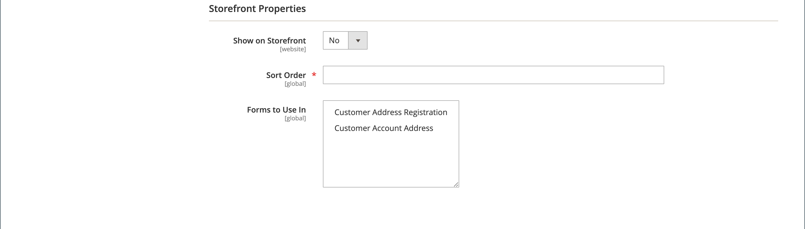
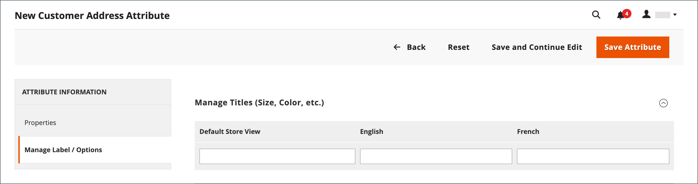

# Customer address attributes

{{ee-feature}}

The Customer Address attribute set determines the properties of street addresses that are entered into the [address book](account-dashboard-address-book.md) from the customer's account or during [checkout](../stores-purchase/checkout-process.md).

Custom address attributes can be set up if you need to provide additional information such as an optional email address, Skype account, alternate phone number, building, or county. The custom attribute can then be incorporated into the [address template](address-templates.md) that is used to produce sales documents. The process to create a custom address attribute is almost the same as creating a [customer attribute](attribute-properties.md).

Customer address attributes are used in the following forms:

- [Customer Address Registration](account-create.md)
- [Customer Account Address](account-dashboard-address-book.md)

<!-- zoom -->

## Step 1: Complete the attribute properties

1. On the _Admin_ sidebar, go to **[!UICONTROL Stores]** > _[!UICONTROL Attributes]_ > **[!UICONTROL Customer Address]**.

1. In the upper-right corner, click **[!UICONTROL Add New Attribute]**.

   <!-- zoom -->

1. In the **[!UICONTROL Attribute Properties]** section, do the following:

   - Enter a **[!UICONTROL Default Label]** to identify the attribute during data entry.

   - Enter an **[!UICONTROL Attribute Code]** to identify the attribute within the system.

      The attribute code must begin with a letter, and can include any combination of lowercase letters (a-z) and numbers (0-9). The code must be fewer than 30 characters in length, and cannot include special characters or spaces. The underscore character (_) can be used to indicate a space.

      >[!TIP]
      >
      >**_Shortcut:_** To complete only the required fields, scroll down to [!UICONTROL Storefront Properties], enter the [!UICONTROL Sort Order], and save.

1. Complete the **Data Entry Properties**.

   - To determine the type of input control that is used for data entry, set **Input Type** to one of the following:

      |Value|Description|
      |--- |--- |
      |`Text Field`|A single-line text field.|
      |`Text Area`|A multi-line text area.|
      |`Multiple Line`|Creates multiple text lines for the attribute, similar to a multi-line street address. The number of separate data entry lines can be from 2 to 20. Use the `Default Value` to specify the initial value of the field.|
      |Date|Displays a date field with a pop-up calendar. Additional properties:  Use `Default Value` to specify the initial value of the field.  Use `Minimal Value` to specify the earliest date that can be entered.   Use `Maximum Value` to specify the latest date that can be entered.|
      |`Dropdown`|A drop-down list that accepts only one value to be selected.|
      |`Multiple Select`|A drop-down list that accepts multiple values to be selected.|
      |`Yes/No`|A  field that offers only a choice of `Yes` or `No` values.|
      |`File (attachment)`|A field that allows a file to be uploaded and associated with the customer attribute as an attachment.|
      |`Image File`|A field that allows an image to be uploaded to the gallery and associated with the customer attribute.|

   - If the customer must enter a value in the field, set **[!UICONTROL Values Required]** to `Yes`.

   - To assign an initial value to the field, enter a **[!UICONTROL Default Value]**.

   - To check the data entered into the field for accuracy before the record is saved, set **[!UICONTROL Input Validation]** to the type of data to be allowed in the field. The available values depend on the Input Type specified.

      |Value|Description|
      |--- |--- |
      | `None` | The field has no input validation during data entry. |
      | `Alphanumeric` | Accepts any combination of numbers (0-9) and alphabetic characters (a-z, A-Z) during data entry. To include special characters, see [!UICONTROL Escape HTML Entities] in the next step. |
      | `Alphanumeric with Space` | Accepts any combination of numbers (0-9), alphabetic characters (a-z, A-Z), and spaces during data entry. |
      | `Numeric Only` | Accepts only numbers (0-9) during data entry. |
      | `Alpha Only` | Accepts only alphabetic characters (a-z, A-Z) during data entry. |
      | `URL` | Accepts only a URL during data entry. |
      | `Email` | Accepts only an email address during data entry. |
      | `Length Only` | Validates the input based on the length of the data entered into the field. |

   - To apply a preprocessing filter to values entered in a text field, text area, or multiple line input type, set **[!UICONTROL Input/Output Filter]** to one of the following:

      |Value|Description|
      |--- |--- |
      | `None` | Does not apply a filter to text entered into the field. |
      | `Strip HTML Tags` | Removes HTML tags from the text. This filter can help clean up data that is pasted into a field from another source that includes HTML tags. |
      | `Escape  HTML Entities` | Converts special characters found in the text to a valid HTML escape sequence, such as `&;`. Escape sequences are enclosed between an ampersand and a semi-colon, and are frequently used for typographer's smart quotes, copyright, and trademark symbols. Escape sequences are also used to identify characters such as the less than (`<`) and greater than (`>`) symbols, and the ampersand character which are also used in the code. This filter can help clean up special characters that are sometimes pasted into database fields from word processors. |

1. Complete the **[!UICONTROL Customers Grid and Segment Properties]**.

   - To be able to include the column in the Customers grid, set **[!UICONTROL Add to Column Options]** to `Yes`.

   - To filter the Customers grid by this attribute, set **[!UICONTROL Use in Filter Options]** to `Yes`.

   - To filter the Customers grid by text attribute with different filter-matching conditions, set **[!UICONTROL Grid Filter Condition Type]** to `Partial Match`, `Prefix Match`, or `Full Match`. It does not affect the _Search by keyword_ field for the grid.

   - To search the Customers grid by this attribute, set **[!UICONTROL Use in Search Options]** to `Yes`.

   - To make this attribute available to [customer segments](customer-segments.md), set **[!UICONTROL Use in Customer Segment]** to `Yes`.

   <!-- zoom -->

## Step 2: Complete the storefront properties

1. To make the attribute visible to customers, set **[!UICONTROL Show on Storefront]** to `Yes`.

1. Enter a number in the **[!UICONTROL Sort Order]** field to determine its order of appearance when listed with other attributes.

1. Set **[!UICONTROL Forms to Use]** to each form that is to include the attribute. To choose multiple options, hold down the Ctrl key and click each form.

   - [Customer Address Registration](account-create.md)
   - [Customer Account Address](account-dashboard-address-book.md)

   <!-- zoom -->

## Step 3: Complete the label and save

1. In the panel on the left, choose **[!UICONTROL Manage Labels/Options]**.

1. Under **[!UICONTROL Manage Titles]**, enter a label to identify the attribute for each [store view](../getting-started/websites-stores-views.md).

1. When complete, click **[!UICONTROL Save Attribute]**.

   <!-- zoom -->

## Field descriptions

### [!UICONTROL Attribute Properties]

|Field|Description|
|--- |--- |
|[!UICONTROL Default Label]|The default label that identifies the attribute in the Admin and storefront.|
|[!UICONTROL Attribute Code]|A unique code that identifies the attribute within the system. The code can be up to 21 characters in length, and cannot include spaces or special characters. The underscore symbol can be used instead of a space.|
|[!UICONTROL Input Type]|Determines the [input control](../catalog/attributes-input-types.md) that is used for data entry. Options:  **`Text Field`** - A single-line text field.  **`Text Area`** - A multi-line text area.  **`Multiple Line`** - Creates multiple text lines for the attribute, similar to a multi-line street address. The number of separate data entry lines can be from 2 to 20.  **`Date`** - Displays a date field with a pop-up calendar. **`Dropdown`** - A drop-down list that accepts only one value to be selected.  **`Multiple Select`** - A drop-down list that accepts multiple values to be selected.  **`Yes/No`** - A  field that offers only a choice of `Yes` or `No` values.  **`File (attachment)`** - A field that allows a file to be uploaded and associated with the customer attribute as an attachment.  **`Image File`** - A field that allows an image to be uploaded to the gallery and associated with the customer attribute.|
|[!UICONTROL Values Required]|Determines if a value must be entered into the field. Options: Yes / No|
|[!UICONTROL Default Value]|Specifies the initial value of the attribute.|
|[!UICONTROL Input Validation]|The selection of options is determined by the input type. Options:  **`None`** - The field has no input validation during data entry.  **`Alphanumeric`** - Accepts any combination of numbers (0-9) and alphabetic characters (a-z, A-Z) during data entry.  **`Alphanumeric with Space`** - Allows spaces in the street address to comply with maximum length requirements of carrier. During checkout, the customer can enter any combination of numbers (0-9), alphabetic characters (a-z, A-Z), and spaces in the street address of the recipient and sender. Any extra spaces are trimmed when the address is saved.  **`Numeric Only`** - Accepts only numbers (0-9) during data entry.  **`Alpha Only`** - Accepts only alphabetic characters (a-z, A-Z) during data entry.  **URL** - Accepts only a URL during data entry.  **`Email`** - Accepts only an email address during data entry.  **`Length Only`** - Validates the input based on the length of the data entered into the field.|
|[!UICONTROL Input/Output Filter]|Applies a preprocessing filter to  values entered in a text field, text area, or multiple line input type before the record is saved. Options:  **`None`** - Does not apply a filter to text entered into the field.  **`Strip HTML Tags`** - Removes HTML tags from the text. This filter can help clean up data that is pasted into a field from another source that includes HTML tags.  **`Escape HTML Entities`** - Converts special characters found in the text to a valid HTML escape sequence, such as `amp;`. Escape sequences are enclosed between an ampersand and a semi-colon, and are frequently used for typographer's smart quotes, copyright symbols, and trademark symbols. Escape sequences are also used to  identify characters such as the less than (`<`) and greater than (`>`) symbols, and the ampersand character which are also used in the code. This filter can help clean up special characters that are sometimes pasted into database fields from word processors.|
|[!UICONTROL Add to Column Options]|Specifies if the attribute is included as a column in the [Customers](./customers-all.md) grid. Options: `Yes` / `No`|
|Use in Filter Options|Specifies if the attribute can be used as a filter for search operations from the grid. Options: `Yes` / `No`|
|[!UICONTROL Grid Filter Condition Type]|Specifies filter-matching conditions for attributes in search operations from the grid. It does not affect the _[!UICONTROL Search by keyword]_ field for the grid. Options: `Partial Match` / `Prefix Match` / `Full Match` |
|[!UICONTROL Use in Search Options]|Specifies if the attribute value can be used as a keyword in search operations. Options: `Yes` / `No`|
|[!UICONTROL Use in Customer Segment]|Determines if the attribute is included in [customer segment](./customer-segments.md) conditions. Options: `Yes` / `No`|

### [!UICONTROL Storefront Properties]

|Field|Description|
|--- |--- |
|[!UICONTROL Show on Storefront]|Determines if the attribute appears as a field in the customer information in the storefront. Options: `Yes` / `No`|
|[!UICONTROL Sort Order]|Specifies the sort order of this attribute in relation to other customer attributes. The sort order determines the sequence that fields receive focus during data entry when using keyboard navigation.|
|[!UICONTROL Forms to Use in]|Determines the pages with data entry forms where the attribute appears. Hold down the Ctrl key to choose multiple forms. Options:  [`Customer Address Registration`](account-create.md)  [`Customer Account Address`](account-dashboard-address-book.md)|
