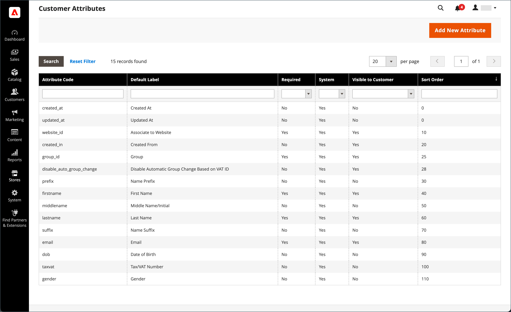
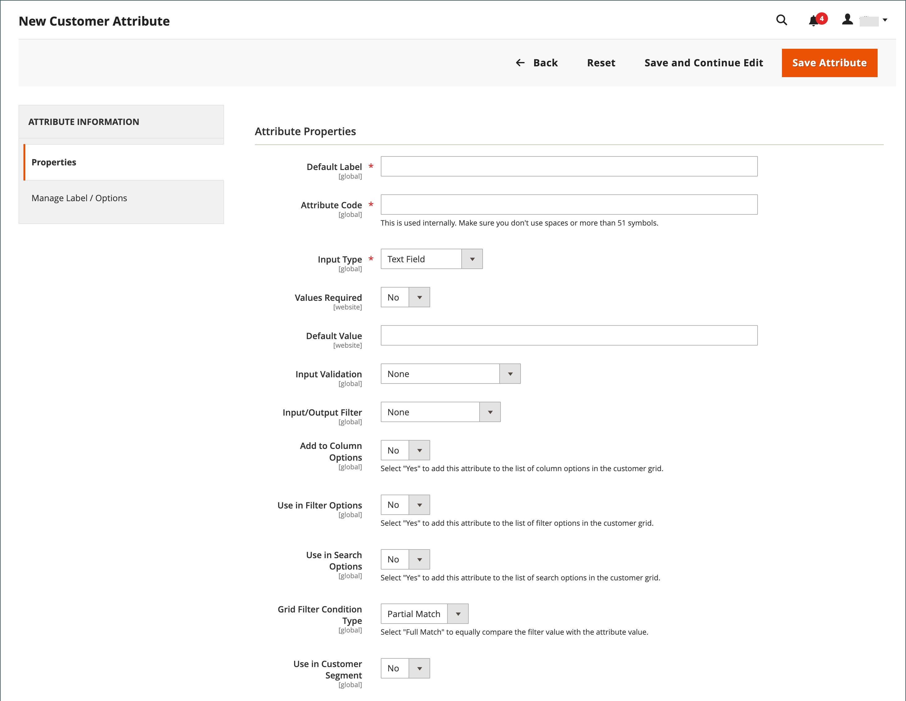
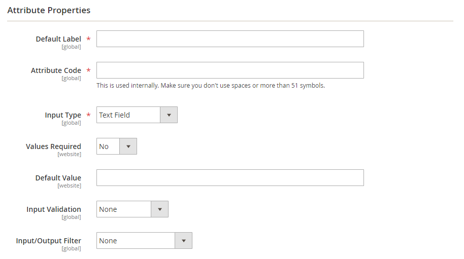
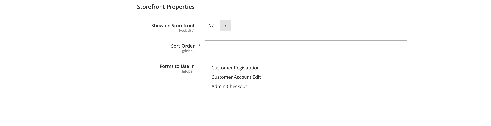
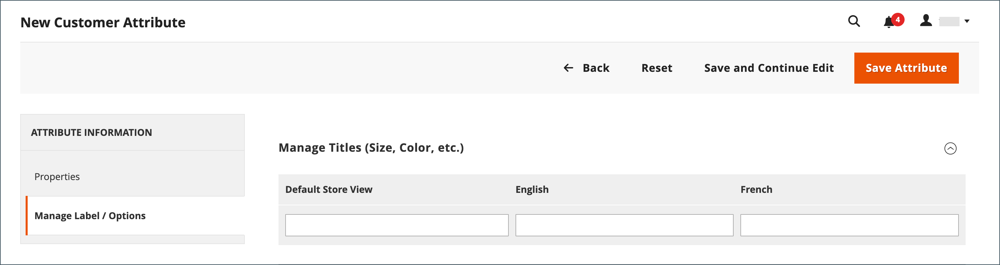

# Customer attribute properties

{{ee-feature}}

Customer attributes provide the information that is required to support the order, fulfillment, and customer management processes. Because your business is unique, you might need fields in addition to those provided by the system. You can add custom attributes to the Account Information, Address Book, and Billing Information sections of the customer's account. Customer [address attributes](address-attributes.md) can also be used in the _Billing Information_ section during checkout, or when guests register for an account.

<!-- zoom -->

## Step 1: Complete the Attribute Properties

1. On the _Admin_ sidebar, go to **[!UICONTROL Stores]** > _[!UICONTROL Attributes]_ > **[!UICONTROL Customer]**.

1. In the upper-right corner, click **[!UICONTROL Add New Attribute]**.

   <!-- zoom -->

1. In the **[!UICONTROL Attribute Properties]** section, do the following:

   - Enter a **[!UICONTROL Default Label]** to identify the attribute during data entry.

   - Enter an **[!UICONTROL Attribute Code]** to identify the attribute within the system.

   The attribute code must begin with a letter, and can include any combination of lowercase letters (a-z) and numbers (0-9). The code must be fewer than 30 characters in length, and cannot include special characters or spaces. The underscore character (`_`) can be used to indicate a space.

   >[!TIP]
   >
   >**Shortcut:** To complete only the required fields, scroll down to _[!UICONTROL Storefront Properties]_, enter the _[!UICONTROL Sort Order]_, and save.

1. Complete the **[!UICONTROL Data Entry Properties]**.

    - To determine the type of input control that is used for data entry, set **[!UICONTROL Input Type]** to one of the following:

      |Type|Description|
      |----|-----------|
      |`Text Field`|A single-line text field.|
      |`Text Area`|A multiple-line input field for entering paragraphs of text, such as a product description. You can use the WYSIWYG editor to format the text with HTML tags, or enter the tags directly into the text.|
      |`Multiple Line`|Creates multiple text lines for the attribute, similar to a multi-line street address. The number of separate data entry lines can be from two to 20. Use the `Default Value` to specify the initial value of the field.|
      |`Date`|Displays a date value in the preferred date format and time zone. Date values can be selected from a list or a calendar (  ).   **_Note:_** Depending on your system configuration, _Admin_ users can enter dates directly into a field or select a date from the calendar or list. For information about specifying date and time values, see [Date and time options](../catalog/attributes-input-types.md#date-and-time-options).|
      |`Yes/No`|Displays a drop-down list with pre-defined options of `Yes` and `No`.|
      |`Dropdown`|Displays a drop-down list of values that accepts only a single selection. The Dropdown input type is a key component of [configurable products](../catalog/product-create-configurable.md).|
      |`Multiple Select`|A drop-down list that accepts multiple values to be selected.|
      |`File (attachment)`|A field that allows a file to be uploaded and associated with the customer attribute as an attachment.|
      |`Image File`|A field that allows an image to be uploaded to the gallery and associated with the customer attribute.|

    - If the customer must enter a value in the field, set **[!UICONTROL Values Required]** to `Yes`.

    - To assign an initial value to the field, enter a **[!UICONTROL Default Value]**.

    - To check the data entered into the field for accuracy before the record is saved, set **[!UICONTROL Input Validation]** to the type of data to be allowed in the field. The available values depend on the [!UICONTROL Input Type] specified.

      |Value|Description|
      |-----|-----------|
      | `None` | The field has no input validation during data entry. |
      | `Alphanumeric` | Accepts any combination of numbers (0-9) and alphabetic characters (a-z, A-Z) during data entry. To include special characters, see [Escape HTML Entities](#escape-HTML). |
      | `Alphanumeric with Space` | Accepts any combination of numbers (0-9), alphabetic characters (a-z, A-Z), and spaces during data entry. |
      | `Numeric Only` | Accepts only numbers (0-9) during data entry. |
      | `Alpha Only` | Accepts only alphabetic characters (a-z, A-Z) during data entry. |
      | `URL` | Accepts only a URL during data entry. |
      | `Email` | Accepts only an email address during data entry. |
      | `Length Only` | Validates the input based on the length of the data entered into the field. |

    - To limit the size of Text Field and Text Area input types, enter the **[!UICONTROL Minimum Text Length]** and **[!UICONTROL Maximum Text Length]**.

    - To apply a preprocessing filter to values entered in a text field, text area, or multiple line input type, set **[!UICONTROL Input/Output Filter]** to one of the following:

      |Value|Description|
      |-----|-----------|
      | `None` | Does not apply a filter to text entered into the field. |
      | `Strip HTML Tags` | Removes HTML tags from the text. This filter can help clean up data that is pasted into a field from another source that includes HTML tags. |
      | `Escape  HTML Entities` | Converts special characters found in the text to a valid HTML escape sequence, such as `&;`. Escape sequences are enclosed between an ampersand and a semi-colon, and are frequently used for typographer's smart quotes, copyright, and trademark symbols. Escape sequences are also used to identify characters such as the less than (`<`) and greater than (`>`) symbols, and the ampersand character which are also used in the code. This filter can help clean up special characters that are sometimes pasted into database fields from word processors. |

      <!-- zoom -->

1. Complete the **[!UICONTROL Customers Grid and Segment Properties]**.

    - To be able to include the column in the Customers grid, set **[!UICONTROL Add to Column Options]** to `Yes`.

    - To filter the Customers grid by this attribute, set **[!UICONTROL Use in Filter Options]** to `Yes`.

    - To filter the Customers grid by text attribute with different filter-matching conditions, set **[!UICONTROL Grid Filter Condition Type]** to `Partial Match`, `Prefix Match`, or `Full Match`. It does not affect the _Search by keyword_  field for the grid.

    - To search the Customers grid by this attribute, set **[!UICONTROL Use in Search Options]** to `Yes`.

    - To make this attribute available to [customer segments](customer-segments.md), set **[!UICONTROL Use in Customer Segment]** to `Yes`.

    <!-- zoom -->

## Step 2: Complete the storefront properties

1. To make the attribute visible to customers, set **[!UICONTROL Show on Storefront]** to `Yes`.

1. Enter a number in the **[!UICONTROL Sort Order]** field to determine its order of appearance when listed with other attributes.

1. Set **[!UICONTROL Forms to Use]** to each form that is to include the attribute. To choose multiple options, hold down the Ctrl key and click each form.

    - [`Customer Registration`](customer-sign-in.md)
    - [`Customer Account Edit`](account-create.md)
    - [`Admin Checkout`](../stores-purchase/checkout-process.md)

    <!-- zoom -->

## Step 3: Complete the label and save

1. In the left panel, choose **[!UICONTROL Manage Labels/Options]**.

1. Under **[!UICONTROL Manage Titles]**, enter a label to identify the attribute for each [store view](../getting-started/websites-stores-views.md).

1. When complete, click **[!UICONTROL Save Attribute]**.

   <!-- zoom -->

## Field descriptions

### [!UICONTROL Attribute Properties]

|Field|Description|
|--- |--- |
|[!UICONTROL Default Label]|The default label that identifies the attribute in the Admin and storefront.|
|[!UICONTROL Attribute Code]|A unique code that identifies the attribute within the system. The code can be up to 60 characters in length, and cannot include spaces or special characters. The underscore symbol can be used instead of a space.|
|[!UICONTROL Input Type]|Determines the input control that is used for data entry. Options:  **`Text Field`** - A single-line text field.  **`Text Area`** - A multi-line text area.  **`Multiple Line`** - Creates multiple text lines for the attribute, similar to a multi-line street address. The number of separate data entry lines can be from 2 to 20.  **`Date`** - Displays a date field with a pop-up calendar. **`Dropdown`** - A drop-down list that accepts only one value to be selected.  **`Multiple Select`** - A drop-down list that accepts multiple values to be selected.  **`Yes/No`** - A  field that offers only a choice of `Yes` or `No` values.  **`File (attachment)`** - A field that allows a file to be uploaded and associated with the customer attribute as an attachment.  **`Image File`** - A field that allows an image to be uploaded to the gallery and associated with the customer attribute.|
|[!UICONTROL Values Required]|Determines if a value must be entered into the field. Options: `Yes` / `No`|
|[!UICONTROL Default Value]|Specifies the initial value of the attribute.|
|[!UICONTROL Input Validation]|The selection of options is determined by the input type. Options:  **`None`** - The field has no input validation during data entry.  **`Alphanumeric`** - Accepts any combination of numbers (0-9) and alphabetic characters (a-z, A-Z) during data entry.  **`Alphanumeric with Space`** - Allows spaces in the street address to comply with maximum length requirements of carrier. During checkout, the customer can enter any combination of numbers (0-9), alphabetic characters (a-z, A-Z), and spaces in the street address of the recipient and sender. Any extra spaces are trimmed when the address is saved.  **`Numeric Only`** - Accepts only numbers (0-9) during data entry.  **`Alpha Only`** - Accepts only alphabetic characters (a-z, A-Z) during data entry.  **`URL`** - Accepts only a URL during data entry.  **`Email`** - Accepts only an email address during data entry.  **`Length Only`** - Validates the input based on the length of the data entered into the field.|
|[!UICONTROL Input/Output Filter]|Applies a preprocessing filter to  values entered in a text field, text area, or multiple line input type before the record is saved. Options:  **`None`** - Does not apply a filter to text entered into the field.  **`Strip HTML Tags`** - Removes HTML tags from the text. This filter can help clean up data that is pasted into a field from another source that includes HTML tags.  **`Escape HTML Entities`** - Converts special characters found in the text to a valid HTML escape sequence, such as `amp;`. Escape sequences are enclosed between an ampersand and a semi-colon, and are frequently used for typographer's smart quotes, copyright symbols, and trademark symbols. Escape sequences are also used to  identify characters such as the less than (`<`) and greater than (`>`) symbols, and the ampersand character which are also used in the code. This filter can help clean up special characters that are sometimes pasted into database fields from word processors.|
|[!UICONTROL Add to Column Options]|Specifies if the attribute is included as a column in the [Customers](customers-all.md) grid. Options: `Yes` / `No`|
|[!UICONTROL Use in Filter Options]|Specifies if the attribute can be used as a filter for search operations from the grid. Options: `Yes` / `No`|
|[!UICONTROL Grid Filter Condition Type]|Specifies the filter-matching conditions for attributes for search operations from the grid. It does not affect the _Search by keyword_ field for the grid. Options: `Partial Match` / `Prefix Match` / `Full Match` |
|[!UICONTROL Use in Search Options]|Specifies if the attribute value can be used as a keyword in search operations. Options: `Yes` / `No`|
|[!UICONTROL Use in Customer Segment]|Determines if the attribute is included in [customer segment](customer-segments.md) conditions. Options: `Yes` / `No`|

### [!UICONTROL Storefront Properties]

|Field|Description|
|--- |--- |
|[!UICONTROL Show on Storefront]|Determines if the attribute appears as a field in the customer information in the storefront. Options: `Yes` / `No`|
|[!UICONTROL Sort Order]|Specifies the sort order of this attribute in relation to other customer attributes. The sort order determines the sequence that fields receive focus during data entry when using keyboard navigation.|
|[!UICONTROL Forms to Use in]|Determines the pages with data entry forms where the attribute appears. Hold down the Ctrl key to choose multiple forms. Options:  [`Customer Registration`](account-dashboard-account-information.md)  [`Customer Account Edit`](account-create.md)  [`Admin Checkout`](../stores-purchase/checkout-process.md)|

## Default customer attributes

| Attribute code  | Description |
| --------------- | ------------------ |
| `created_at`    | The date the customer account was created. |
| `updated_at`    | The date the customer account was last updated. |
| `website_id`    | The website ID of the site where the customer account was created. |
| `store_id`      | The store ID of the site where the customer account was created. |
| `created_in`    | The store view where the account was created. |
| `group_id`      | The ID of the customer group where the customer is assigned. |
| `disable_auto_group_change` | Determines if customer groups can be dynamically assigned during [VAT ID validation](../stores-purchase/vat.md#configure-vat-id-validation). |
| `prefix`        | Any prefix that is used with the customer name (such as Mr., Ms., or Dr.). |
| `firstname`     | The first name of the customer. |
| `middlename`    | The middle name or middle initial of the customer. |
| `lastname`      | The last name of the customer. |
| `suffix`        | Any suffix that is used with the customer name. (such as Jr., Sr., or Esquire) |
| `email`         | The customer's email address. |
| `dob`           | The customer's date of birth.    **_Important:_** In keeping with current security and privacy best practices, be aware of any potential legal and security risks associated with the storage of customers' full date of birth (month, day, year) with other personal identifiers. It is recommended that you limit the storage of customers' full birth dates and suggest using customer year of birth as an alternative. |
| `taxvat`        | The Value Added Tax (VAT) ID that is assigned to the customer. The default label of this attribute is `VAT Number`. The VAT number field is always present in all shipping and billing customer addresses when viewed from the Admin, but is not a required field. |
| `gender`        | The customer gender. |

## Customer attributes demo

Watch this video to learn about creating customer attributes:

>[!VIDEO](https://video.tv.adobe.com/v/343661?quality=12)
