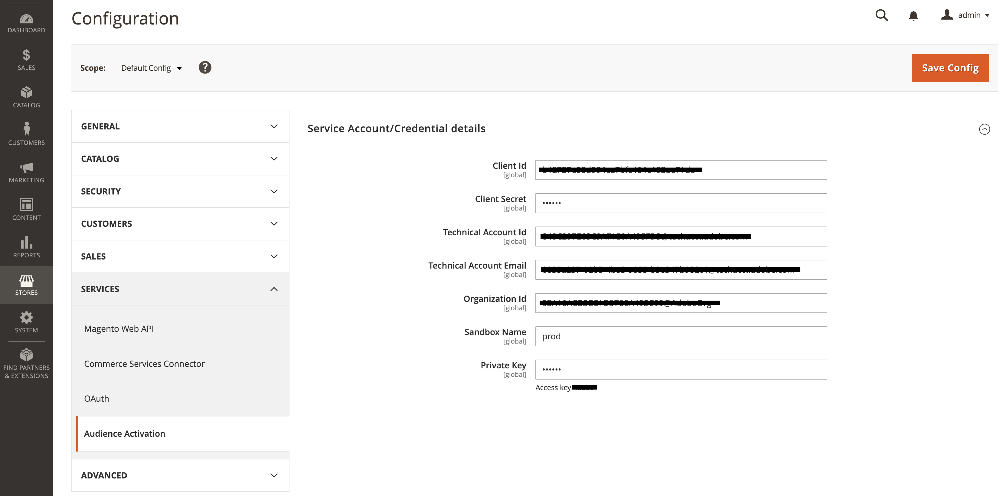
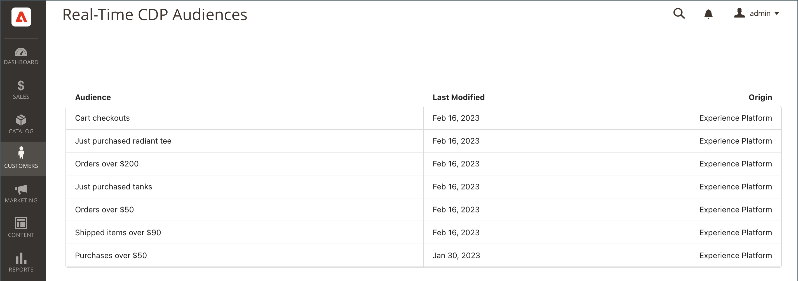
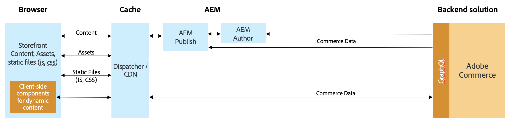

# [!DNL Audience Activation]

The [!DNL Audience Activation] extension lets you activate Real-Time CDP audiences in Adobe Commerce to create unique offers in the cart. These offers and incentives include common ecommerce merchandising techniques, such as _buy 2 get 1 free_, hero banners geared toward that customer, and modified product pricing through various offers. The audiences built within Real-Time CDP are based on data from various enterprise systems, such as Enterprise Resource Planning (ERP), Customer Relationship Management (CRM), point of sale, and marketing systems. Because customer segment information is constantly refreshed, customers can become associated and disassociated from a segment as they shop in your store.

You can activate audiences in a Luma storefront or [headless](#headless-support) storefront. In a Luma storefront, audience information (segment membership) is stored in a cookie on the Commerce side. In a headless storefront, audience information is passed in the GraphQL API header as a parameter named: `aep-segments-membership`.

## Release notes

This section contains information about updates to the Audience Activation extension and includes:

-  - New features
-  - Fixes and improvements
-  - Known issues

See [Upcoming Releases](https://experienceleague.adobe.com/docs/commerce-operations/release/planning/schedule.html) to learn about release schedules and support.

See the developer documentation to [learn about product compatibility](https://experienceleague.adobe.com/docs/commerce-operations/release/product-availability.html).

## Supported service updates

These release notes describe feature changes and fixes related to extensions used by Audience Activation.

+++Supported service updates

_June 27, 2023_

-  - Added support for PHP 8.2 in the `magento/module-data-services-graphql` package.

_May 30, 2023_

-  - Updated the [Real-Time CDP Audiences dashboard](#real-time-cdp-audiences-dashboard) to include the ability to sort, search, and filter the active audiences within your Adobe Commerce instance.

+++

### 1.1.0

_May 30, 2023_

[!BADGE Compatibility]{type=Informative tooltip="Compatibility"} Adobe Commerce versions 2.4.4 and newer

-  - Added support for [dynamic blocks](#headless-support) in a headless storefront.

### 1.0.1

_May 11, 2023_

[!BADGE Compatibility]{type=Informative tooltip="Compatibility"} Adobe Commerce versions 2.4.4 and newer

-  - Fixed an issue where a dynamic block or cart price rule was not applied to the storefront.
-  - Fixed an issue where an unconfigured installation of the Audience Activation extension caused an error when a merchant tried to create or update a dynamic block.

### 1.0.0

_March 31, 2023_

[!BADGE Compatibility]{type=Informative tooltip="Compatibility"} Adobe Commerce versions 2.4.4 and newer

-  - General availability release

## Implementation

The following tasks apply to both Luma and headless storefront implementations. To activate audiences in Adobe Commerce, you must:

- [Install Adobe Commerce on cloud infrastructure, version 2.4.4 or higher](https://experienceleague.adobe.com/docs/commerce-cloud-service/user-guide/overview.html)
- [Activate](https://experienceleague.adobe.com/docs/experience-platform/destinations/catalog/personalization/adobe-commerce.html) Adobe Commerce as a destination in Real-Time CDP
- [Install](#install-the-extension) the [!DNL Audience Activation] extension in the Admin
- [Configure](#configure-the-extension) the [!DNL Audience Activation] extension in the Admin

### Install the extension

You can install the [!DNL Audience Activation] extension from the [marketplace](https://commercemarketplace.adobe.com/magento-audiences.html) or you can run the following command:

   ```bash
   composer require magento/audiences
   ```

### Configure the extension

After you install the [!DNL Audience Activation] extension, you must log into your Commerce Admin and complete the following:

1. On the _Admin_ sidebar, go to **[!UICONTROL System]** > _[!UICONTROL Services]_ > **[!UICONTROL Commerce Services Connector]**.

1. [Sign in](https://experienceleague.adobe.com/docs/commerce-merchant-services/user-guides/integration-services/saas.html#organizationid) to your Adobe account and select your organization ID.

1. On the _Admin_ sidebar, go to **[!UICONTROL System]** > _[!UICONTROL Services]_ > **[!UICONTROL Experience Platform Connector]**.

1. In the **[!UICONTROL Datastream ID]** field, paste the ID of the datastream that you created when you [activated](https://experienceleague.adobe.com/docs/experience-platform/destinations/catalog/personalization/adobe-commerce.html#parameters) Adobe Commerce as a destination in Real-Time CDP. 

    This datastream sends data from your Commerce website to Real-Time CDP to determine if a shopper belongs to an audience. If you have not yet created a datastream, [create](https://experienceleague.adobe.com/docs/experience-platform/edge/datastreams/configure.html#create) one in Experience Platform, [add](https://experienceleague.adobe.com/docs/experience-platform/destinations/catalog/personalization/adobe-commerce.html) it to the Commerce destination in Real-Time CDP, and to the [Experience Platform Connector](https://experienceleague.adobe.com/docs/commerce-merchant-services/experience-platform-connector/fundamentals/connect-data.html#data-collection) in the Admin.

    >[!NOTE]
    >
    >When you specify a datastream ID, you [associate it to a specific website](https://experienceleague.adobe.com/docs/commerce-merchant-services/experience-platform-connector/fundamentals/connect-data.html#data-collection) in the Experience Platform connector. If your Commerce store has multiple websites, [create a destination](https://experienceleague.adobe.com/docs/experience-platform/destinations/ui/connect-destination.html) for each website in Real-Time CDP and use a different datastream ID for each.

1. On the _Admin_ sidebar, go to **[!UICONTROL Stores]** > _[!UICONTROL Settings]_ > **[!UICONTROL Configuration]**.

1. Expand **[!UICONTROL Services]** and select **[!UICONTROL Audience Activation]**. 

1. Enter the configuration credentials found in the [developer console](https://developer.adobe.com/console/home).

    {width="700" zoomable="yes"}

1. Click **Save Config**.

With audiences activated to your Adobe Commerce instance, you can:

- [Create a cart price rule](../merchandising-promotions/price-rules-cart-create.md#set-a-condition-using-real-time-cdp-audiences) informed by audiences
- [Create a dynamic block](../content-design/dynamic-blocks.md#use-real-time-cdp-audiences-in-dynamic-blocks) informed by audiences

## Real-Time CDP audiences dashboard

You can view all active audiences that are available to personalize within your Adobe Commerce instance using the **Real-Time CDP Audiences** dashboard. Any audiences you [activated](https://experienceleague.adobe.com/docs/experience-platform/destinations/ui/activate/activate-edge-personalization-destinations.html) in the Adobe Commerce destination in Real-Time CDP appear in this dashboard.

To access the **Real-Time CDP Audiences** dashboard, go to the _Admin_ sidebar, then go to **[!UICONTROL Customers]** > **[!UICONTROL Real-time CDP Audience]**. The **Real-Time CDP Audiences** dashboard appears:

{width="700" zoomable="yes"}

|Column|Description|
|--- |--- |
|`Search Filter`|Section that lets you specify the search criteria. You can search by `Audience` or `Last Modified`. If you do not select any criteria or you select all criteria, all audiences are searched.|
|`Search`|Lets you search for active audiences in your Commerce instance. |
|`Audience`|Name given to the audience in Real-Time CDP.|
|`Last Modified`|Indicates when the audience was modified in Real-Time CDP.|
|`Origin`|Indicates where the audience came from, such as `Experience Platform`.|
|`Sync now`|Retrieves new or updated audiences from Real-Time CDP.|

{style="table-layout:auto"}

## Headless support

You can activate audiences in a headless Adobe Commerce instance, such as AEM and PWA, to display cart price rules or dynamic blocks based on the audiences.

### Cart price rules

For cart price rules, a headless storefront communicates to the Experience Platform through the [Commerce Integration Framework (CIF)](https://experienceleague.adobe.com/docs/experience-manager-cloud-service/content/content-and-commerce/integrations/magento.html). The framework provides a server-side API that is implemented using GraphQL. Audience information, such as a shopper's segment, passes to Commerce through a GraphQL header parameter named: `aep-segments-membership`.

The overall architecture is as follows:

{width="700" zoomable="yes"}

After you [install](#install-the-extension) and [configure](#configure-the-extension) the extension, the Experience Platform Web SDK contains the audience information in the form of segment membership.

To capture those segment memberships from the SDK, see this [code snippet](https://experienceleague.adobe.com/docs/experience-platform/destinations/catalog/personalization/custom-personalization.html#example-response-for-custom-personalization-with-attributes).

After it is retrieved, you can pass those segments to Commerce within the GraphQL header. For example:

```bash
curl 'http://magento.config/graphql' -H 'Authorization: Bearer abc123' -H 'aep-segments-membership: urlencoded_list_of_segments' -H 'Content-Type: application/json' --data-binary '{"query":"query {\ncustomer {\nfirstname\nlastname\nemail\n}\n}"}'
```

### Dynamic blocks

For dynamic blocks, GraphQL `dynamicBlocks` queries can contain the `audience_id` input attribute. If you specify one or more `audience_id` values in a `dynamicBlocks` query, it returns a list of dynamic blocks assigned to those audiences.

#### Example usage

The following query returns all dynamic blocks associated with multiple audience IDs.

**Request:**

```graphql
{
  dynamicBlocks(input:
  {
    type: SPECIFIED
    audience_id: {
      in: [
        "cd29a789-9be8-40ad-a1ef-640c33b3742e"
        "92c3e14d-c72b-40d0-96b7-b96801dcc135"
      ]
    }
  })
  {
    items {
      uid
      audience_id
      content {
        html
      }
    }
    page_info {
      current_page
      page_size
      total_pages
    }
    total_count
  }
}
```

**Response:**

```json
{
  "data": {
    "dynamicBlocks": {
      "items": [
        {
          "uid": "MQ==",
          "audience_id": [
            "cd29a789-9be8-40ad-a1ef-640c33b3742e"
          ],
          "content": {
            "html": "<h2><strong>SAVE 20%</strong></h2>\r\n<p>(some restrictions apply)</p>\r\n<p>&nbsp;</p>"
          }
        },
        {
          "uid": "Mg==",
          "audience_id": [
            "cd29a789-9be8-40ad-a1ef-640c33b3742e",
            "92c3e14d-c72b-40d0-96b7-b96801dcc135"
          ],
          "content": {
            "html": "<p></p>"
          }
        }
      ],
      "page_info": {
        "current_page": 1,
        "page_size": 20,
        "total_pages": 1
      },
      "total_count": 2
    }
  }
}
```

Learn more about the `dynamicBlocks` GraphQL query in the [developer documentation](https://developer.adobe.com/commerce/webapi/graphql/schema/store/queries/dynamic-blocks/).

## Retrieve audiences using the Adobe Experience Platform Mobile SDK

Your mobile Commerce site can integrate with the Adobe Experience Platform Mobile SDK. To learn how to install and configure the SDK for your mobile Commerce site, see the [Experience Platform connector](https://experienceleague.adobe.com/docs/commerce-merchant-services/experience-platform-connector/fundamentals/mobile-sdk-epc.html) documentation.

>[!IMPORTANT]
>
>The Adobe Experience Platform Mobile SDK for iOS supports iOS 11 or later.

After you finish the installation and configuration, you can use the mobile SDK to retrieve Real-Time CDP audiences. For example:

```swift
Edge.sendEvent(experienceEvent: experienceEvent) { (handles: [EdgeEventHandle]) in
    for handle in handles {
        if handle.type == "activation:pull" {
        let payloadItems = handle.payload ?? []
            for payloadItem in payloadItems {
                if let segments = payloadItem["segments"] as? any Sequence {
                    var segmentsArr = [Any]()
                    for segment in segments {
                        let response = segment as AnyObject?
                        segmentsArr.append(response?.object(forKey: "id")! ?? "")
                    }
                    print("Saving segments ->  \(segments)")
                    storage.set(segmentsArr, forKey: "segments")
                    print("End saving segments")
                }
         
                // Show segments
                let rSegments = storage.object(forKey: "segments") ?? nil;
                print("Retrieving segments -> \(rSegments)")
            }
        }
    }
}
```

You can now use that audience data in your Commerce app to [create cart price rules](../merchandising-promotions/price-rules-cart-create.md#set-a-condition-using-real-time-cdp-audiences) and [dynamic blocks](../content-design/dynamic-blocks.md#use-real-time-cdp-audiences-in-dynamic-blocks) informed by audiences.
