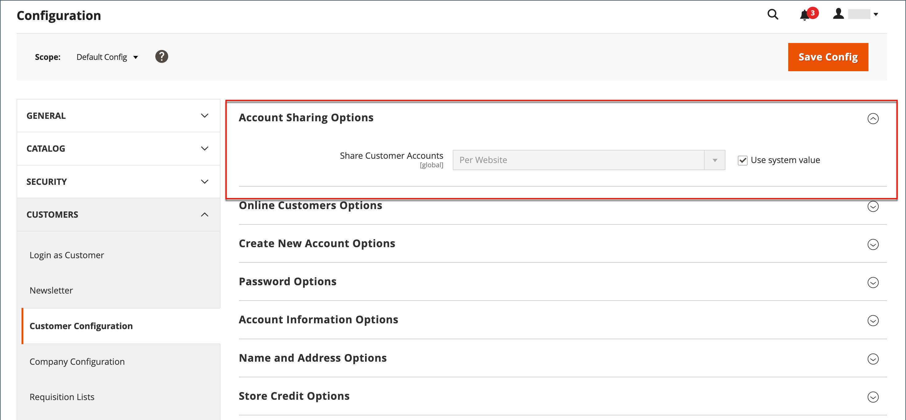

# Customer Account

The header of every page in your store extends an invitation for shoppers to _Log in or register_ for an account with your store. Customers who open an account enjoy a range of benefits, including:

* [!UICONTROL **Create customer account**] - Visitors can create a new customer account so that they can use the storefront as a registered customer.
* [!UICONTROL **Create Individual or Company Account**] Depending on the configuration, a visitor to your store can choose to create either an individual or company account. For more information see [B2B for Adobe Commerce](../b2b/introduction.md).
* [!UICONTROL **Faster checkout**] — Registered customers move through checkout faster because much of the information is already in their accounts.
* [!UICONTROL **Self service**] — Registered customers can update their information, check the status of orders, and even reorder from their accounts.

Customers can access their account by clicking the [!UICONTROL **My Account**] link in the header of the store. From their account, customers can view and modify information, including past and current addresses, billing and shipping preferences, newsletter subscriptions, wishlist, and more.

<!-- zoom -->

## Customer Account Scope

The scope of customer accounts can be limited to the website where the account was created, or shared with all websites and stores in the store hierarchy.

## Set the scope of customer accounts

1. On the _Admin_ sidebar, go to [!UICONTROL **Stores**] > [!UICONTROL _Settings_] > [!UICONTROL **Configuration**].

1. In the left panel, expand [!UICONTROL **Customers**] and choose [!UICONTROL **Customer Configuration**].

1. Expand the [!UICONTROL **Account Sharing Options**] section.

   <!-- zoom -->

1. Set [!UICONTROL **Share Customer Accounts**] to one of the following:

   |Column|Description|
   | --- | --- |
   | Global | Shares customer account information with every website and store in the installation. |
   | Per Website | Limits customer account information to the website where the account was created. |

   >[!INFO]
   >
   > If necessary, clear the [!UICONTROL **User system value**] checkbox to make the change.

1. When complete, click [!UICONTROL **Save Config**].

   >[!NOTE]
   >
   > If the [website is excluded from the customer group](https://developer.adobe.com/commerce/php/development/components/indexing/optimization/), the customer is not allowed to log in to the website when the scope of customer accounts is limited to the website or shared with all websites.
