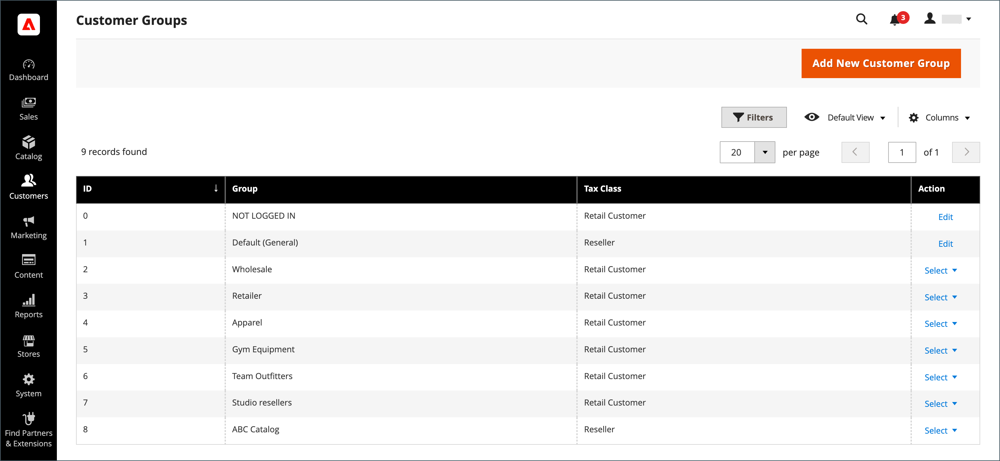
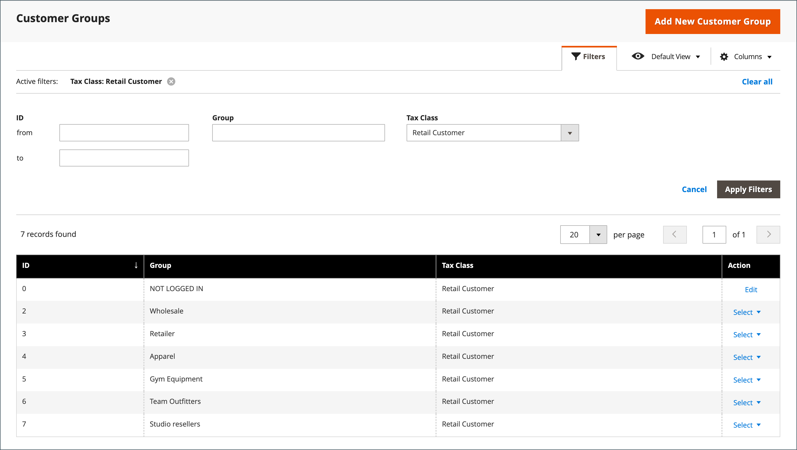
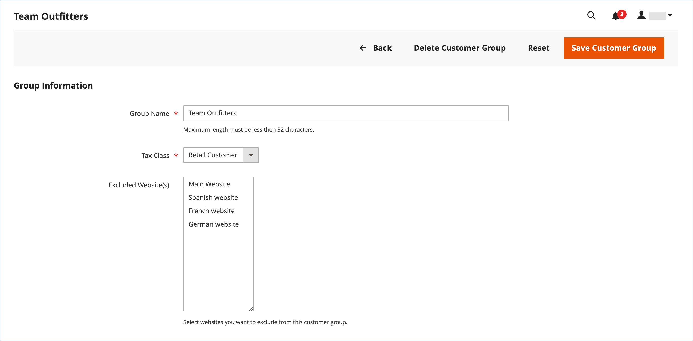
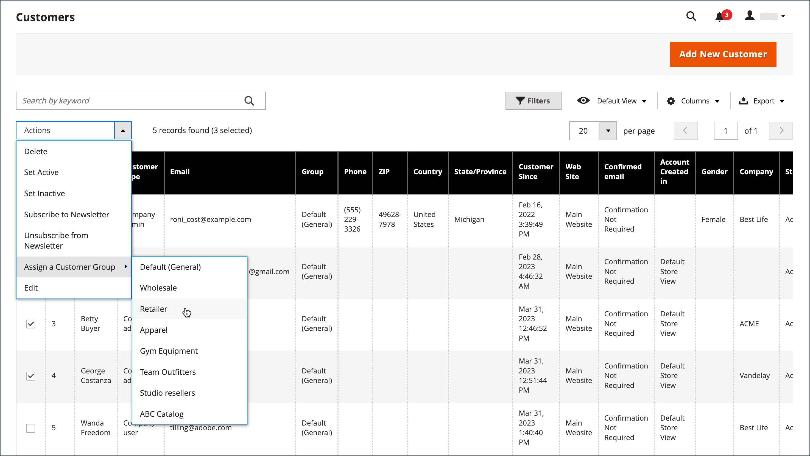
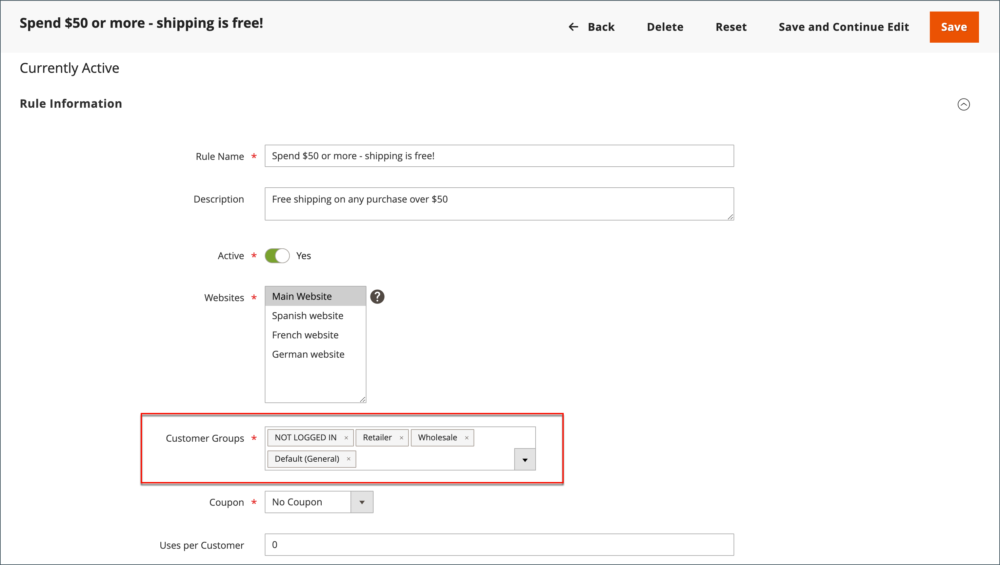

# Customer groups

Customer groups determine which discounts are available and the tax class that is associated with the group. The default customer groups are `General`, `Not Logged In`, and `Wholesale`.

{width="700" zoomable="yes"}

## Filter the [!UICONTROL Customer Groups] list

1. On the _Admin_ sidebar, go to **[!UICONTROL Customers]** > **[!UICONTROL Customer Groups]**.

1. Click **[!UICONTROL Filters]**.

1. Enter criteria for searching groups, including a range of IDs, group, or tax class.

   {width="600" zoomable="yes"}

1. When complete, click **[!UICONTROL Apply Filters]**.

## Create a customer group

>[!NOTE]
>
>Admin users that do not have access to all websites (assigned a role with a 'Custom' [!UICONTROL Role Scope]) cannot create, modify, or delete customer groups.

1. On the _Admin_ sidebar, go to **[!UICONTROL Customers]** > **[!UICONTROL Customer Groups]**.

1. Click **[!UICONTROL Add New Customer Group]**.

1. For [!DNL **Group Name]**, enter a unique name fewer than 32 characters to identify the group.

1. Select the **[!UICONTROL Tax Class]** that applies to the group.

   {width="600" zoomable="yes"}

1. Select the **[!UICONTROL Excluded Website(s)]** that you want to exclude from the group.

   >[!IMPORTANT]
   >
   >Excluding websites can decrease product price and catalog rule indexing time, because excluded websites are not indexed. When a customer group is saved with an added website exclusion, the product price, catalog rule, and catalog search indexes are invalidated. If you have many products, websites, and customer groups, it is recommended that you pause the reindex process until you have excluded websites from the customer groups.

   No websites are excluded by default. To select multiple values, hold down the _Ctrl_ key (PC) or the _Command_ key (Mac) and click each option.

1. When complete, click **[!UICONTROL Save Customer Group]**.

## Edit a customer group

1. On the _Admin_ sidebar, go to **[!UICONTROL Customers]** > **[!UICONTROL Customer Groups]**.

1. Open the record in edit mode.

1. Make the necessary changes.

1. When complete, click **[!UICONTROL Save Customer Group]**.

## Assign a customer to a different group

>[!NOTE]
>
>After changing the company group, a company user must log out and log in on the Storefront to see new prices in the catalog.
>When customer already assigned to a company, Admin user cannot update it's Customer Group.

1. On the _Admin_ sidebar, go to **[!UICONTROL Customers]** > **[!UICONTROL All Customers]**.

1. Find the customer in the list and select the checkbox in the first column.

1. Set the **Actions** control to `Assign a Customer Group` and choose the group from the menu.

   {width="600" zoomable="yes"}

1. When prompted to confirm, click **OK**.

## Associate a group of customers with specific discounts

1. On the _Admin_ sidebar, go to **[!UICONTROL Marketing]** > _Promotions_ > **[!UICONTROL Cart Price Rules]**.

1. Select the cart price rule where you want to associate a group for the applied discount, or [create a price rule](../merchandising-promotions/price-rules-catalog.md).

1. Select the customer groups that the rule applies to.

   {width="600" zoomable="yes"}

1. Click **[!UICONTROL Save]**.

>[!NOTE]
>
> You can also use Advance pricing to apply product discounts to customer groups. See [Advanced pricing](../catalog/product-price-group.md).

## Delete a customer group

1. On the _Admin_ sidebar, go to **[!UICONTROL Customers]** > **[!UICONTROL Customer Groups]**.

1. Open the record in edit mode.

1. In the button bar, click **[!UICONTROL Delete Customer Group]**.

1. When prompted to confirm, click **OK**.

## Customer groups demo

Learn about creating customer groups by watching this demo:

>[!VIDEO](https://video.tv.adobe.com/v/343660/?quality=12&learn=on)
