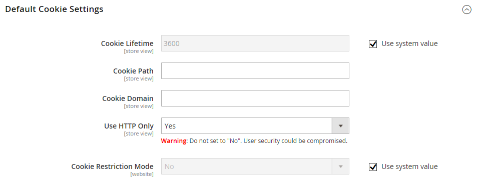

# Customer Session Lifetime

The lifetime of a customer shopping session is determined by several factors, including the length of the server session, the use of a [persistent cart](../stores-purchase/cart-persistent.md), and the lifetime of information that is stored in the browser. Although these are related to the same customer experience, they are actually separate processes with different expiration events and lifetimes.

|Column|Description|
| --- | --- |
| Session | Information that is stored on the server, such as the contents of the shopping cart. If the server session expires before the cookie expires, customers might lose the cart contents and reduce security risk. |
| Session Cookie | Information that is stored in the browser as a number or string of characters. If the session cookie expires before the server session, the customer is logged out. The session cookie is deleted when the customer closes the browser window. By default, the cookie lifetime is set to 3600 seconds, or one hour. If there is no keyboard activity during that time, the current session ends, and customers must log back into their accounts to continue shopping. |

{style="table-layout:auto"}

If [Persistent Cart](../stores-purchase/cart-persistent.md) is enabled, the cart contents are saved for the next time customers sign into their accounts. When using a persistent cart, it is recommended that you set the lifetime of the server session and the session cookie to a long period of time.

On the server, the length of the session is controlled by the `php.ini` file and several variables. At this time, Adobe Commerce does not have an Admin configuration setting that controls the length of the server session.

## Configure the cookie lifetime

1. On the _Admin_ sidebar, go to [!UICONTROL **Stores**] > _[!UICONTROL Settings]_ > [!UICONTROL **Configuration**].

1. If you have multiple stores, set the **[!UICONTROL Store View]** chooser in the upper-right corner to the store where the configuration applies.

1. In the left panel under **[!UICONTROL General]**, choose **[!UICONTROL Web]**.

1. Expand the **[!UICONTROL Default Cookie Settings]** section.

   

1. To change the default, clear the **[!UICONTROL Use system value]** checkbox and enter the new value in seconds.

1. When complete, click **[!UICONTROL Save Config]**.

## Configure Remember Me functionality

To make login easier, the **[!UICONTROL Remember Me]** function allows user account holders to avoid entering their credentials every time they enter the storefront. For security reasons, the persistence feature is disabled by default.

1. On the _Admin_ sidebar, go to **[!UICONTROL Stores]** > _[!UICONTROL Settings]_ > **[!UICONTROL Configuration]**.

1. In the left panel, expand **[!UICONTROL Customers]** and choose **[!UICONTROL Persistent Shopping Cart]**.

1. Expand the **[!UICONTROL General Options]** section.

1. For **[!UICONTROL Enable Persistence]**, set to `Yes`. (Clear the **[!UICONTROL Use system value]** checkbox to allow changing the default setting.)

1. For **[!UICONTROL Enable "Remember Me"]**, set to `Yes` or `No` according to your requirements.

1. When complete, click **[!UICONTROL Save Config]**.
