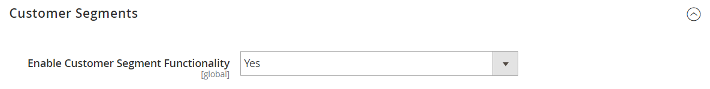

# Creating and Deleting Customer Segments

{{ee-feature}}

Creating a customer segment is similar to building a [cart price rule](../merchandising-promotions/price-rules-cart.md), except that the options include [customer segment-specific attributes](../customers/customer-segments.md).

The following example shows how to create a customer segment that targets female customers in Los Angeles.

## Step 1: Enable Customer Segments

1. On the _Admin_ sidebar, go to [!UICONTROL **Stores**]  > _Settings_ > [!UICONTROL **Configuration**].

1. In the left panel, expand [!UICONTROL **Customers**] and choose [!UICONTROL **Customer Configuration**].

1. Expand the [!UICONTROL **Customer Segments**] section.

1. Verify that [!UICONTROL **Enable Customer Segment Functionality**] is set to `Yes`.

   

1. When complete, click [!UICONTROL **Save Config**].

## Step 2: Add a Customer Segment

1. On the _Admin_ sidebar, go to [!UICONTROL **Customers**] > [!UICONTROL **Segments**].

1. In the upper-right corner, click [!UICONTROL **Add Segment**].

1. Enter a [!UICONTROL **Segment Name**] to identify the customer segment when working in the Admin.

1. Enter a brief [!UICONTROL **Description**] that explains the purpose of the segment.

1. Set [!UICONTROL **Assigned to Website**] to the website where the customer segment can be used.

1. Set the [!UICONTROL **Status**] to _Active_ or _Inactive_.

1. To identify the customer types that you want to use for applying the segment, set [!UICONTROL **Apply to**] to one of the following:

   |Field|Description|
   | --- | --- |
   | Visitors and Registered Customers | Includes all shoppers, regardless of whether they are logged in to an account. |
   | Registered Customers | Includes only shoppers who are logged in to an account. |
   | Visitors | Includes only shoppers who are not logged in to an account. |

   {style="table-layout:auto"}

1. If you are creating a segment based on customer attributes stored in a customer account, it is a best practice to apply the segment to registered customers only.

   

1. Click [!UICONTROL **Save and Continue Edit**].

1. Additional options become available in the left panel.

### Segment properties

|Field|Description|
|--- |---|
|Segment Name| A name that identifies the segment for internal reference.|
|Description| A brief description that explains the purpose of the segment for internal reference.|
|Assigned to Website| The single website where the segment can be used.|
|Status| Activates and deactivates the segment. Any associated price rules and banners are deactivated when the segment is disabled. Options include: Active / Inactive.|
|Apply to| Defines the customer types to which the segment is applied. The selection influences the set of conditions available for creating the segment. The setting cannot be changed after the segment is saved.  |

{style="table-layout:auto"}

## Step 3: Define the conditions (Example)

1. In the left pane, click [!UICONTROL **Conditions**].

   The default condition begins, "If ALL of these conditions are TRUE:".

   

1. Create a condition to target female customers:

   * Click the [!UICONTROL **Add**] icon to display the list of conditions and select `Gender`.

   * Leave the default **is** condition control option.

   * Click **...** and select `female`.

   

1. Create another condition that targets residents of Los Angeles:

   * On the next line, click the [!UICONTROL **Add**] icon and select `Customer Address`.

1. This creates a parent condition where you can define one or more address fields to match.

   * Click the [!UICONTROL **Add**] icon to display the list of address fields and select `City`.

   * Click **is** to display the condition control options and select `contains`.

   * Click **...** and enter `Los Angeles`.

   * On the next line, click the [!UICONTROL **Add**] icon and select `State/Province`.

   * Leave the default **is** condition control option.

   * Click **...** and select `United States > California`.

   

1. Click [!UICONTROL **Save and Continue Edit**].

## Step 4: Review the list of matched customers

1. In the left pane, click [!UICONTROL **Matched Customers**] to display all customers who match the condition.

   

1. If the list of customers meets your goal, click [!UICONTROL **Save**] to complete the customer segment.

1. The customer segment can now be used for targeting promotions, content, and mailings.

## Delete a customer segment

1. On the _Admin_ sidebar, go to [!UICONTROL **Customers**] > [!UICONTROL **Segments**].

1. Find the segment to be deleted and select it.

1. In the menu bar click [!UICONTROL **Delete**] button.

1. To confirm the action, click [!UICONTROL **OK**].

## Button bar

|Button|Description|
|--- |--- |
|**Back**|Returns to the Customer Segments page without saving changes.|
|**Delete**|Deletes the current customer segment. Customers or completed orders associated with the customer in the segment are not removed.|
|**Reset**|Resets any unsaved changes in the customer segment form to their previous values.|
|**Refresh Segment Data**|Refreshes the segment data to the most recently saved values. Relevant if any segment data is unavailable or out of date.|
|**Save and Continue Edit**|Saves changes and keeps the customer segment open.|
|**Save **|Saves changes and closes the customer segment.|

{style="table-layout:auto"}

## Matched Customers Grid

|Column|Description|
|--- |--- |
|ID|The customer ID of a registered customer.|
|Name|The name of of a registered customer.|
|Email|The email address of a registered customer.|
|Group|The customer group to which the customer is assigned.|
|Phone|The phone number of the customer.|
|ZIP|The ZIP or postal code of the customer.|
|Country|The country where the customer is located.|
|State / Province|The state or province where the customer is located.|
|Customer Since|The date and time the customer account was created.|

{style="table-layout:auto"}

## Customer Segments Grid

|Column|Description|
|--- |--- |
|ID|The unique ID of customer segment.|
|Segment|The name of customer segment.|
|Status|Indicates whether the customer segment is __Active__ or __Inactive__.|
|Website|Indicates the website to which the customer segment belongs.|

{style="table-layout:auto"}

## Customer segments demo

Watch this video to learn about creating customer segments:

>[!VIDEO](https://video.tv.adobe.com/v/343659/?quality=12)
