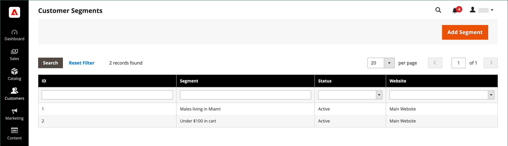
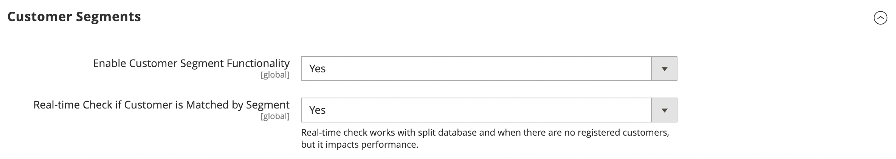
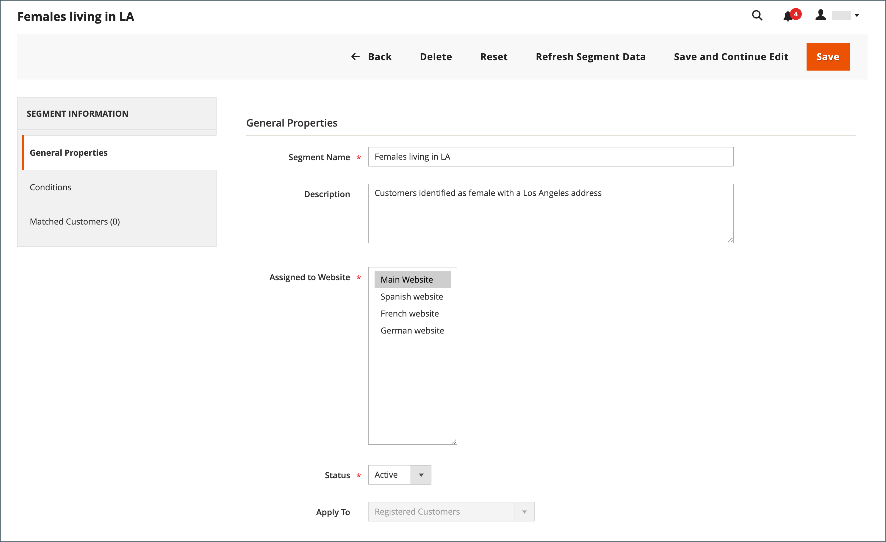
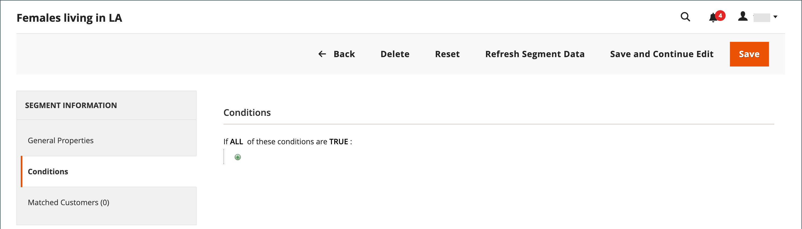
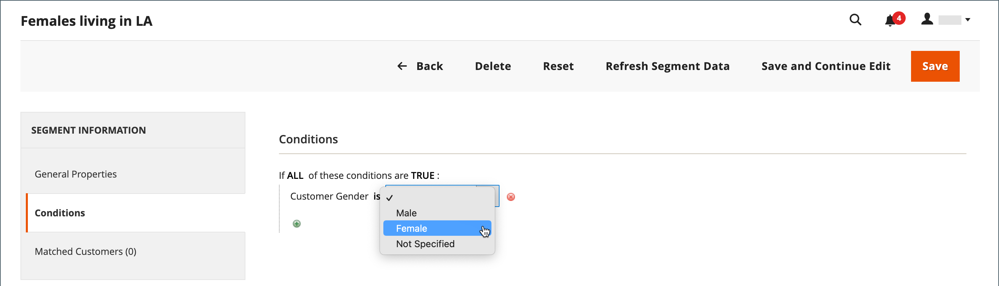
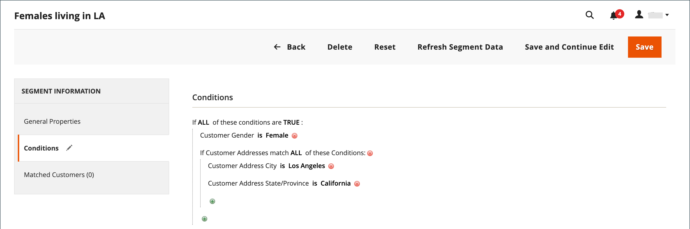
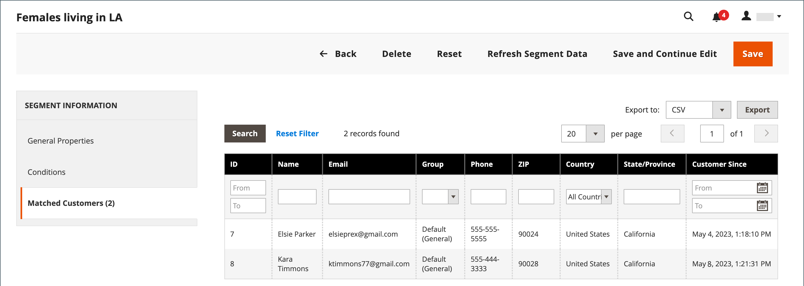

# Create and delete customer segments

{{ee-feature}}

Creating a customer segment is similar to building a [cart price rule](../merchandising-promotions/price-rules-cart.md), except that the options include [customer segment-specific attributes](../customers/customer-segments.md).

{width="700" zoomable="yes"}

_**[!UICONTROL Customer Segments] grid**_

|Column|Description|
|--- |--- |
|**[!UICONTROL ID]**|The unique ID of customer segment.|
|**[!UICONTROL Segment]**|The name of customer segment.|
|**[!UICONTROL Status]**|Indicates whether the customer segment is _[!UICONTROL Active]_ or _[!UICONTROL Inactive]_.|
|**[!UICONTROL Website]**|Indicates the website to which the customer segment belongs.|

{style="table-layout:auto"}

## Prerequisite: Enable customer segments

1. On the _Admin_ sidebar, go to **[!UICONTROL Stores]**  > _[!UICONTROL Settings]_ > **[!UICONTROL Configuration]**.

1. In the left panel, expand **[!UICONTROL Customers]** and choose **[!UICONTROL Customer Configuration]**.

1. Expand the **[!UICONTROL Customer Segments]** section.

1. Verify that **[!UICONTROL Enable Customer Segment Functionality]** is set to `Yes`.

   {width="600" zoomable="yes"}

1. (Optional) To disable real-time validation for customer segments, set **[!UICONTROL Real-time Check if Customer is Matched by Segment]** to `No`.

   When you disable real-time validation, customer segments are validated by a single combined condition SQL query. Disabling this function improves performance of segments validation if there are many customer segments in the system. However, the validation does not work with a split database or when there are no registered customers. 

1. When complete, click **[!UICONTROL Save Config]**.

## Create a segment

The following steps use an example for creating a customer segment that targets female customers in Los Angeles.

### Step 1: Add a customer segment

1. On the _Admin_ sidebar, go to **[!UICONTROL Customers]** > **[!UICONTROL Segments]**.

1. In the upper-right corner, click **[!UICONTROL Add Segment]**.

1. Enter a **[!UICONTROL Segment Name]** that identifies the customer segment when working in the Admin.

1. Enter a brief **[!UICONTROL Description]** that explains the purpose of the segment.

1. Set **[!UICONTROL Assigned to Website]** to the website where the customer segment can be used.

1. Set the **[!UICONTROL Status]** to _Active_ or _Inactive_.

1. To identify the customer types that you want to use for applying the segment, set **[!UICONTROL Apply to]** to one of the following:

   - `Visitors and Registered Customers` - Includes all shoppers, regardless of whether they are logged in to an account.
   - `Registered Customers` - Includes only shoppers who are logged in to an account.
   - `Visitors` - Includes only shoppers who are not logged in to an account.

   >[!TIP]
   >
   >If you are creating a segment based on customer attributes stored in a customer account, it is a best practice to apply the segment to registered customers only.
   
   >[!NOTE]
   >
   > If a segment applies to `Visitors and Registered Customers`, the [!UICONTROL Matched Customers] displays only `Registered Customers`. This is the case even if visitors can be targeted based on conditions that apply to them. For `Visitors` only segments, no `Matched Customers` tab is displayed.

1. Click **[!UICONTROL Save and Continue Edit]**.

   After saving the segment _[!UICONTROL General Properties]_, additional options become available in the left panel.

   {width="600" zoomable="yes"}

**_[!UICONTROL General Properties]_**

|Field|Description|
|--- |---|
|**[!UICONTROL Segment Name]**| A name that identifies the segment for internal reference.|
|**[!UICONTROL Description]**| A brief description that explains the purpose of the segment for internal reference.|
|**[!UICONTROL Assigned to Website]**| The single website where the segment can be used.|
|**[!UICONTROL Status]**| Activates and deactivates the segment. Any associated price rules and banners are deactivated when the segment is disabled. Options: `Active` / `Inactive`|
|**[!UICONTROL Apply to]**| Defines the customer types to which the segment is applied. The selection influences the set of conditions available for creating the segment. The setting cannot be changed after the segment is saved.  |

{style="table-layout:auto"}

### Step 2: Define the conditions

>[!NOTE]
>
> For visitors, only the following conditions are applicable: Shopping Cart conditions (cart subtotal amount, cart line items, and cart products quantity), Product rules (products found in shopping cart and product history), and combinations of these items. If a segment should apply to both visitors and registered customers, the visitors are tracked based on the listed conditions only.

1. In the left pane, click **[!UICONTROL Conditions]**.

   The default condition begins with _[!UICONTROL If ALL of these conditions are TRUE:]_ on the page.

   {width="600" zoomable="yes"}

1. Create a condition that targets female customers:

   - Click the **[!UICONTROL Add]** icon to display the list of conditions and select `Gender`.

   - Leave the default **is** condition control option.

   - Click **...** and select `female`.

   {width="600" zoomable="yes"}

1. Create another condition that targets residents of Los Angeles:

   - On the next line, click the **[!UICONTROL Add]** icon and select `Customer Address`.

      This action creates a parent condition where you can define one or more address fields to match.

   - Click the **[!UICONTROL Add]** icon to display the list of address fields and select `City`.

   - Click **is** to display the condition control options and select `contains`.

   - Click **...** and enter `Los Angeles`.

   - On the next line, click the **[!UICONTROL Add]** icon and select `State/Province`.

   - Leave the default **is** condition control option.

   - Click **...** and select `United States > California`.

   {width="600" zoomable="yes"}

1. Click **[!UICONTROL Save and Continue Edit]**.

### Step 3: Review the list of matched customers

1. In the left pane, click **[!UICONTROL Matched Customers]** to display all customers who match the condition.

   {width="600" zoomable="yes"}

1. If the list of customers meets your goal, click **[!UICONTROL Save]** to complete the customer segment.

1. The customer segment can now be used for targeting promotions, content, and mailings.

_**[!UICONTROL Matched Customers] grid**_

|Column|Description|
|--- |--- |
|**[!UICONTROL ID]**|The customer ID of a registered customer.|
|**[!UICONTROL Name]**|The name of a registered customer.|
|**[!UICONTROL Email]**|The email address of a registered customer.|
|**[!UICONTROL Group]**|The customer group to which the customer is assigned.|
|**[!UICONTROL Phone]**|The phone number of the customer.|
|**[!UICONTROL ZIP]**|The ZIP or postal code of the customer.|
|**[!UICONTROL Country]**|The country where the customer is located.|
|**[!UICONTROL State / Province]**|The state or province where the customer is located.|
|**[!UICONTROL Customer Since]**|The date and time the customer account was created.|

{style="table-layout:auto"}

## Remove a customer segment

1. On the _Admin_ sidebar, go to **[!UICONTROL Customers]** > **[!UICONTROL Segments]**.

1. Find the segment to be deleted and select it.

1. In the menu bar, click **[!UICONTROL Delete]** button.

1. To confirm the action, click **[!UICONTROL OK]**.

## Button bar

|Button|Description|
|--- |--- |
|**[!UICONTROL Back]**|Returns to the _[!UICONTROL Customer Segments]_ page without saving changes.|
|**[!UICONTROL Delete]**|Deletes the current customer segment. Customers or completed orders associated with the customer in the segment are not removed.|
|**[!UICONTROL Reset]**|Resets any unsaved changes in the customer segment form to their previous values.|
|**[!UICONTROL Refresh Segment Data]**|Refreshes the segment data to the most recently saved values. Relevant if any segment data is unavailable or out of date.|
|**[!UICONTROL Save and Continue Edit]**|Saves changes and keeps the customer segment open.|
|**[!UICONTROL Save]**|Saves changes and closes the customer segment.|

{style="table-layout:auto"}

## Customer segments demo

Watch this video for a demonstration of creating customer segments:

>[!VIDEO](https://video.tv.adobe.com/v/343659/?quality=12)
