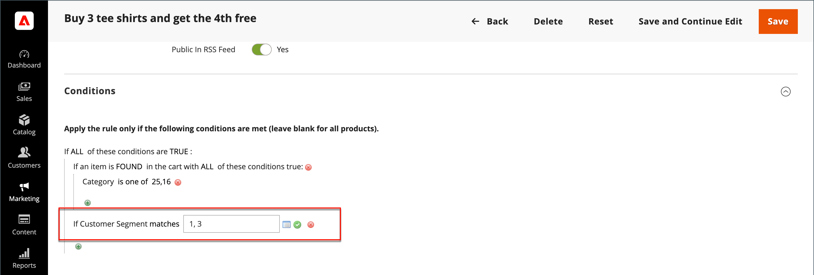
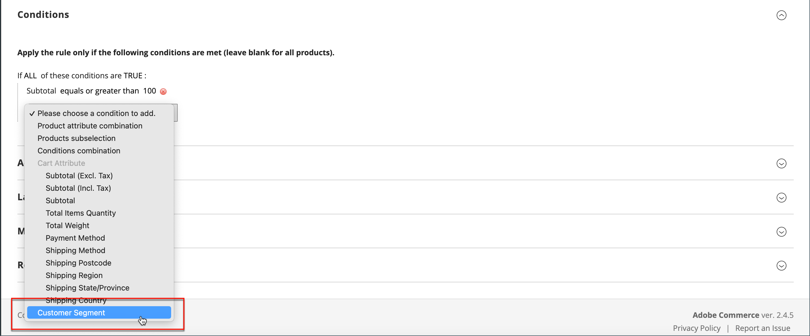
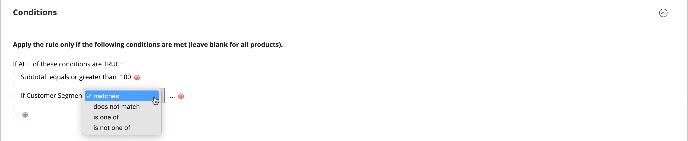
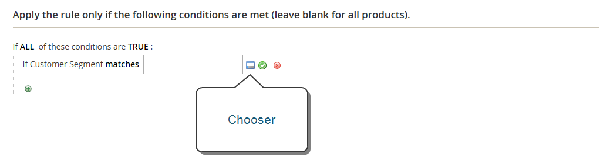

# Customer Segments in Price Rules

{{ee-feature}}

A customer segment can be targeted by associating it with a [cart price rule](../merchandising-promotions/price-rules-cart.md).

## Target a Segment with a Cart Price Rule

1. On the _Admin_ sidebar, go to [!UICONTROL **Marketing**] > _Promotions_ > [!UICONTROL **Cart Price Rules**].

1. Open a new or existing rule:

   * To use a new rule, click [!UICONTROL **Add New Rule**] in the upper-right corner.
   * To use an existing rule, click the rule in the list to open it in edit mode.

1. Scroll down and expand the [!UICONTROL **Conditions**] section.

1. Add the condition.

1. Click the [!UICONTROL **Add**] to display the list of conditions. Then, choose [!UICONTROL **Customer Segment**].

      

1. By default, the condition is set to find a matching condition. If needed, click the [!UICONTROL **matches**] link and change the operator to one of the following:

      * `does not match`
      * `is one of`
      * `is not one of`

        

1. To target a specific segment, click the More **…** link to display additional options. Then, click the [!UICONTROL **Chooser**] to display the list of customer segments.

   

1. In the list, select the checkbox of each segment that you want to target with the condition.

1. Click [!UICONTROL **Select**] to place the selected customer segments into the condition.

1. Complete the rest of the price rule as needed.

1. When complete, click [!UICONTROL **Save**].
