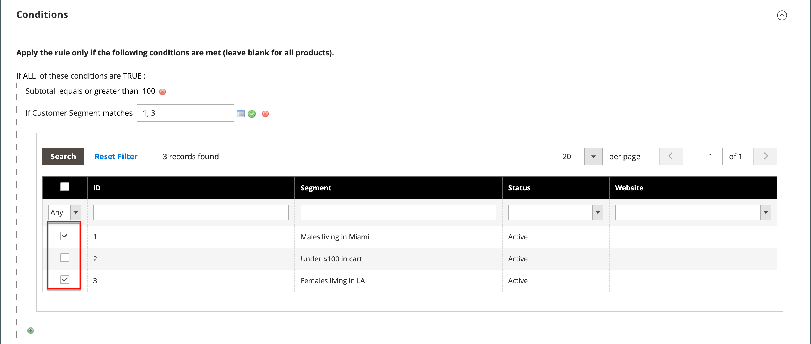

# Customer segments in price rules

{{ee-feature}}

A customer segment can be used for targeted promotions by associating it with a [cart price rule](../merchandising-promotions/price-rules-cart.md).

{width="700" zoomable="yes"}

_**To associate a segment with a cart price rule:**_

1. On the _Admin_ sidebar, go to **[!UICONTROL Marketing]** > _Promotions_ > **[!UICONTROL Cart Price Rules]**.

1. Open a new or existing rule:

   * To use a new rule, click **[!UICONTROL Add New Rule]** in the upper-right corner.
   * To use an existing rule, click the rule in the list to open it in edit mode.

1. Scroll down and expand the **[!UICONTROL Conditions]** section.

1. Add the condition.

   * Click the _Add_ () icon, which displays the list of conditions. Then, choose **[!UICONTROL Customer Segment]**.

   {width="600" zoomable="yes"}

   By default, the condition is set to find a matching condition. If needed, click the **[!UICONTROL matches]** link and change the operator to one of the following:

      * `does not match`
      * `is one of`
      * `is not one of`

   {width="600" zoomable="yes"}

1. To target a specific segment, click the More **…** link to display additional options. Then, click the _Chooser_ () icon to display the list of customer segments.

1. In the list, select the checkbox of each segment that you want to target with the condition.

   {width="600" zoomable="yes"}

1. Click **[!UICONTROL Select]** to place the selected customer segments into the condition.

1. Complete the rest of the price rule as needed.

1. When complete, click **[!UICONTROL Save]**.
