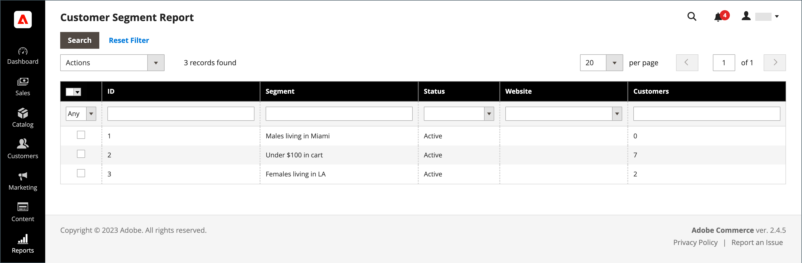
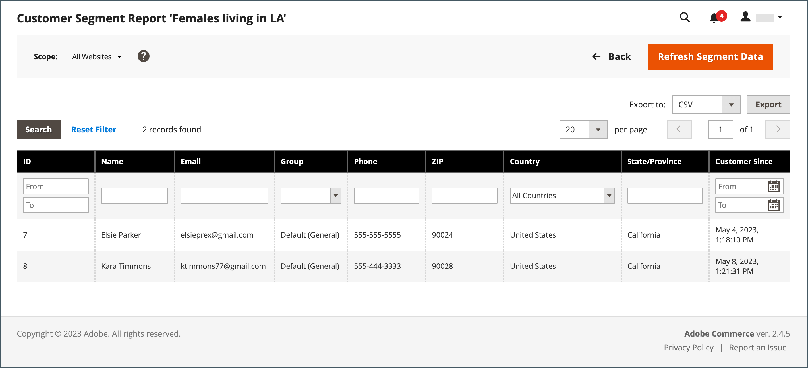

# Customer Segment report

{{ee-feature}}

The Customer Segment report provides information about the number of customers in each segment.

{width="700" zoomable="yes"}

|Column|Description|
|--- |--- |
|**[!UICONTROL Select]**|Select the checkbox for each the segment to be subject to an action, or use the selection control in the column header. Options: `Select All` / `Deselect All` / `Select Visible` / `Unselect Visible`|
|**[!UICONTROL ID]**|A unique numeric identifier that is assigned to each segment|
|**[!UICONTROL Segment]**|Segment name|
|**[!UICONTROL Status]**|Segment status. Options: `Active` / `Inactive`|
|**[!UICONTROL Website]**|Website to which the segment is assigned|
|**[!UICONTROL Customers]**|Number of customers assigned to a segment|

{style="table-layout:auto"}

You can drill down to a list of customers in the segment, and export the data.

{width="600" zoomable="yes"}

To ensure you have the most recent data, the segment data must be refreshed. If the segment data is not available or is outdated, click **[!UICONTROL Refresh Segment Data]** in the button bar to update.

1. For **[!UICONTROL Export to]**, choose an export format:
    
    * CSV - A comma-separated value file containing plain text data.
    * Excel XML - An XML-based, spreadsheet data format.

1. Click **[!UICONTROL Export]**.

   |Column|Description|
   |--- |--- |
   |**[!UICONTROL ID]**|A unique numeric identifier that is assigned to each user|
   |**[!UICONTROL Name]**|Customer name|
   |**[!UICONTROL Email]**|The email address of a registered customer|
   |**[!UICONTROL Group]**|The customer group to which the customer is assigned|
   |**[!UICONTROL Phone]**|The phone number of the customer|
   |**[!UICONTROL ZIP]**|The ZIP or postal code where the customer is located|
   |**[!UICONTROL Country]**|The country where the customer is located|
   |**[!UICONTROL State/Province]**|The state or province where the customer is located|
   |**[!UICONTROL Customer Since]**|The date and time the customer account was created|

   {style="table-layout:auto"}

1. The generated file is automatically saved to your local machine.
