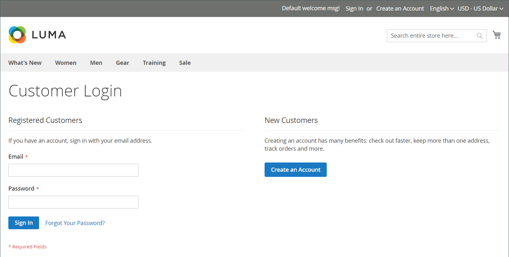
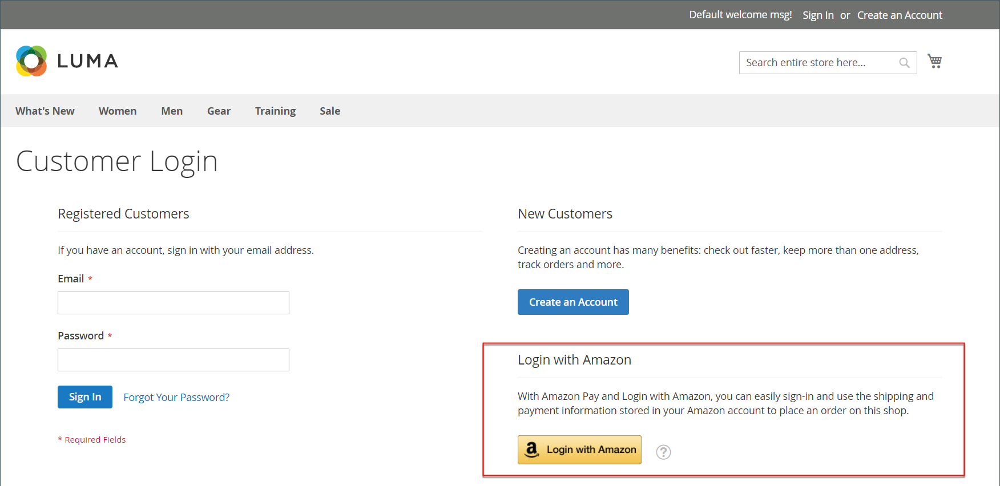
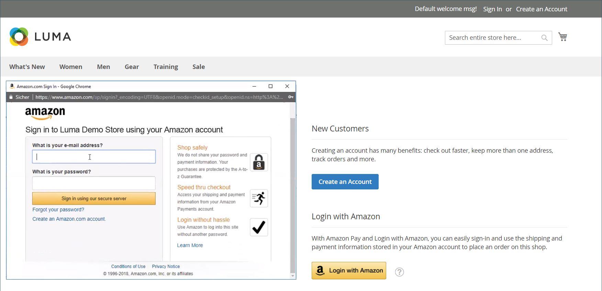

# Customer Sign In

Customers have easy access to their accounts from every page in your store. Depending on the [configuration](../customers/account-options-new.md), customers can be redirected to their account dashboard, or continue shopping after they log in to their accounts.

If [CAPTCHA](../systems/security-captcha.md) is enabled in the configuration, the person must correctly complete a test that verifies them to be human, before gaining access to their accounts.

When customers forget their passwords, a reset link is sent to the email address that is associated with the account. The number of times a customer can try to enter a password, the number of minutes between attempts, the number of total attempts before the account is locked, and the length of the lockout is set in the [Password Options](../customers/password-options.md) configuration.

## Sign in to a customer account

1. In the header of the store, click **[!UICONTROL Sign in]**.

   

1. Enter your **[!UICONTROL Email]** address and **[!UICONTROL Password]**.

1. Click **[!UICONTROL Sign in]**.

   >[!IMPORTANT]
   >
   > If you cannot remember your password, click **[!UICONTROL Forgot Your Password?]** and follow the [instructions](../customers/password-reset.md) to reset your password.

## Set the redirect to the Account Dashboard after customer login

You can configure the store to redirect customers to their account dashboard after they log in or let them continue shopping.

1. On the _Admin_ sidebar, go to **[!UICONTROL Stores]** > _[!UICONTROL Settings]_ > **[!UICONTROL Configuration]**.

1. In the left panel, expand **[!UICONTROL Customers]** and choose **[!UICONTROL Customer Configuration]**.

1. Expand the **[!UICONTROL Login Options]** section.

1. Set **[!UICONTROL Redirect Customer to Account Dashboard after Logging in]** to one of the following:

   |Column|Description|
   | --- | --- |
   | Yes | The account dashboard appears when customers log in to their accounts. |
   | No | Customers can continue shopping after logging in to their accounts. |

   {style="table-layout:auto"}

1. When complete, click **[!UICONTROL Save Config]**.

## Sign in with Amazon

1. In the header of the store, click **[!UICONTROL Sign in]**.

1. Click **[!UICONTROL Login with Amazon]**.

   

1. When prompted to sign in, enter the **[!UICONTROL email address]** and **[!UICONTROL password]** for your Amazon buyer account.

   

1. To grant Amazon permission to share the following information from your account with the store when processing your purchases, click **Okay**.

   - Your Name
   - Your Email Address
   - Shipping Addresses

   

## Sign out of a customer account

1. In the upper-right corner next to  _Welcome, Customer Name!_, click  the **[!UICONTROL v]** menu selector.

1. Choose **[!UICONTROL Sign Out]**.

After the sign-out, the customer is redirected to the homepage, within five seconds.
