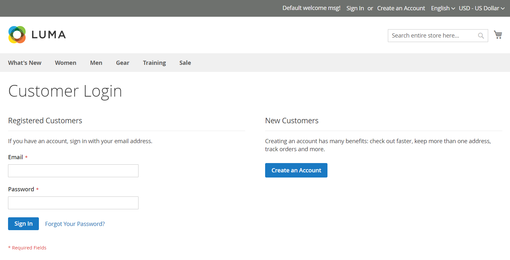
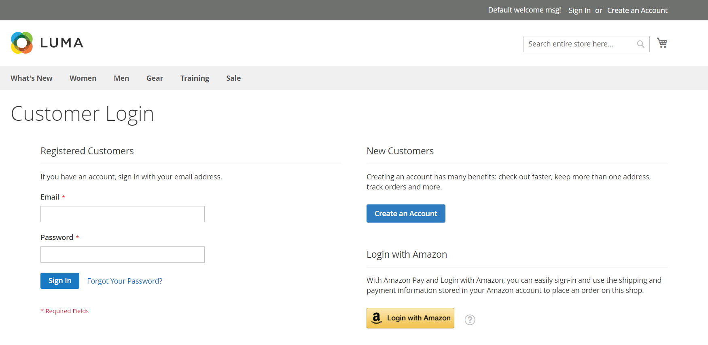
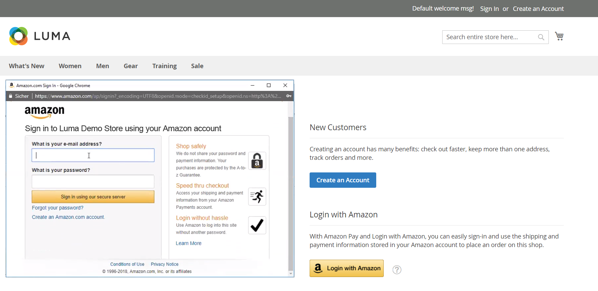
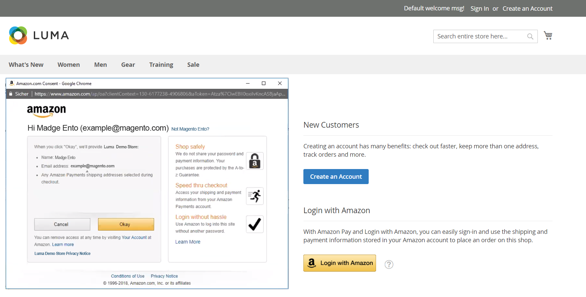

# Customer sign in

Customers have easy access to their accounts from every page in your store. Depending on the [configuration](../customers/account-options-new.md), customers can be redirected to their account dashboard, or continue shopping after they log in to their accounts.

If [CAPTCHA](../systems/security-captcha.md) is enabled in the configuration, the person must correctly complete a test that verifies them to be human, before gaining access to their accounts.

When customers forget their passwords, a reset link is sent to the email address that is associated with the account. The [Password Options](../customers/password-options.md) configuration controls the customer experience for login attempts:

- The number of times a customer can attempt to enter a password
- The number of minutes between attempts
- The number of total attempts before the account is locked
- The length of the lockout

{width="700" zoomable="yes"}

## Sign in to a customer account

1. In the header of the store, the customer clicks **[!UICONTROL Sign in]**.

   {width="700" zoomable="yes"}

1. Enters their **[!UICONTROL Email]** address and **[!UICONTROL Password]**.

1. Clicks **[!UICONTROL Sign in]**.

   >[!IMPORTANT]
   >
   >If they cannot remember their password, the customer can click **[!UICONTROL Forgot Your Password?]** and follow the [instructions](../customers/password-reset.md) to reset the password.

## Set the redirect to the account dashboard after customer login

You can configure the store to redirect customers to their account dashboard after they log in or let them continue shopping.

1. On the _Admin_ sidebar, go to **[!UICONTROL Stores]** > _[!UICONTROL Settings]_ > **[!UICONTROL Configuration]**.

1. In the left panel, expand **[!UICONTROL Customers]** and choose **[!UICONTROL Customer Configuration]**.

1. Expand the **[!UICONTROL Login Options]** section.

1. Set **[!UICONTROL Redirect Customer to Account Dashboard after Logging in]** to one of the following:

   - `Yes` - The account dashboard appears when customers log in to their accounts.
   - `No` - Customers can continue shopping after logging in to their accounts.

1. When complete, click **[!UICONTROL Save Config]**.

## Sign in with Amazon

For stores with a configured [!DNL Amazon Pay] and [!DNL Login with Amazon] integration, customers can log in to their Amazon buyer account.

1. In the header of the store, the customer clicks **[!UICONTROL Sign in]**.

1. Clicks **[!UICONTROL Login with Amazon]**.

   {width="700" zoomable="yes"}

1. When prompted to sign in, the customer enters the **[!UICONTROL email address]** and **[!UICONTROL password]** for their Amazon buyer account.

   {width="700" zoomable="yes"}

1. To grant Amazon permission to share the following information from their account with the store when processing purchases, clicks **Okay**.

   - Name
   - Email Address
   - Shipping Addresses

   {width="700" zoomable="yes"}

## Sign out of a customer account

1. In the upper-right corner next to  _[!UICONTROL Welcome, Customer Name!]_, the customer clicks  the **[!UICONTROL v]** menu selector.

1. Choose **[!UICONTROL Sign Out]**.

After the sign-out, the customer is redirected to the homepage.
