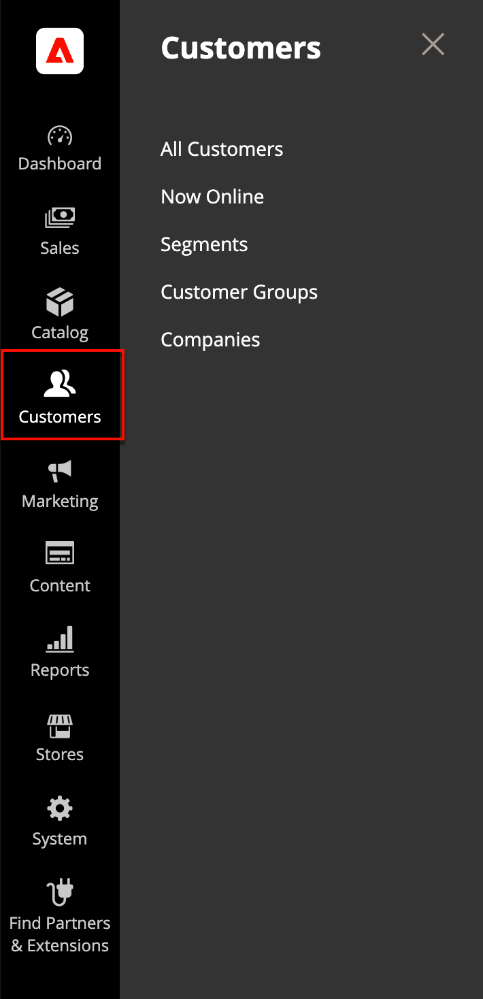

# [!DNL Customers] menu

The [!DNL Customers] menu provides access to customer account management tools, and gives you the ability to see who is currently online in your store.

## Display the Customers menu

On the _Admin_ sidebar, click [!UICONTROL Customers] to display the menu options:

| Field | Description |
|---|---|
| [!UICONTROL All Customers] | Lists all [customers](../customers/customers-all.md) who have registered for an account with your store or were added by the administrator. |
| [!UICONTROL Now Online] | Lists all customers and visitors who are currently [online](../customers/now-online.md) in your store. |
| [!UICONTROL Segments] | Dynamically display content and promotions to specific customers [based on properties](../customers/customers-segments) such as customer address, order history, shopping cart contents, and more. |
| [!UICONTROL Customer Groups] | The [customer groups](../customers/customer-groups.md) determine which discounts are available to shoppers and the tax class for the purchase. |
| [!UICONTROL Companies] | Lists all active [company accounts](../b2b/account-companies.md){target=_blank} and pending requests, regardless of status setting, and provides the tools needed to create and [manage](../b2b/account-company-manage.md){target=_blank} company accounts. |

>[!NOTE]
>
> Check [B2B for Adobe Commerce](../b2b/introduction.md) for more information on [!UICONTROL Companies].
