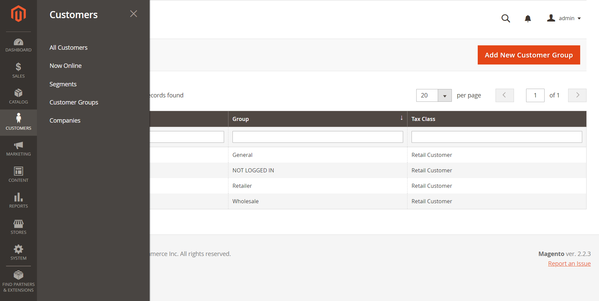

# Introduction to customer management

The _[!UICONTROL Customers]_ menu provides access to customer account management tools and gives you the ability to see who is online in your store.

>[!BEGINTABS]

>[!TAB Adobe Commerce]

[!BADGE PaaS only]{type=Informative url="https://experienceleague.adobe.com/en/docs/commerce/user-guides/product-solutions" tooltip="Applies to Adobe Commerce on Cloud projects (Adobe-managed PaaS infrastructure) and on-premises projects only."}

{width="300" zoomable="yes"}

>[!TAB Adobe Commerce as a Cloud Service]

[!BADGE SaaS only]{type=Positive url="https://experienceleague.adobe.com/en/docs/commerce/user-guides/product-solutions" tooltip="Applies to Adobe Commerce as a Cloud Service and Adobe Commerce Optimizer projects only (Adobe-managed SaaS infrastructure)."}

{width="300" zoomable="yes"}

>[!ENDTABS]

## Display the [!UICONTROL Customers] menu

On the _Admin_ sidebar, click [!UICONTROL Customers] to display the menu options:

| Field | Description |
|---|---|
| [!UICONTROL All Customers] | Lists all [customers](../customers/customers-all.md) who have registered for an account with your store or were added by the administrator. |
| [!UICONTROL Now Online] | Lists all customers and visitors who are currently [online](../customers/now-online.md) in your store. |
| [!UICONTROL Segments] | Lists the [customer segments](../customers/customer-segments.md) that are used to dynamically display content and promotions to specific customers based on various properties. |
| [!UICONTROL Customer Groups] | The [customer groups](../customers/customer-groups.md) determine which discounts are available to shoppers and the tax class for the purchase. |
| [!UICONTROL Companies] | (Requires Adobe Commerce B2B) Lists all active [company accounts](../b2b/account-companies.md) and pending requests, regardless of status setting, and provides the tools used to create and [manage](../b2b/account-company-manage.md) company accounts. |

{style="table-layout:auto"}
