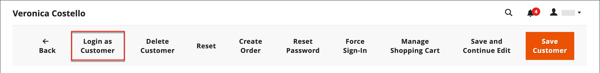
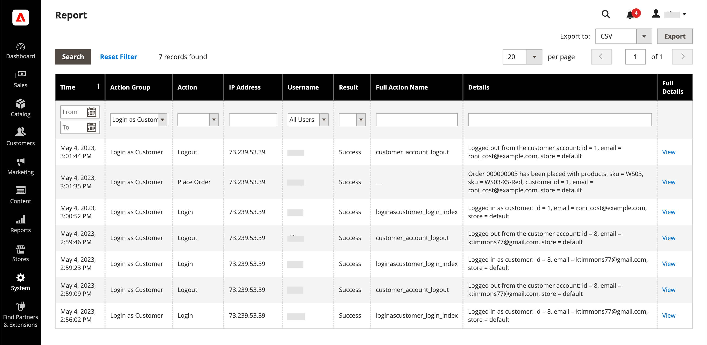
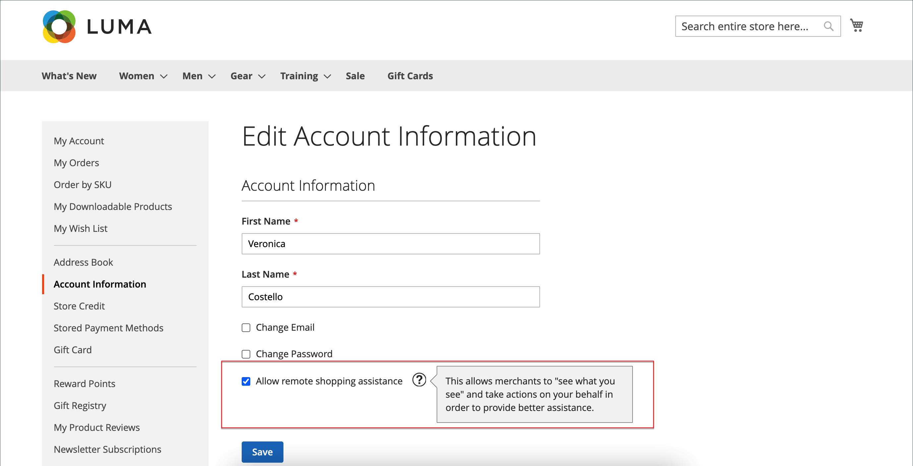

# Providing Shopper Assistance

There are times when customers need help with their order. To see what they see, store administrators can use _Login as Customer_, which allows them to see what the customer sees and take actions on their behalf.

Any actions taken while logged in as the customer are applied to the actual customer's account.

When it is enabled for an _Admin_ user, the Login as Customer button will appear in multiple pages:

* [Customer Edit page](../customers/update-account.md)
* [Order View page](../stores-purchase/order-processing.md)
* [Invoice View page](../stores-purchase/invoices.md)
* [Shipment View page](../stores-purchase/shipments.md)
* [Credit Memo View page](../stores-purchase/credit-memo-create.md)

## Enable Login as Customer

Enabling Login as Customer requires that you enable the feature in your commerce instance and then enable access for Admin users in the user role permissions.

### Enable the feature

1. On the _Admin_ sidebar go to  **[!UICONTROL Stores]** > _[!UICONTROL Settings]_ > **[!UICONTROL Configuration]**.

1. In the left panel, expand **[!UICONTROL Customers]** and choose  **[!UICONTROL Login as Customer]**.

   

1. Set **[!UICONTROL Enable Login as Customer]** to `Yes`.

1. _(Optional)_ Set **[!UICONTROL Disable Page Cache for Admin User]** to `No` to enable the page cache when the Admin user logs in as a customer.

   >[!WARNING]
   >
   > Disabling the page cache (`Yes` - default) ensures that the user logging in as Customer will get fresh, uncached data.

1. _(Optional)_ Set **[!UICONTROL Store View to Log in]** to `Manual Selection` if you have a multi-site and/or multi-store setup and want the Admin user to select the store view when logging in as a customer.

1. When complete, click **[!UICONTROL Save Config]**.

### Enable access for Admin users

1. On the _Admin_ sidebar, go to **[!UICONTROL System]** > _Permissions_ > **[!UICONTROL User Roles]**.

1. Click a role in the list to edit it.

1. In the [!UICONTROL _Role Information_] left panel, click **[!UICONTROL Role Resources]**.

1. Change **[!UICONTROL Role Resources]** on the page to `Custom`.

   >[!INFO]
   >
   > With this option selected, the resource hierarchy is displayed in the page.

1. Scroll to the  **[!UICONTROL Customers]**  parent item and the **[!UICONTROL Login as Customer]** item underneath. Then, select the resources that you want to enable for the role:

   * **[!UICONTROL Allow Login as Customer]** - This allows the Admin user to use the _Login as Customer_ feature.
   * **[!UICONTROL View Login as Customer Log]** - Allows the Admin user to see the _Login as Customer_ Log.

   

1. Click **[!UICONTROL Save Role]**.

## Login as a customer from the admin panel

1. On the _Admin_ sidebar, go to **[!UICONTROL Customers]** > [!UICONTROL _All Customers_].

1. Open a user in edit mode.

1. In the **[!UICONTROL Customer Information]** panel, choose the **[!UICONTROL Account Information]** section.

1. Set the **[!UICONTROL Allow remote shopping assistance]** to `Yes`.

   >[!INFO]
   >
   > The administrator can now log in as a user without their permission from the storefront.

## Login as Customer logging

{ee-feature}

Adobe Commerce provides a logging for the _Login as Customer_ actions. It lists all sessions where a Admin user accesses the feature. To access the logged actions, go to the [Admin Actions Report](../systems/action-log-report.md).

You can filter the report setting **[!UICONTROL Action Group]** to `Login As Customer` at the top of the page and clicking **[!UICONTROL Search]**.

## Customer account permission for remote shopping assistance

To allow the ability for the merchant to log in as the customer from the Admin, a customer must enable the feature:

1. Go to the **[!UICONTROL Account Information]** page.

1. Select the **[!UICONTROL Allow remote shopping assistance]** checkbox.

1. Click the **[!UICONTROL Save]** button.

>[!WARNING]
>
> Without this permission, an Admin user cannot login as this customer to provide assistance.

## Using Login as Customer

>[!INFO]
>
> To use Login as Customer, ensure your Admin is configured as described earlier.

Login as Customer allows you to see the site just as the customer does, and allows you to troubleshoot and take other actions for the customer. If you have an assigned user role with the required permissions:

1. You can click **[!UICONTROL Login as Customer]** on the pages listed in the previous section.
1. The Login as Customer actions are available in the Actions Report.

>[!WARNING]
>
> Any actions taken while logged in [!UICONTROL _as Customer_] (such as add/remove products) are applied to the actual customer's order. On the storefront, a banner is displayed when you are `logged in as customer_name` to provide a reminder of the special state.
