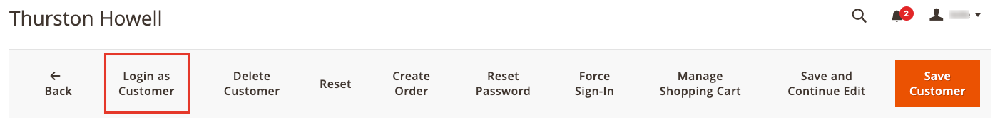
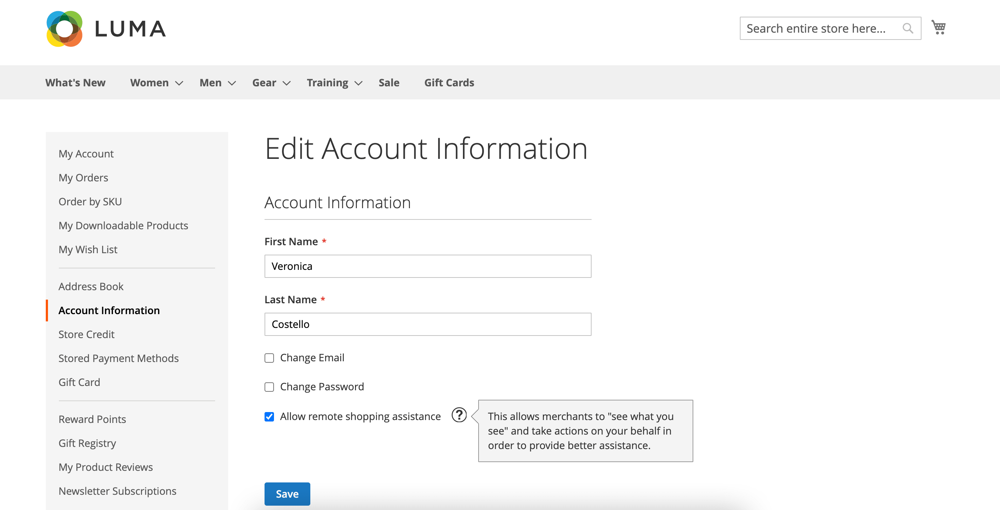
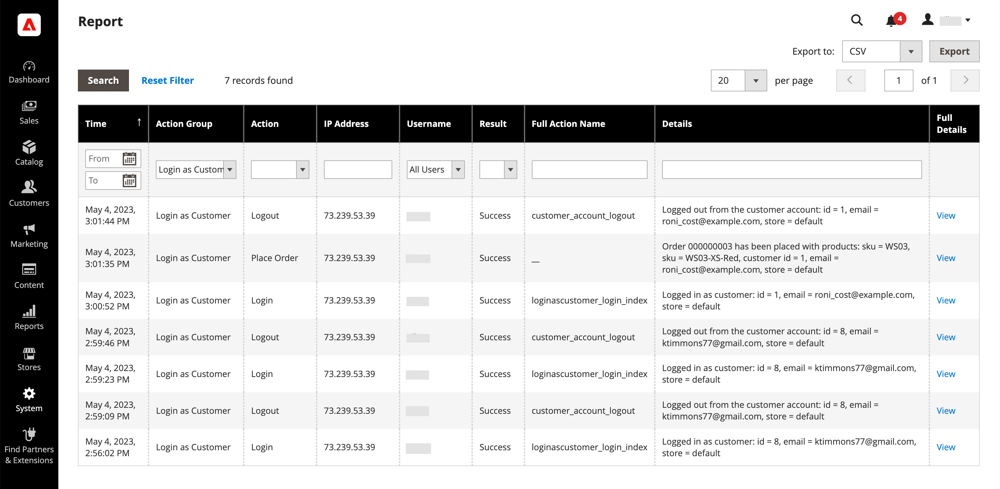

# Provide shopper assistance

At times, customers need help with their order. Store administrators can use _Login as Customer_, which allows them to see what the customer sees and make updates to assist them.

Any actions taken while logged in as the customer are applied to the actual customer's account.

>[!BEGINTABS]

>[!TAB Adobe Commerce]

[!BADGE PaaS only]{type=Informative url="https://experienceleague.adobe.com/en/docs/commerce/user-guides/product-solutions" tooltip="Applies to Adobe Commerce on Cloud projects (Adobe-managed PaaS infrastructure) and on-premises projects only."}

When it is enabled for an _Admin_ user, the _[!UICONTROL Login as Customer]_ button appears in multiple pages:

* [Customer Edit page](../customers/update-account.md)
* [Order View page](../stores-purchase/order-processing.md)
* [Invoice View page](../stores-purchase/invoices.md)
* [Shipment View page](../stores-purchase/shipments.md)
* [Credit Memo View page](../stores-purchase/credit-memo-create.md)

{width="600" zoomable="yes"}

>[!TAB Adobe Commerce as a Cloud Service]

[!BADGE SaaS only]{type=Positive url="https://experienceleague.adobe.com/en/docs/commerce/user-guides/product-solutions" tooltip="Applies to Adobe Commerce as a Cloud Service and Adobe Commerce Optimizer projects only (Adobe-managed SaaS infrastructure)."}

In Adobe Commerce as a Cloud Service, the Login as Customer feature uses a **One-Time Code (OTC)** workflow instead of a direct login. Administrators generate a short-lived, single-use code for a customer. This code can then be exchanged for a customer access token through GraphQL, enabling passwordless Login as Customer workflows for seller-assisted shopping scenarios.

The feature comprises the following components:

* **Admin UI** - On the customer edit page, administrators can request a one-time code (OTC) instead of directly logging in as a customer.
* **[REST API](https://developer.adobe.com/commerce/webapi/rest/saas-integrations/login-as-customer/)** - A programmatic endpoint for OTC generation, useful for admin scripts and third-party integrations.
* **GraphQL API** - Mutations that exchange an OTC for a customer access token for storefront or headless commerce flows.

>[!ENDTABS]

## Enable Login as Customer

Enabling _Login as Customer_ requires that you enable the feature in your Commerce instance and then enable access for Admin users in the user role permissions.

### Enable the feature

1. On the Admin sidebar, go to  **[!UICONTROL Stores]** > _[!UICONTROL Settings]_ > **[!UICONTROL Configuration]**.

1. In the left panel, expand **[!UICONTROL Customers]** and choose  **[!UICONTROL Login as Customer]**.

   {width="600" zoomable="yes"}

1. Set **[!UICONTROL Enable Login as Customer]** to `Yes`.

1. _(Optional)_ Set **[!UICONTROL Disable Page Cache for Admin User]** to `No` to enable the page cache when the Admin user logs in as a customer.

   >[!WARNING]
   >
   > Disabling the page cache (`Yes` - default) ensures that the user logging in as Customer gets fresh, uncached data.

1. _(Optional)_ Set **[!UICONTROL Store View to Log in]** to `Manual Selection` if you have a multi-site and/or multi-store setup and want the Admin user to select the store view when logging in as a customer.

1. When complete, click **[!UICONTROL Save Config]**.

### Enable access for Admin users

1. On the _Admin_ sidebar, go to **[!UICONTROL System]** > _Permissions_ > **[!UICONTROL User Roles]**.

1. Click the role in the list.

1. In the [!UICONTROL _Role Information_] left panel, click **[!UICONTROL Role Resources]**.

1. Change **[!UICONTROL Role Resources]** on the page to `Custom`.

   >[!INFO]
   >
   > With this option selected, the resource hierarchy is displayed in the page.

1. Scroll to the  **[!UICONTROL Customers]** parent item and the **[!UICONTROL Login as Customer]** item underneath. Then, select the resources that you want to enable for the role:

   * **[!UICONTROL Allow Login as Customer]** - Allows the Admin user to use the _Login as Customer_ feature.
   * **[!UICONTROL View Login as Customer Log]** - Allows the Admin user to see the _Login as Customer_ Log.

   {width="400" zoomable="yes"}

1. Click **[!UICONTROL Save Role]**.

## Customer account permission for remote shopping assistance

To enable account access for store support staff from the Admin, a customer must enable the feature for their account:

>[!BEGINTABS]

>[!TAB Adobe Commerce]

[!BADGE PaaS only]{type=Informative url="https://experienceleague.adobe.com/en/docs/commerce/user-guides/product-solutions" tooltip="Applies to Adobe Commerce on Cloud projects (Adobe-managed PaaS infrastructure) and on-premises projects only."}

1. The customer goes to the **[!UICONTROL Account Information]** page.

1. Selects the **[!UICONTROL Allow remote shopping assistance]** checkbox.

1. The customer clicks **[!UICONTROL Save]**.

{width="700" zoomable="yes"}

>[!TAB Adobe Commerce as a Cloud Service]

[!BADGE SaaS only]{type=Positive url="https://experienceleague.adobe.com/en/docs/commerce/user-guides/product-solutions" tooltip="Applies to Adobe Commerce as a Cloud Service and Adobe Commerce Optimizer projects only (Adobe-managed SaaS infrastructure)."}

The customer must have the `login_as_customer_assistance_allowed` extension attribute set to **2**. This can be configured on the **Edit Customer** page in the Admin or through GraphQL when creating or editing a customer.

>[!WARNING]
>
>Without this permission, an Admin user cannot log in as this customer.

{width="600" zoomable="yes"}

To set this permission with GraphQL for an existing customer account, use the [`updateCustomerV2`](https://developer.adobe.com/commerce/webapi/graphql/schema/customer/mutations/update-v2/) mutation.

**Query** (`updateCustomerV2`):

```graphql
mutation {
  updateCustomerV2(input: { allow_remote_shopping_assistance: true }) {
    customer {
      allow_remote_shopping_assistance
    }
  }
}
```

>[!ENDTABS]

## Login as a customer from the Admin

>[!BEGINTABS]

>[!TAB Adobe Commerce]

[!BADGE PaaS only]{type=Informative url="https://experienceleague.adobe.com/en/docs/commerce/user-guides/product-solutions" tooltip="Applies to Adobe Commerce on Cloud projects (Adobe-managed PaaS infrastructure) and on-premises projects only."}

1. On the _Admin_ sidebar, go to **[!UICONTROL Customers]** > [!UICONTROL _All Customers_].

1. Open a user in edit mode.

1. In the **[!UICONTROL Customer Information]** panel, choose the **[!UICONTROL Account Information]** section.

1. Set the **[!UICONTROL Allow remote shopping assistance]** to `Yes`.

   >[!INFO]
   >
   >The administrator can now log in as a user without their permission from the storefront.

>[!TAB Adobe Commerce as a Cloud Service]

[!BADGE SaaS only]{type=Positive url="https://experienceleague.adobe.com/en/docs/commerce/user-guides/product-solutions" tooltip="Applies to Adobe Commerce as a Cloud Service and Adobe Commerce Optimizer projects only (Adobe-managed SaaS infrastructure)."}

>[!NOTE]
>
>For guidance on implementing this feature using REST, see the [Login as Customer](https://developer.adobe.com/commerce/webapi/rest/saas-integrations/login-as-customer/) REST API documentation.

### Request a One-Time Code (OTC) from the Admin

1. Navigate to **[!UICONTROL Customers]** and select a customer to open the edit page.

1. On the Edit Customer page, click **[!UICONTROL Get Customer Login OTC]**.

   {width="600" zoomable="yes"}

1. Enter a **[!UICONTROL Reason]** (required) and click **[!UICONTROL Request]**.

   {width="600" zoomable="yes"}

   >[!NOTE]
   >
   >The **Reason** field is required. It is passed to the OTP generation flow and is reserved for use in upcoming audit and event logging features.

1. The generated OTC is displayed in the modal. Use this code with the `generateCustomerToken` or `exchangeOtpForCustomerToken` GraphQL mutation for customer authorization.

   {width="300" zoomable="yes"}

>[!IMPORTANT]
>
>The generated One-Time Code OTC is valid for 30 seconds by default and is invalidated after a single use. The TTL can be configured by submitting a [support ticket](https://experienceleague.adobe.com/home?support-tab=home#support).

After the One-Time Code is generated, you can use it by navigating to your storefront and logging in using the following credentials:

* **Email**: The customer's email address
* **Password**: The generated One-Time Code (OTC)

>[!ENDTABS]

## Use Login as Customer

>[!INFO]
>
>To use _Login as Customer_, make sure that your Admin is configured as described earlier.

_Login as Customer_ allows you to see the site just as the customer does, and allows you to troubleshoot and take other actions for the customer. If you have an assigned user role with the required permissions:

1. You can click **[!UICONTROL Login as Customer]** on the pages listed in the previous section.
1. The Login as Customer actions are available in the Actions Report.

>[!WARNING]
>
>Any actions taken while logged in [!UICONTROL _as Customer_] (such as add/remove products) are applied to the actual customer's order. On the storefront, a banner is displayed when you are `logged in as customer_name` to provide a reminder of the special state.

## Login as Customer logging

{{ee-feature}}

Adobe Commerce provides a logging for the _Login as Customer_ actions. It lists all sessions where an Admin user accesses the feature. To access the logged actions, go to the [Admin Actions Report](../systems/action-log-report.md).

You can filter the report setting **[!UICONTROL Action Group]** to `Login As Customer` at the top of the page and clicking **[!UICONTROL Search]**.

{width="700" zoomable="yes"}
