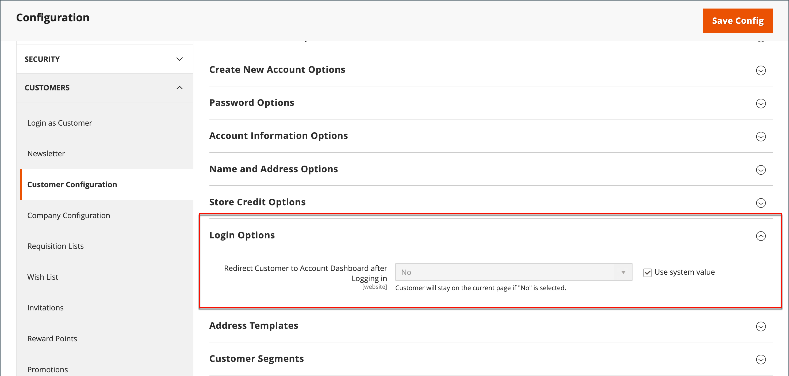

# Customer login landing page

You can configure your store to redirect customers to their account dashboard after they log in or let them continue shopping.

1. On the _Admin_ sidebar, go to **[!UICONTROL Stores]** > _[!UICONTROL Settings]_ > **[!UICONTROL Configuration]**.

1. In the left panel, expand **[!UICONTROL Customers]** and choose **[!UICONTROL Customer Configuration]**.

1. Expand the **[!UICONTROL Login Options]** section.

   {width="600" zoomable="yes"}

1. Set **[!UICONTROL Redirect Customer to Account Dashboard after Logging in]** to one of the following:

   - `Yes` - The account dashboard appears when customers log in to their accounts.
   - `No` - Customers can continue shopping after logging in to their accounts.

   >[!INFO]
   >
   >If necessary, clear the **[!UICONTROL User system value]** checkbox to make the change.

1. When complete, click **[!UICONTROL Save Config]**.
