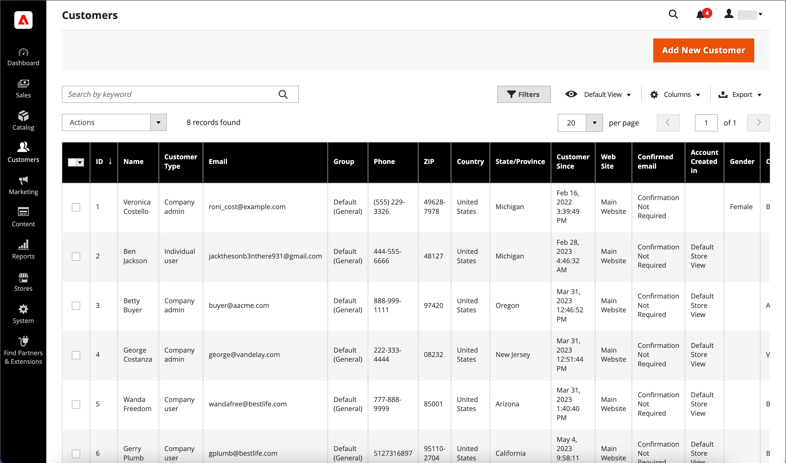

# Manage customer accounts

Use the _[!UICONTROL Customers]_ grid to find any customer account. You can use the standard [workplace controls](../getting-started/admin-workspace.md) to filter the list, change the [column layout](../getting-started/admin-grid-controls.md), save views, and export data. The [Actions control](../getting-started/admin-actions-control.md) above the grid can be used to apply an operation to multiple customer records.

{width="700" zoomable="yes"}

See [Update customer profile](update-account.md) for information about making manual updates to a customer account.

## Customer account actions

1. On the _Admin_ sidebar, go to **[!UICONTROL Customers]** > **[!UICONTROL All Customers]**.

1. In the first column of the grid, select the checkbox of each record that you want to update.

1. Follow the instructions for the action that you want to apply.

   >[!INFO]
   >
   >The following actions can be applied to either single or multiple records.

1. When complete, click **[!UICONTROL Save Config]**.

### Subscribe to newsletter

In multi-store and multi-site setups with a global [customer account scope](../customers/customer-account-scope.md), a customer account can be subscribed to newsletters multiple sites or stores. If you apply the _Subscribe_ action to a customer account, it activates the newsletter subscription for the default site/store view only.

* Set the **[!UICONTROL Actions]** control to `Subscribe to newsletter`.

See [Manage subscribers](../merchandising-promotions/newsletter-subscribers.md) for more information about managing newsletter subscriptions for a customer.

### Unsubscribe from newsletter

In multi-store and multi-site setups with a global [customer account scope](customer-account-scope.md), a customer account can be subscribed to newsletters for multiple sites/stores. If you apply the _Unsubscribe_ action to a customer account, all active subscriptions are unsubscribed.

1. Set the **[!UICONTROL Actions]** control to `Unsubscribe to newsletter`.

1. When prompted to confirm, click **OK**.

### Assign a customer group

1. Set the **[!UICONTROL Actions]** control to `Assign a customer group`.

1. Choose the customer group to which all selected customer records are to be assigned.

1. When prompted to confirm, click **[!UICONTROL OK]**.

### Delete customer accounts

Deleted customer accounts cannot be restored. Information about customer activity and transactions is retained in the system.

1. Set the **[!UICONTROL Actions]** control to `Delete`.

1. When prompted to confirm, click **[!UICONTROL OK]**.

## Export customers accounts

1. On the _Admin_ sidebar, go to **[!UICONTROL Customers]** > **[!UICONTROL All Customers]**.

1. In the Table Header Menu, click **[!UICONTROL Export]** and select the desired format:

   * CSV
   * Excel XML

1. Click **[!UICONTROL OK]**.

   The file goes to your default downloads folder.

The above instruction exports all customer accounts. If you want to export a limited set, select the checkboxes for the accounts you want to export, or use filters on the control panel to select a range of customer accounts.

## Actions/controls

|Option|Description|
|--- |--- |
|**[!UICONTROL Delete]**|Deletes selected customer accounts. If the customer account belongs to a company administrator for a B2B store, another company user must be assigned as administrator before the customer account can be deleted.|
|**[!UICONTROL Subscribe to Newsletter]**|Subscribes selected customers to newsletter.|
|**[!UICONTROL Unsubscribe from Newsletter]**|Unsubscribes selected customers from newsletter.|
|**[!UICONTROL Assign a Customer Group]**|Assigns selected customers to a customer group.|
|**[!UICONTROL Edit]**|Allows some values of a single selected customer record to be edited from the grid. By default, the following values are available for a quick edit: Email, Group, Phone, ZIP, Web Site, Tax VAT Number, and Gender.|

{style="table-layout:auto"}

## Columns

|Column|Description|
|--- |--- |
|**[!UICONTROL Select]**|Manages the checkbox selections for the customer records for applying an action. You can also use the selection control in the column header to select/deselect all.|
|**[!UICONTROL ID]**|A unique numeric identifier that is assigned when the customer account is created.|
|**[!UICONTROL Name]**|The first and last name of the customer.|
|**[!UICONTROL Email]**|The email address of the customer.|
|**[!UICONTROL Group]**|The customer group to which the customer is assigned.|
|**[!UICONTROL Phone]**|The phone number of the customer.|
|**[!UICONTROL ZIP]**|The ZIP or postal code of the customer.|
|**[!UICONTROL Country]**|The country where the customer is located.|
|**[!UICONTROL State/Province]**|The state or province where the customer is located.|
|**[!UICONTROL Customer Since]**|The date and time the customer account was created.|
|**[!UICONTROL Web Site]**|The web site in the store hierarchy to which the customer account is associated.|
|**[!UICONTROL Confirmed Email]**|Indicates if a confirmation email is required.|
|**[!UICONTROL Account Created In]**|Indicates the store view from which the customer account was created.|
|**[!UICONTROL Date of Birth]**|The date of birth of the customer. In keeping with current security and privacy best practices, be aware of any potential legal and security risks associated with the storage of customers' full date of birth (month, day, year) with other personal identifiers. It is recommended that you limit the storage of customers' full birth dates and suggest using customer year of birth as an alternative.|
|**[!UICONTROL Tax / VAT Number]**|If applicable, the tax number or [value-added tax](../stores-purchase/vat.md) number that is assigned to the customer.    This field is not the same as the VAT Number.|
|**[!UICONTROL Gender]**|The gender of the customer.|
|**[!UICONTROL Action]**|Edit - Opens the company account in edit mode.|

{style="table-layout:auto"}

### Additional columns

These columns are available by changing the [column layout](../getting-started/admin-grid-controls.md) of the grid.

|Column|Description|
|--- |--- |
|**[!UICONTROL Company]**|The company name of the customer.|
|**[!UICONTROL Street Address]**|The street address of the customer.|
|**[!UICONTROL City]**|The city where the customer is located.|
|**[!UICONTROL Fax]**|The fax number of the customer, if applicable.|
|**[!UICONTROL Billing Firstname]**|The first name in the billing address of the customer.|
|**[!UICONTROL Billing Lastname]**|The last name in the billing address of the customer.|
|**[!UICONTROL Billing Address]**|The address where billing information is to be sent.|
|**[!UICONTROL Shipping Address]**|The address where orders are to be shipped.|
|**[!UICONTROL VAT Number]**|The value-added tax number that is associated with the customer address. For [digital goods](../stores-purchase/taxes.md) sold in the EU, the VAT is based on the billing address of the customer.    This field is not the same as the Tax/VAT Number.|
|**[!UICONTROL Account Lock]**|Indicates the status of the account. As a security measure, customer accounts can be [locked](../customers/password-options.md) after too many login attempts. Values: `Locked` / `Unlocked` |
|**[!UICONTROL Status]**|The current user status. Options: `Active` / `Inactive`|
|**[!UICONTROL Customer Type]**|Customer classification. Options: `Individual user` / `Company admin` / `Company user` |
|**[!UICONTROL Sales Representative]**|The sales representative who is assigned as the point of contact for a company account and receives all automated email messages related to the company.|

{style="table-layout:auto"}
