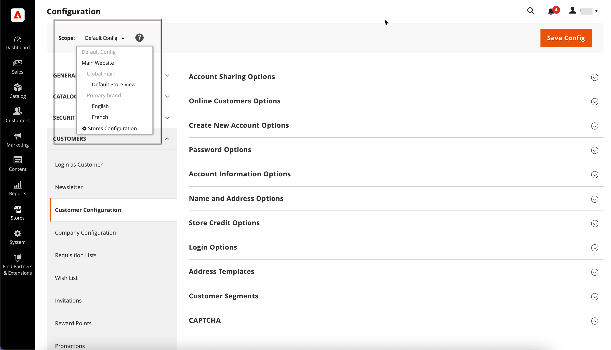
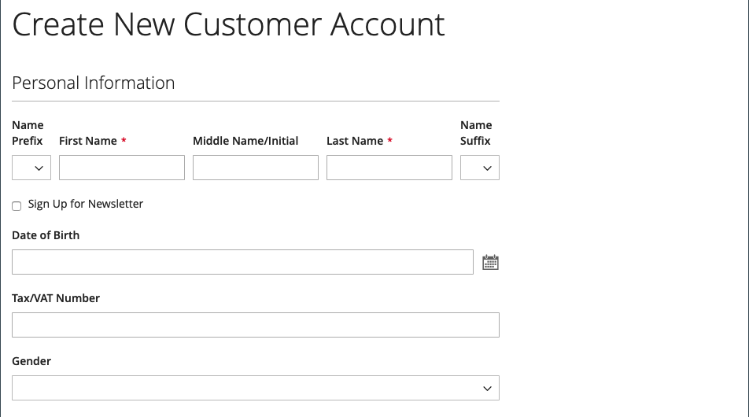
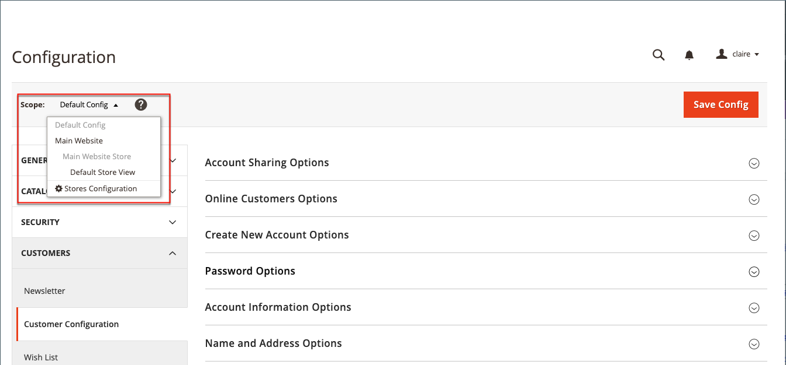

# Customer name and address options

The _Name and Address Options_ determine which fields are included in the name and address forms when customers create an [account](../customers/account-create.md) with your store.

{width="500" zoomable="yes"}

The steps for configuring the name and address options are different for Adobe Commerce and Magento Open Source.

## Configure name and address options for Adobe Commerce

You can configure the name and address options that are presented to customers on the storefront when they create their account.

### Step 1: Set the scope of the configuration

1. On the _Admin_ sidebar, go to **[!UICONTROL Stores]** > _[!UICONTROL Settings]_ > **[!UICONTROL Configuration]**.

1. In the left panel, expand **[!UICONTROL Customers]** and choose **[!UICONTROL Customer Configuration]**.

1. Expand the **[!UICONTROL Name and Address Options]** section.

   >[!INFO]
   >
   >Notice that the scope of the name and address options applies at the `website` level.

1. Scroll up to the top of the page and set the scope of the configuration to one of the following:

   - `Default Config`
   - `Main Website` (or specific site for multi-site installations)

   >[!INFO]
   >
   >The _[!UICONTROL Name and Address Options]_ section doesn't appear when the scope is set to `Default Store View`.

   {width="700" zoomable="yes"}

### Step 2: Configure the name and address options

1. Return to the [!UICONTROL _Name and Address Options_] section of the Customer Configuration page.

   >[!INFO]
   >
   > If you are not using the `Default config` scope setting, you must clear the `Use Default` checkbox for each field before changing the value.

   {width="600" zoomable="yes"}

1. For **[!UICONTROL Prefix Dropdown Options]**, enter each prefix that you want to appear in the list, separated by a semicolon.

   >[!IMPORTANT]
   >
   >Place a semicolon before the first value to display a blank value at the top of the list.

1. For **[!UICONTROL Suffix Dropdown Options]**, enter each suffix that you want to appear in the list, separated by a semicolon.

1. To include the following fields in customer forms, set the value of each to `Optional` or `Required`, as needed.

   - **[!UICONTROL Show Telephone]**
   - **[!UICONTROL Show Company]**
   - **[!UICONTROL Show Fax]**

### Step 3: Save and refresh

1. When complete, click **[!UICONTROL Save Config]**.

1. In the message at the top of the page, click **[!UICONTROL Cache Management]** and [refresh](../systems/cache-management.md) each invalid cache.

## Configure name and address options for Magento Open Source

Configure the name and address options that are presented to customers on the storefront when they create their account.

{width="500" zoomable="yes"}

### Step 1: Set the scope of the configuration

1. On the _Admin_ sidebar, go to **[!UICONTROL Stores]** > _[!UICONTROL Settings]_ > **[!UICONTROL Configuration]**.

1. In the left panel, expand **[!UICONTROL Customers]** and choose **[!UICONTROL Customer Configuration]**.

1. Expand the **[!UICONTROL Name and Address Options]** section.

   >[!IMPORTANT]
   >
   > Notice that the scope of the name and address options applies at the `website` level.

   {width="600" zoomable="yes"}

1. Scroll back up to the top of the page and set the scope of the configuration to one of the following:

   - `Default Config`
   - `Main Website` (or specific site for multi-site installations)

   >[!NOTE]
   >
   >The _Name and Address Options_ section doesn't appear when the scope is set to `Default Store View`.

   {width="600" zoomable="yes"}

### Step 2: Configure the name and address options

1. Return to the [!UICONTROL _Name and Address Options_] section of the Customer Configuration page.

   >[!INFO]
   >
   >If you are not using the `Default config` scope setting, you must clear the `Use Default` checkbox for each field before changing the value.

1. For **Number of Lines in a Street Address**, enter a number from 1 to 4.

   >[!WARNING]
   >
   >By default, the street address is three lines.

1. To include a prefix (such as Mr. or Ms.) as part of the name, set **Show Prefix** to `Yes`.

   {width="600" zoomable="yes"}

   >[!INFO]
   >
   >For **Prefix Dropdown Options**, enter each prefix that you want to appear in the list, separated by a semicolon. You can place a semicolon before the first value to display a blank value at the top of the list.

1. To include an optional field for the customer's middle name or initial, set **[!UICONTROL Show Middle Name (initial)]** to `Yes`.

1. To include a suffix (such as Jr. or Sr.) after the customer name, set **[!UICONTROL Show Suffix]** to one of the following:

   - `Optional`
   - `Required`

   >[!INFO]
   >
   >For **Suffix Dropdown Options**, enter each suffix that you want to appear in the list, separated by a semicolon. You can place a semicolon before the first value to display a blank value at the top of the list.

1. To include the date of birth, set **[!UICONTROL Show Date of Birth]** to one of the following:

   - `Optional`
   - `Required`

   >[!INFO]
   >
   >In keeping with current security and privacy best practices, be aware of any potential legal and security risks associated with the storage of customers' full date of birth (month, day, year) with other personal identifiers. It is recommended that you limit the storage of customers' full birth dates and suggest using customer year of birth as an alternative.

   Customers can use the Calendar icon after the field to choose the birth date from a pop-up calendar.

   {width="600" zoomable="yes"}

1. To allow customers to enter their tax or [VAT](../stores-purchase/vat.md) number, set **[!UICONTROL Show Tax/VAT Number]** to one of the following:

   - `Optional`
   - `Required`

1. To include a field for gender in the customer form, set **[!UICONTROL Show Gender]** to one of the following:

   - `Optional`
   - `Required`

   {width="600" zoomable="yes"}

1. To include the following fields in customer forms, set the value of each to `Optional` or `Required`, as needed.

   - **[!UICONTROL Show Telephone]**
   - **[!UICONTROL Show Company]**
   - **[!UICONTROL Show Fax]**

### Step 3: Save and refresh

1. When complete, click **[!UICONTROL Save Config]**.

1. In the message at the top of the page, click **[!UICONTROL Cache Management]** and [refresh](../systems/cache-management.md) each invalid cache.
